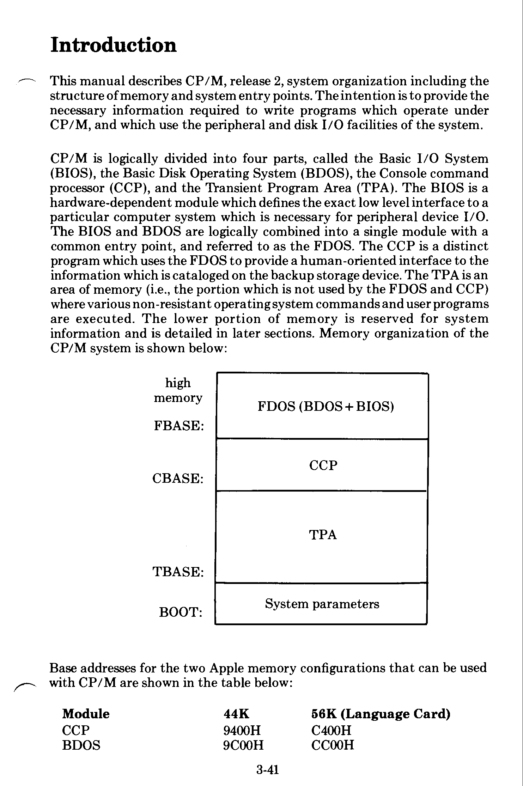
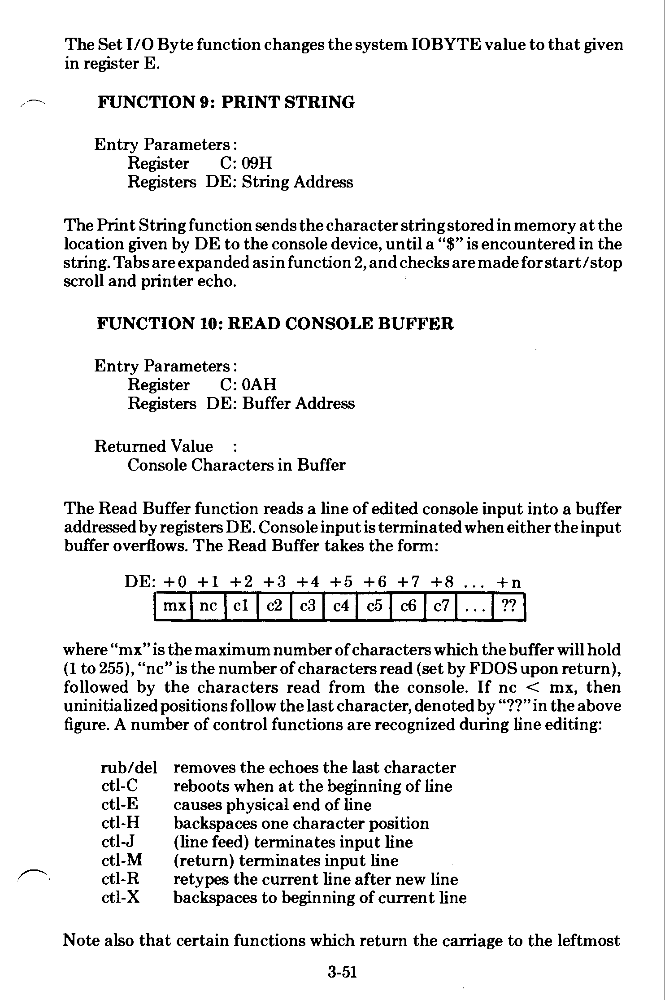
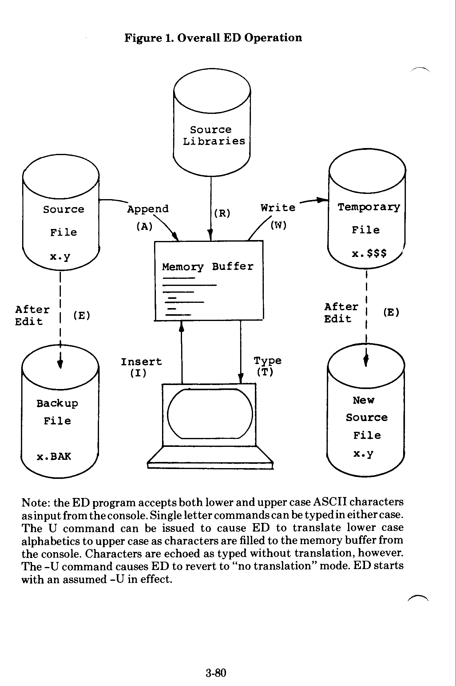
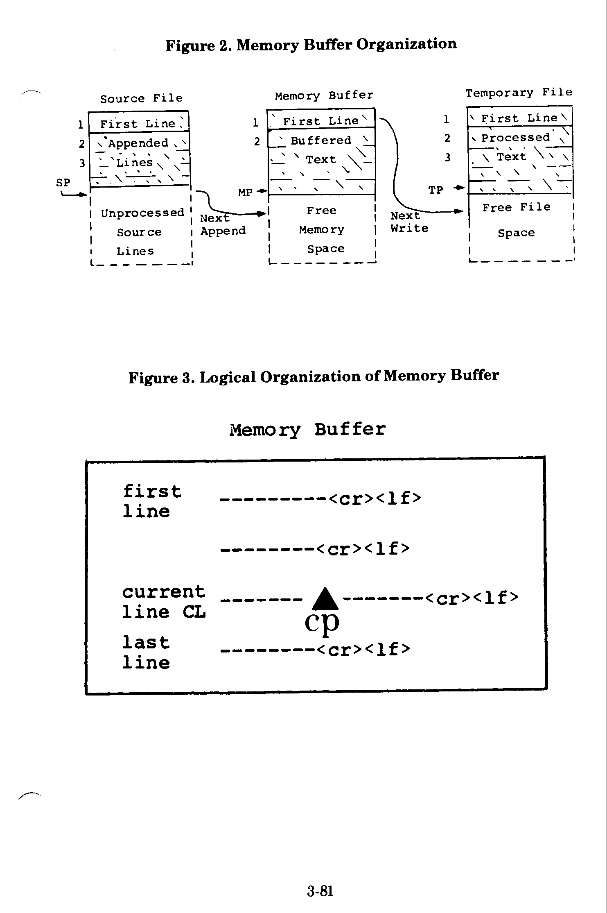

# Microsoft SoftCard - CP/M Reference Manual

> **AI-reconstructed text.** Transcribed from the scanned manual `manuals/Microsoft_SoftCard_-_CPM_Reference_Manual.pdf` (md5 `a68340225075e1097fd06f9a304bc6a5`, 154 pages) by a vision model, with an adversarial verification pass on every table and code page. Convenience copy for search and reference. **The scanned PDF remains the authoritative source** - verify any exact byte, address, or opcode against it. Reconstructed 2026-06-17; spot-check items in [`README.md`](README.md).


<!-- ===== scan page 001 - type:cover ===== -->

# CP/M Reference Manual

Written by Digital Research

Digital Research, Post Office Box 579
Pacific Grove, CA 93950

<!-- ===== scan page 002 - type:blank ===== -->

<!-- ===== scan page 003 (printed 3-a) - type:text ===== -->

# PART 3: CP/M REFERENCE MANUAL

## Chapter 1
## Introduction to CP/M Features and Facilities

| | |
|---|---|
| Introduction | 3-3 |
| An Overview of CP/M 2.0 Facilities | 3-5 |
| Functional Description of CP/M | 3-6 |
| General Command Structure | 3-6 |
| File References | 3-7 |
| Switching Disks | 3-9 |
| Form of Built-In Commands | 3-9 |
| &nbsp;&nbsp;&nbsp;&nbsp;ERAse Command | |
| &nbsp;&nbsp;&nbsp;&nbsp;DIRectory Command | |
| &nbsp;&nbsp;&nbsp;&nbsp;REName Command | |
| &nbsp;&nbsp;&nbsp;&nbsp;SAVE Command | |
| &nbsp;&nbsp;&nbsp;&nbsp;TYPE Command | |
| &nbsp;&nbsp;&nbsp;&nbsp;USER Command | |
| Line Editing and Output Control | 3-13 |
| Transient Commands | 3-14 |
| &nbsp;&nbsp;&nbsp;&nbsp;STAT | |
| &nbsp;&nbsp;&nbsp;&nbsp;ASM | |
| &nbsp;&nbsp;&nbsp;&nbsp;LOAD | |
| &nbsp;&nbsp;&nbsp;&nbsp;DDT | |
| &nbsp;&nbsp;&nbsp;&nbsp;PIP | |
| &nbsp;&nbsp;&nbsp;&nbsp;ED | |
| &nbsp;&nbsp;&nbsp;&nbsp;SUBMIT | |
| &nbsp;&nbsp;&nbsp;&nbsp;DUMP | |
| BDOS Error Messages | 3-36 |

## Chapter 2
## CP/M 2.0 Interface Guide

| | |
|---|---|
| Introduction | 3-41 |
| Operating System Call Conventions | 3-43 |
| Sample File-to-File Copy Program | 3-63 |
| Sample File Dump Utility | 3-66 |

<!-- ===== scan page 004 (printed 3-b) - type:text ===== -->

| | |
|---|---|
| Sample Random Access Program | 3-69 |
| System Function Summary | 3-76 |

## Chapter 3
## CP/M Editor

| | |
|---|---|
| Introduction to ED | 3-79 |
| ED Operation | 3-79 |
| Text Transfer Functions | 3-79 |
| Memory Buffer Organization | 3-83 |
| Memory Buffer Operation | 3-83 |
| Command Strings | 3-84 |
| Text Search and Alteration | 3-86 |
| Source Libraries | 3-88 |
| Repetitive Command Execution | 3-89 |
| ED Error Conditions | 3-89 |
| Summary of Control Characters | 3-90 |
| Summary of ED Commands | 3-91 |
| ED Text Editing Commands | 3-92 |

## Chapter 4
## CP/M Assembler

| | |
|---|---|
| Introduction | 3-97 |
| Program Format | 3-99 |
| Forming the Operand | 3-100 |
| &nbsp;&nbsp;&nbsp;&nbsp;Labels | |
| &nbsp;&nbsp;&nbsp;&nbsp;Numeric Constants | |
| &nbsp;&nbsp;&nbsp;&nbsp;Reserved Words | |
| &nbsp;&nbsp;&nbsp;&nbsp;String Constants | |
| &nbsp;&nbsp;&nbsp;&nbsp;Arithmetic and Logical Operators | |
| &nbsp;&nbsp;&nbsp;&nbsp;Precedence of Operators | |
| Assembler Directives | 3-105 |
| &nbsp;&nbsp;&nbsp;&nbsp;The ORG Directive | |
| &nbsp;&nbsp;&nbsp;&nbsp;The END Directive | |
| &nbsp;&nbsp;&nbsp;&nbsp;The EQU Directive | |
| &nbsp;&nbsp;&nbsp;&nbsp;The SET Directive | |
| &nbsp;&nbsp;&nbsp;&nbsp;The IF and ENDIF Directives | |
| &nbsp;&nbsp;&nbsp;&nbsp;The DB Directive | |

<!-- ===== scan page 005 (printed 3-c) - type:text ===== -->

|  |  |
| --- | --- |
| The DW Directive |  |
| The DS Directive |  |
| Operation Codes | 3-110 |
| Jumps, Calls and Returns |  |
| Immediate Operand Instructions |  |
| Increment and Decrement Instructions |  |
| Data Movement Instructions |  |
| Arithmetic Logic Unit Operations |  |
| Control Instructions |  |
| Error Messages | 3-114 |
| A Sample Session | 3-116 |

# Chapter 5
## CP/M Dynamic Debugging Tool

|  |  |
| --- | --- |
| Introduction | 3-123 |
| DDT Commands | 3-125 |
| The A (Assemble) Command | 3-126 |
| The D (Display) Command | 3-126 |
| The F (Fill) Command | 3-127 |
| The G (Go) Command | 3-127 |
| The I (Input) Command | 3-128 |
| The L (List) Command | 3-129 |
| The M (Move) Command | 3-129 |
| The R (Read) Command | 3-129 |
| The S (Set) Command | 3-130 |
| The T (Trace) Command | 3-131 |
| The U (Untrace) Command | 3-132 |
| The X (Examine) Command | 3-132 |
| Implementation Notes | 3-133 |
| Sample Session | 3-133 |

<!-- ===== scan page 006 (printed 3-d) - type:text ===== -->

# Copyright Notice

The CP/M Reference Manual is supplied by Digital Research and edited in part by Microsoft.

All portions of this manual are copyrighted by Digital Research. Copyright© 1976, 1977, 1978 by Digital Research. All rights reserved. No part of this publication may be reproduced, transmitted, transcribed, stored in a retrieval system, or translated into any language or computer language, in any form or by any means, electronic, mechanical, magnetic, optical, chemical, manual or otherwise, without the prior written permission of Digital Research, Post Office Box 579, Pacific Grove, CA 93950.

# Disclaimer

Digital Research and Microsoft make no representations or warranties with respect to the contents hereof and specifically disclaim any implied warranties of merchantability or fitness for any particular purpose. Further, Digital Research and Microsoft reserve the right to revise this publication and to make changes from time to time in the content hereof without obligation to notify any person of such revision or changes.

<!-- ===== scan page 007 (printed 3-1) - type:text ===== -->

# CHAPTER 1
# INTRODUCTION TO CP/M FEATURES AND FACILITIES

- Introduction
- Overview of CP/M 2.0 Facilities
- Functional Description of CP/M
- General Command Structure
- Switching Disks
- Form of Built-in Commands
    - ERAse Command
    - DIRectory Command
    - REName Command
    - SAVE Command
    - TYPE Command
    - USER Command
- Line Editing and Output Control
- Transient Commands
    - STAT
    - ASM
    - LOAD
    - DDT
    - PIP
    - ED
    - SUBMIT
    - DUMP
- BDOS Error Messages

<!-- ===== scan page 008 (printed 3-2) - type:blank ===== -->

<!-- ===== scan page 009 (printed 3-3) - type:text ===== -->

# Introduction

CP/M is a monitor control program for microcomputer system development which uses IBM-compatible flexible disks for backup storage. Using a computer mainframe based upon Intel's 8080 microcomputer, CP/M provides a general environment for program construction, storage, and editing, along with assembly and program check-out facilities. An important feature of CP/M is that it can be easily altered to execute with any computer configuration which uses an Intel 8080 (or Zilog Z-80) Central Processing Unit, and has at least 16K bytes of main memory with up to four IBM-compatible diskette drives. Although the standard Digital Research version operates on a single-density Intel MDS 800, several different hardware manufacturers support their own input-output drivers for CP/M.

The CP/M monitor provides rapid access to programs through a comprehensive file management package. The file subsystem supports a named file structure, allowing dynamic allocation of file space as well as sequential and random file access. Using this file system, a large number of distinct programs can be stored in both source and machine executable form.

CP/M also supports a powerful context editor, Intel-compatible assembler, and debugger subsystem. Optional software includes a powerful Intel-compatible macro assembler, symbolic debugger, along with various high-level languages. When coupled with CP/M's Console Command Processor, the resulting facilities equal or excel similar large computer facilities.

CP/M is logically divided into several distinct parts:

| | |
| --- | --- |
| BIOS | Basic I/O System (hardware dependent) |
| BDOS | Basic Disk Operating System |
| CCP | Console Command Processor |
| TPA | Transient Program Area |

**The BIOS** provides the primitive operations necessary to access the diskette drives and to interface standard peripherals (teletype, CRT, Paper Tape Reader/Punch, and user-defined peripherals), and can be tailored by the user for any particular hardware environment by "patching" this portion of CP/M.

**The BDOS** provides disk management by controlling one or more disk drives containing independent file directories. The BDOS implements disk allocation strategies which provide fully dynamic file construction while

<!-- ===== scan page 010 (printed 3-4) - type:text ===== -->

minimizing head movement across the disk during access. Any particular file may contain any number of records, not exceeding the size of any single disk. In a standard CP/M system, each disk can contain up to 64 distinct files. The BDOS has entry points which include the following primitive operations which can be programmatically accessed:

| | |
|---|---|
| SEARCH | Look for a particular disk file by name. |
| OPEN | Open a file for further operations. |
| CLOSE | Close a file after processing. |
| RENAME | Change the name of a particular file. |
| READ | Read a record from a particular file. |
| WRITE | Write a record onto the disk. |
| SELECT | Select a particular disk drive for further operations. |

**The CCP** provides symbolic interface between the user's console and the remainder of the CP/M system. The CCP reads the console device and processes commands which include listing the file directory, printing the contents of files, and controlling the operation of transient programs, such as assemblers, editors, and debuggers. The standard commands which are available in the CCP are listed in a following section.

The last segment of CP/M is the area called the Transient Program Area (TPA). **The TPA** holds programs which are loaded from the disk under command of the CCP. During program editing, for example, the TPA holds the CP/M text editor machine code and data areas. Similarly, programs created under CP/M can be checked out by loading and executing these programs in the TPA.

It should be mentioned that any or all of the CP/M component subsystems can be "overlayed" by an executing program. That is, once a user's program is loaded into the TPA, the CCP, BDOS, and BIOS areas can be used as the program's data area. A "bootstrap" loader is programmatically accessible whenever the BIOS portion is not overlayed; thus, the user program need only branch to the bootstrap loader at the end of execution, and the complete CP/M monitor is reloaded from disk.

It should be reiterated that the CP/M operating system is partitioned into distinct modules, including the BIOS portion which defines the hardware environment in which CP/M is executing. Thus, the standard system can be

<!-- ===== scan page 011 (printed 3-5) - type:text ===== -->

easily modified to any non-standard environment by changing the peripheral drivers to handle the custom system.

# An Overview of CP/M 2.0 Facilities

CP/M 2.0 is a high-performance single-console operating system which uses table driven techniques to allow field configuration to match a wide variety of disk capacities. All of the fundamental file restrictions are removed, while maintaining upward compatibility from previous versions of release 1. Features of CP/M 2.0 include field specification of one to sixteen logical drives, each containing up to eight megabytes. Any particular file can reach the full drive size with the capability to expand to thirty-two megabytes in future releases. The directory size can be field configured to contain any reasonable number of entries, and each file is optionally tagged with read/only and system attributes. Users of CP/M 2.0 are physically separated by user numbers, with facilities for file copy operations from one user area to another. Powerful relative-record random access functions are present in CP/M 2.0 which provide direct access to any of the 65536 records of an eight megabyte file.

All disk-dependent portions of CP/M 2.0 are placed into a BIOS-resident "disk parameter block" which is either hand coded or produced automatically using the disk definition macro library provided with CP/M 2.0. The end user need only specify the maximum number of active disks, the starting and ending sector numbers, the data allocation size, the maximum extent of the logical disk, directory size information, and reserved track values. The macros use this information to generate the appropriate tables and table references for use during CP/M 2.0 operation. Deblocking information is also provided which aids in assembly or disassembly of sector sizes which are multiples of the fundamental 128 byte data unit, and the system alteration manual includes general-purpose subroutines which use this deblocking information to take advantage of larger sector sizes. Use of these subroutines, together with the table driven data access algorithms, make CP/M 2.0 truly a universal data management system.

File expansion is achieved by providing up to 512 logical file extents, where each logical extent contains 16K bytes of data. CP/M 2.0 is structured, however, so that as much as 128K bytes of data is addressed by a single physical extent (corresponding to a single directory entry), thus maintaining compatibility with previous versions while taking full advantage of directory space.

Random access facilities are present in CP/M 2.0 which allow immediate reference to any record of an eight megabyte file. Using CP/M's unique data organization, data blocks are only allocated when actually required and movement to a record position requires little search time. Sequential file access is upwardly compatible from earlier versions to the full eight

<!-- ===== scan page 012 (printed 3-6) - type:text ===== -->

megabytes, while random access compatibility stops at 512K byte files. Due to CP/M 2.0's simpler and faster random access, application programmers are encouraged to alter their programs to take full advantage of the 2.0 facilities.

Several CP/M 2.0 modules and utilities have improvements which correspond to the enhanced file system. STAT and PIP both account for file attributes and user areas, while the CCP provides a "login" function to change from one user area to another. The CCP also formats directory displays in a more convenient manner and accounts for both CRT and hard-copy devices in its enhanced line editing functions.

# Functional Description of CP/M

The user interacts with CP/M primarily through the CCP, which reads and interprets commands entered through the console. In general, the CCP addresses one of several disks which are online (the standard system addresses up to four different disk drives). These disk drives are labelled A, B, C, and D. A disk is "logged in" if the CCP is currently addressing the disk. In order to clearly indicate which disk is the currently logged disk, the CCP always prompts the operator with the disk name followed by the symbol ">" indicating that the CCP is ready for another command. Upon initial start up, the CP/M system is brought in from disk A, and the CCP displays the message

```
xxK CP/M VER m.m
```

where xx is the memory size (in kilobytes) which this CP/M system manages, and m.m is the CP/M version number. All CP/M systems are initially set to operate in a 16K memory space, but can be easily reconfigured to fit any memory size on the host system. Following system signon, CP/M automatically logs in disk A, prompts the user with the symbol "A>" (indicating that CP/M is currently addressing disk "A"), and waits for a command. The commands are implemented at two levels: built-in commands and transient commands.

# General Command Structure

Built-in commands are a part of the CCP program itself, while transient commands are loaded into the TPA from disk and executed. The built-in commands are

| Command | Description |
|---------|-------------|
| ERA | Erase specified files. |
| DIR | Displays file names in the directory. |

<!-- ===== scan page 013 (printed 3-7) - type:text ===== -->

| Command | Description |
| --- | --- |
| REN | Rename the specified file. |
| SAVE | Save memory contents in a file. |
| TYPE | Type the contents of a file on the logged disk. |
| USER | Move to another area within the same directory. |

Nearly all of the commands reference a particular file or group of files. The form of a file reference is specified below.

# File References

A file reference identifies a particular file or group of files on a particular disk attached to CP/M. These file references can be either "unambiguous" (ufn) or "ambiguous" (afn). An unambiguous file reference uniquely identifies a single file, while an ambiguous file reference may be satisfied by a number of different files.

File references consist of two parts: the primary name and the secondary name. Although the secondary name is optional, it usually is generic; that is, the secondary name "ASM," for example, is used to denote that the file is an assembly language source file, while the primary name distinguishes each particular source file. The two names are separated by a "." as shown below:

```
pppppppp.sss
```

where pppppppp represents the primary name of eight characters or less, and sss is the secondary name of no more than three characters. As mentioned above, the name

```
pppppppp
```

is also allowed and is equivalent to a secondary name consisting of three blanks. The characters used in specifying an unambiguous file reference cannot contain any of the special characters

```
< > . , ; : = ? * [ ]
```

while all alphanumerics and remaining special characters are allowed.

An ambiguous file reference is used for directory search and pattern matching. The form of an ambiguous file reference is similar to an unambiguous reference, except the symbol "?" may be interspersed throughout the primary and secondary names. In various commands throughout CP/M, the "?" symbol matches any character of a file name in the "?" position. Thus, the ambiguous reference

<!-- ===== scan page 014 (printed 3-8) - type:text ===== -->

```
                          X?Z.C?M
```

is satisfied by the unambiguous file names

```
                          XYZ.COM
```

and

```
                          X3Z.CAM
```

Note that the ambiguous reference

```
                            *.*
```

is equivalent to the ambiguous file reference

```
                       ????????.???
```

while

```
                       pppppppp.*
```

and

```
                          *.sss
```

are abbreviations for

```
                       pppppppp.???
```

and

```
                       ????????.sss
```

respectively. As an example,

```
                          DIR *.*
```

is interpreted by the CCP as a command to list the names of all disk files in the directory, while

```
                          DIR X.Y
```

searches only for a file by the name X.Y.  Similarly, the command

```
                          DIR X?Y.C?M
```

causes a search for all (unambiguous) file names on the disk which satisfy this ambiguous reference.

3-8

<!-- ===== scan page 015 (printed 3-9) - type:text ===== -->

The following file names are valid unambiguous file references:

```
X               XYZ             GAMMA
X.Y             XYZ.COM         GAMMA.1
```

As an added convenience, the programmer can generally specify the disk drive name along with the file name. In this case, the drive name is given as a letter A through Z followed by a colon (:). The specified drive is then "logged in" before the file operation occurs. Thus, the following are valid file names with disk name prefixes:

```
A:X.Y           B:XYZ           C:GAMMA
Z:XYZ.COM       B:X.A?M         C:*.ASM
```

It should also be noted that all alphabetic lower case letters in file and drive names are always translated to upper case when they are processed by the CCP.

# Switching Disks

The operator can switch the currently logged disk by typing the disk drive name (A, B, C, or D) followed by a colon (:) when the CCP is waiting for console input. Thus, the sequence of prompts and commands shown below might occur after the CP/M system is loaded from disk A:

```
16K CP/M VER 1.4
A>DIR                   List all files on disk A.
SAMPLE  ASM
SAMPLE  PRN
A>B:                    Switch to disk B.
B>Dir *.ASM             List all "ASM" files on B.
DUMP    ASM
FILES   ASM
B>A:                    Switch back to A.
```

# Form of Built-In Commands

The file and device reference forms described above can now be used to fully specify the structure of the built-in commands. In the description below, assume the following abbreviations:

```
ufn             unambiguous file reference
afn             ambiguous file reference
cr              carriage return
```

Further, recall that the CCP always translates lower case characters to

<!-- ===== scan page 016 (printed 3-10) - type:text ===== -->

upper case characters internally. Thus, lower case alphabetics are treated as if they are upper case in command names and file references.

## ERAse Command

```
ERA afn
```

The ERA (erase) command removes files from the currently logged-in disk (i.e., the disk name currently prompted by CP/M preceding the ">"). The files which are erased are those which satisfy the ambiguous file reference afn. The following examples illustrate the use of ERA:

| Command | Description |
|---------|-------------|
| ERA X.Y | The file named X.Y on the currently logged disk is removed from the disk directory, and the space is returned. |
| ERA X.* | All files with primary name X are removed from the current disk. |
| ERA *.ASM | All files with secondary name ASM are removed from the current disk. |
| ERA X?Y.C?M | All files on the current disk which satisfy the ambiguous reference X?Y.C?M are deleted. |
| ERA *.* | Erase all files in the current user's directory. (See USER n, page 13.) The CCP prompts with the message<br>`ALL (Y/N)?`<br>which requires a Y response before files are actually removed. |
| ERA B:*.PRN | All files on drive B which satisfy the ambiguous reference ????????.PRN are deleted, independently of the currently logged disk. |

## DIRectory Command

```
DIR afn
```

The DIR (directory) command causes the names of all files which satisfy the ambiguous file name afn to be listed at the console device. As a special case, the command

```
DIR
```

lists the files on the currently logged disk (the command "DIR" is equivalent to the command "DIR *.*"). Valid DIR commands are shown below.

3-10

<!-- ===== scan page 017 (printed 3-11) - type:text ===== -->

```
DIR X.Y

DIR X?Z.C?M

DIR ??.Y
```

Similar to other CCP commands, the afn can be preceded by a drive name. The following DIR commands cause the selected drive to be addressed before the directory search takes place.

```
DIR B:

DIR B:X.Y

DIR B:*.A?M
```

If no files can be found on the selected diskette which satisfy the directory request, then the message "NOT FOUND" is typed at the console.

## REName Command

```
REN ufn2 = ufn1
```

The REN (rename) command allows the user to change the names of files on disk. The file satisfying ufn2 is changed to ufn1. The currently logged disk is assumed to contain the file to rename (ufn1). The CCP also allows the user to type a left-directed arrow instead of the equal sign, if the user's console supports this graphic character. Examples of the REN command are

```
REN X.Y=Q.R              The file Q.R is changed to X.Y.

REN XYZ.COM=XYZ.XXX      The file XYZ.XXX is changed to
                         XYZ.COM.
```

The operator can precede either ufn1 or ufn2 (or both) by an optional drive address. Given that ufn1 is preceded by a drive name, then ufn2 is assumed to exist on the same drive as ufn1. Similarly, if ufn2 is preceded by a drive name, then ufn1 is assumed to reside on that drive as well. If both ufn1 and ufn2 are preceded by drive names, then the same drive must be specified in both cases. The following REN commands illustrate this format.

```
REN A:X.ASM = Y.ASM      The file Y.ASM is changed to X.ASM
                         on drive A.

REN B:ZAP.BAS=ZOT.BAS    The file ZOT.BAS is changed to
                         ZAP.BAS on drive B.
```

<!-- ===== scan page 018 (printed 3-12) - type:text ===== -->

```
REN B:A.ASM = B:A.BAK        The file A.BAK is renamed to A.ASM
                             on drive B.
```

If the file ufn1 is already present, the REN command will respond with the error "FILE EXISTS" and not perform the change. If ufn2 does not exist on the specified diskette, then the message "NOT FOUND" is printed at the console.

## SAVE Command

```
SAVE n ufn
```

The SAVE command places n pages (256-byte blocks) onto disk from the TPA and names this file ufn. In the CP/M distribution system, the TPA starts at 100H (hexadecimal), which is the second page of memory. Thus, if the user's program occupies the area from 100H through 2FFH, the SAVE command must specify two pages of memory. The machine code file can be subsequently loaded and executed. Examples are:

```
SAVE   3  X.COM        Copies 100H through 3FFH to
                       X.COM.

SAVE  40  Q            Copies 100H through 28FFH to Q
                       (note that 28 is the page count in
                       28FFH, and that 28H = 2*16+8 =
                       40 decimal).

SAVE   4  X.Y          Copies 100H through 4FFH to X.Y.
```

The SAVE command can also specify a disk drive in the afn portion of the command, as shown below.

```
SAVE  10  B:ZOT.COM    Copies 10 pages (100H through
                       0AFFH) to the file ZOT.COM on
                       drive B.
```

The SAVE operation can be used any number of times without altering the memory image.

## TYPE Command

```
TYPE ufn
```

The TYPE command displays the contents of the ASCII source file ufn on the currently logged disk at the console device. Valid TYPE commands are

```
TYPE   X.Y
```

<!-- ===== scan page 019 (printed 3-13) - type:text ===== -->

```
TYPE   X.PLM

TYPE   XXX
```

The TYPE command expands tabs (clt-I characters), assuming tab positions are set at every eighth column. The ufn can also reference a drive name as shown below.

```
TYPE        B:X.PRN     The file X.PRN from drive B is displayed.
```

## USER Command

```
            USER n
```

Where n is an integer value in the range 0 to 15.

Upon cold start, the operator is automatically "logged" into user area number 0. The operator may issue the USER command at any time to move to another logical area within the same directory.

Drives which are logged in while addressing one user number are automatically active when the operator moves to another user number since a user number is simply a prefix which accesses particular directory entries on the active disks.

The active user number is maintained until changed by a subsequent USER command, or until a cold start operation when user 0 is again assumed.

# Line Editing and Output Control

The CCP allows certain line editing functions while typing command lines. "Control" indicates that the Control key and the indicated key are to be pressed simultaneously. CCP commands can generally be up to 255 characters in length; they are not acted upon until the carriage return key is pressed.

| Key | Function |
| --- | --- |
| rubout/delete | Remove and echo last character typed |
| Control C | Reboot CP/M when at beginning of line |
| Control E | Physical end of line: carriage is returned, but line is not sent until the carriage return key is depressed. |

<!-- ===== scan page 020 (printed 3-14) - type:text ===== -->

| | |
|---|---|
| Control H | Backspace one character position. Produces the backspace overwrite function. Can be changed internally to another character, such as delete, through a simple single byte change. |
| Control J | Line feed. Terminates current input. |
| Control M | Carriage return. Terminates input. |
| Control R | Retype current command line after new line. |
| Control X | Backspace to beginning of current line. |

The line editor keeps track of the current prompt column position so that the operator can properly align data input following a Control R or Control X command.

The control functions Control P and Control S affect console output as shown below.

| | |
|---|---|
| Control P | Copy all subsequent console output to the currently assigned list device (see the STAT command). Output is sent to both the list device and the console device until the next Control P is typed. |
| Control S | Stop the console output temporarily. Program execution and output continue when the next character is typed at the console (e.g., another Control S). This feature is used to stop output on high speed consoles, such as CRT's, in order to view a segment of output before continuing. |

# Transient Commands

Transient commands are loaded from the currently logged disk and executed in the TPA. The transient commands defined for execution under the CCP are shown below. Additional functions can easily be defined by the user (see the LOAD command definition).

| | |
|---|---|
| STAT | List the number of bytes of storage remaining on the currently logged disk, provide statistical information about particular files, and display or alter device assignment. |
| ASM | Load the CP/M assembler and assemble the specified program from disk. |

<!-- ===== scan page 021 (printed 3-15) - type:text ===== -->

| Command | Description |
| --- | --- |
| LOAD | Load the file in Intel "hex" machine code format and produce a file in machine executable form which can be loaded into the TPA (this loaded program becomes a new command under the CCP). |
| DDT | Load the CP/M debugger into TPA and start execution. |
| PIP | Load the Peripheral Interchange Program for subsequent disk file and peripheral transfer operations. |
| ED | Load and execute the CP/M text editor program. |
| SUBMIT | Submit a file of commands for batch processing. |
| DUMP | Dump the contents of a file in hex. |

Transient commands are specified in the same manner as built-in commands, and additional commands can be easily defined by the user. As an added convenience, the transient command can be preceded by a drive name, which causes the transient to be loaded from the specified drive into the TPA for execution. Thus, the command

```
B:STAT
```

causes CP/M to temporarily "log in" drive B for the source of the STAT transient, and then return to the original logged disk for subsequent processing.

The basic transient commands are listed in detail below.

## STAT

The STAT command provides general statistical information about file storage and device assignment. It is initiated by typing one of the following forms:

```
STAT
STAT "command line"
```

Special forms of the "command line" allow the current device assignment to be examined and altered as well. The various command lines which can be specified are shown below, with an explanation of each form shown to the right.

<!-- ===== scan page 022 (printed 3-16) - type:text ===== -->

`STAT <cr>`

If the user types an empty command line, the STAT transient calculates the storage remaining on all active drives, and prints a message

```
        x:  R/W,  SPACE:  nnnK
or
        x:  R/O,  SPACE:  nnnK
```

for each active drive x, where R/W indicates the drive may be read or written, and R/O indicates the drive is read only (a drive becomes R/O by explicitly setting it to read only, as shown below, or by inadvertently changing diskettes without performing a warm start). The space remaining on the diskette in drive x is given in kilobytes by nnn.

`STAT x: <cr>`

If a drive name is given, then the drive is selected before the storage is computed. Thus, the command "STAT B:" could be issued while logged into drive A, resulting in the message

```
            BYTES REMAINING ON B: nnnK
```

`STAT afn <cr>`

The command line can also specify a set of files to be scanned by STAT. The files which satisfy afn are listed in alphabetical order, with storage requirements for each file under the heading

```
RECS    BYTS    EX      D:FILENAME.TYP
rrrr    bbbK    ee      d:pppppppp.sss
```

where rrrr is the number of 128-byte records allocated to the file, bbb is the number of kilobytes allocated to the file (bbb = rrrr*128/1024), ee is the number of 16K extensions (ee = bbb/16), d is the drive name containing the file (A...Z), pppppppp is the (up to) eight-character primary file name, and sss is the (up to) three-character secondary name. After listing the individual files, the storage usage is summarized.

`STAT x:afn <cr>`

As a convenience, the drive name can be given ahead of the afn. In this case, the specified drive is first selected, and the form "STAT afn" is executed.

3-16

<!-- ===== scan page 023 (printed 3-17) - type:text ===== -->

```
STAT d:filename.typ $S <cr>
```
("d:" is optional drive name and "filename.typ" is an unambiguous or ambiguous file name)

Produces the output display format:

```
Size   Recs Bytes Ext Acc
   48     48   6K    1  R/O A:ED.COM
   55     55  12K    1  R/O (A:PIP.COM)
65536    128   2K    2  R/W A:X.DAT
```

The $S parameter causes the "Size" field to be displayed. (The command may be used without the $S if desired.) The Size field lists the virtual file size in records, while the "Recs" field sums the number of virtual records in each extent. For files constructed sequentially, the Size and Recs fields are identical. The "Bytes" field lists the actual number of bytes allocated to the corresponding file. The minimum allocation unit is determined at configuration time, and thus the number of bytes corresponds to the record count plus the remaining unused space in the last allocated block for sequential files. Random access files are given data areas only when written, so the Bytes field contains the only accurate allocation figure. In the case of random access, the Size field gives the logical end-of-file record position and the Recs field counts the logical records of each extent (each of these extents, however, may contain unallocated "holes" even though they are added into the record count). The "Ext" field counts the number of local 16K extents allocated to the file. The "Acc" field gives the R/O or R/W access mode, which is changed using the commands shown below. The parentheses shown around the PIP.COM file name indicate that it has the "system" indicator set, so that it will not be listed in DIR commands.

```
STAT d:filename.typ $R/O <cr>
```

Places the file or set of files in a read-only status until changed by a subsequent STAT command. The R/O status is recorded in the directory with the file so that it remains R/O through intervening cold start operations. When a file is marked R/O, attempts to erase or write into the file result in a terminal BDOS message: Bdos Err on D: File R/O.

```
STAT d:filename.typ $R/W <cr>
```

Places the file in a permanent read/write status.

<!-- ===== scan page 024 (printed 3-18) - type:text ===== -->

```
STAT d:filename.typ $SYS <cr>
                          Attaches the system indicator to the file.

STAT d:filename.typ $DIR <cr>
                          Removes the system indicator from the file.
```

```
STAT d:DSK: <cr>          Lists the drive characteristics of the disk named
                          by "d:" which is in the range A:, B:, ..., P:. The
                          drive characteristics are listed in the format:
                              d:    Drive Characteristics
                          65536:    128 Byte Record Capacity
                           8192:    Kilobyte Drive Capacity
                            128:    32 Byte Directory Entries
                              0:    Checked Directory Entries
                           1024:    Records/Extent
                            128:    Records/Block
                             58:    Sectors/Track
                              2:    Reserved Tracks
```

The total record capacity is listed, followed by the total drive capacity listed in Kbytes. The number of checked entries is usually identical to the directory size for removable media, since this mechanism is used to detect changed media during CP/M operation without an intervening warm start. The number of records per extent determines the addressing capacity of each directory entry (1024 times 128 bytes, or 128K in the example above). The number of records per block shows the basic allocation size (in the example, 128 records/block times 128 bytes per record, or 16K bytes per block). The listing is then followed by the number of physical sectors per track and the number of reserved tracks.

```
STAT DSK: <cr>            Lists drive characteristics as above for all
                          currently active drives.

STAT USR: <cr>            Produces a list of the user numbers which have
                          files on the currently addressed disk. The display
                          format is:
                              Active User : 0
                              Active Files: 0 1 3
```

where the first line lists the currently addressed user number, as set by the last CCP USER command, followed by a list of user numbers scanned from the current directory. In the above case, the active user number is 0 (default at cold start), with three user numbers which have

<!-- ===== scan page 025 (printed 3-19) - type:text ===== -->

active files on the current disk. The operator can subsequently examine the directories of the other user numbers by logging in with USER 1, USER 2, or USER 3 commands, followed by a DIR command at the CCP level.

The STAT command also allows control over the physical to logical device assignment (see the IOBYTE function described in the "CP/M Interface Guide." In general, there are four logical peripheral devices which are, at any particular instant, each assigned to one of several physical peripheral devices. The four logical devices are named:

| Device | Description |
|--------|-------------|
| CON: | The system console device (used by CCP for communication with the operator) |
| RDR: | The paper tape reader device |
| PUN: | The paper tape punch device |
| LST: | The output list device |

The actual devices attached to any particular computer system are driven by subroutines in the BIOS portion of CP/M. Thus, the logical RDR: device, for example, could actually be a high speed reader, Teletype reader, or cassette tape. In order to allow some flexibility in device naming and assignment, several physical devices are defined, as shown below:

| Device | Description |
|--------|-------------|
| TTY: | Teletype device (slow speed console) |
| CRT: | Cathode ray tube device (high speed console) |
| BAT: | Batch processing (console is current RDR:, output goes to current LST: device) |
| UC1: | User-defined console |
| PTR: | Paper tape reader (high speed reader) |
| UR1: | User-defined reader #1 |
| UR2: | User-defined reader #2 |
| PTP: | Paper tape punch (high speed punch) |
| UP1: | User-defined punch #1 |

<!-- ===== scan page 026 (printed 3-20) - type:mixed ===== -->

| Device | Description |
| --- | --- |
| UP2: | User-defined punch #2 |
| LPT: | Line printer |
| UL1: | User-defined list device #1 |

It must be emphasized that the physical device names may or may not actually correspond to devices which the names imply. That is, the PTP: device may be implemented as a cassette write operation, if the user wishes. The exact correspondence and driving subroutine is defined in the BIOS portion of CP/M. In the standard distribution version of CP/M, these devices correspond to their names on the MDS 800 development system.

The command:

```
STAT VAL: <cr>
```

produces a summary of the available status commands, resulting in the output:

```
Temp R/O Disk:    d: = R/O

Set Indicator:    d:filename.typ $R/O   $R/W   $SYS   $DIR

Disk Status:      DSK:      d:DSK:

User Status:      USR:

Iobyte Assign:

CON. = TTY:   CRT:   BAT:   UC1:
RDR: = TTY:   PTR:   UR1:   UR2:
PUN: = TTY:   PTP:   UP1:   UP2:
LST: = TTY:   CRT:   LPT:   UL1:
```

In each case, the logical device shown to the left can take any of the four physical assignments shown to the right on each line. The current logical to physical mapping is displayed by typing the command

```
STAT DEV: <cr>
```

which produces a listing of each logical device to the left, and the current corresponding physical device to the right. For example, the list might appear as follows:

<!-- ===== scan page 027 (printed 3-21) - type:text ===== -->

```
CON: = CRT:
RDR: = UR1:
PUN: = PTP:
LST: = TTY:
```

The current logical to physical device assignment can be changed by typing a STAT command of the form

```
STAT ld1 = pd1, ld2 = pd2 , ... , ldn = pdn ⟨cr⟩
```

where ld1 through ldn are logical device names, and pd1 through pdn are compatible physical device names (i.e., ldi and pdi appear on the same line in the "VAL:" command shown above). The following are valid STAT commands which change the current logical to physical device assignments:

```
STAT CON: = CRT: ⟨cr⟩
STAT PUN: = TTY:,LST: = LPT:, RDR: = TTY: ⟨cr⟩
```

## ASM ufn

The ASM command loads and executes the CP/M 8080 assembler. The ufn specifies a source file containing assembly language statements where the secondary name is assumed to be ASM, and thus is not specified. The following ASM commands are valid:

```
ASM X

ASM GAMMA
```

The two-pass assembler is automatically executed. If assembly errors occur during the second pass, the errors are printed at the console.

The assembler produces a file

```
x.PRN
```

where x is the primary name specified in the ASM command. The PRN file contains a listing of the source program (with imbedded tab characters if present in the source program), along with the machine code generated for each statement and diagnostic error messages, if any. The PRN file can be listed at the console using the TYPE command, or sent to a peripheral device using PIP (see the PIP command structure below). Note also that the PRN file contains the original source program, augmented by miscellaneous assembly information in the leftmost 16 columns (program addresses and hexadecimal machine code, for example). Thus, the PRN file can serve as a

<!-- ===== scan page 028 (printed 3-22) - type:text ===== -->

backup for the original source file: if the source file is accidentally removed or destroyed, the PRN file can be edited (see the ED operator's guide) by removing the leftmost 16 characters of each line (this can be done by issuing a single editor "macro" command). The resulting file is identical to the original source file and can be renamed (REN) from PRN to ASM for subsequent editing and assembly. The file

```
x.HEX
```

is also produced which contains 8080 machine language in Intel "hex" format suitable for subsequent loading and execution (see the LOAD command). For complete details of CP/M's assembly language program, see the "CP/M Assembler Language (ASM) User's Guide."

Similar to other transient commands, the source file for assembly can be taken from an alternate disk by prefixing the assembly language file name by a disk drive name. Thus, the command

```
ASM B:ALPHA <cr>
```

loads the assembler from the currently logged drive and operates upon the source program ALPHA.ASM on drive B. The HEX and PRN files are also placed on drive B in this case.

## LOAD ufn cr

The LOAD command reads the file ufn, which is assumed to contain "hex" format machine code, and produces a memory image file which can be subsequently executed. The file name ufn is assumed to be of the form

```
x.HEX
```

and thus only the name x need be specified in the command. The LOAD command creates a file named

```
x.COM
```

which marks it as containing machine executable code. The file is actually loaded into memory and executed when the user types the file name x immediately after the prompting character ">" printed by the CCP.

In general, the CCP reads the name x following the prompting character and looks for a built-in function name. If no function name is found, the CCP searches the system disk directory for a file by the name

<!-- ===== scan page 029 (printed 3-23) - type:text ===== -->

x.COM

If found, the machine code is loaded into the TPA, and the program executes. Thus, the user need only LOAD a hex file once; it can be subsequently executed any number of times by simply typing the primary name. In this way, the user can "invent" new commands in the CCP. (Initialized disks contain the transient commands as COM files, which can be deleted at the user's option.) The operation can take place on an alternate drive if the file name is prefixed by a drive name. Thus

```
LOAD B:BETA
```

brings the LOAD program into the TPA from the currently logged disk and operates upon drive B after execution begins.

It must be noted that the BETA.HEX file must contain valid Intel format hexadecimal machine code records (as produced by the ASM program, for example) which begin at 100H, the beginning of the TPA. Further, the addresses in the hex records must be in ascending order; gaps in unfilled memory regions are filled with zeroes by the LOAD command as the hex records are read. Thus, LOAD must be used only for creating CP/M standard "COM" files which operate in the TPA. Programs which occupy regions of memory other than the TPA can be loaded under DDT.

## PIP

PIP is the CP/M Peripheral Interchange Program which implements the basic media conversion operations necessary to load, print, punch, copy, and combine disk files. The PIP program is initiated by typing one of the following forms

```
PIP <cr>
PIP "command line" <cr>
```

In both cases, PIP is loaded into the TPA and executed. In case 1, PIP reads command lines directly from the console, prompted with the "*" character, until an empty command line is typed (i.e., a single carriage return is issued by the operator). Each successive command line causes some media conversion to take place according to the rules shown below. Form 2 of the PIP command is equivalent to the first, except that the single command line given with the PIP command is automatically executed, and PIP terminates immediately with no further prompting of the console for input command lines. The form of each command line is

```
destination = source #1, source #2, ... , source #n <cr>
```

<!-- ===== scan page 030 (printed 3-24) - type:text ===== -->

where "destination" is the file or peripheral device to receive the data, and "source #1, ..., source #n" represents a series of one or more files or devices which are copied from left to right to the destination.

When multiple files are given in the command line (i.e., n > 1), the individual files are assumed to contain ASCII characters, with an assumed CP/M end-of-file character (ctl-Z) at the end of each file (see the O parameter to override this assumption). The equal symbol (=) can be replaced by a left-oriented arrow, if your console supports this ASCII character, to improve readability. Lower case ASCII alphabetics are internally translated to upper case to be consistent with CP/M file and device name conventions. Finally, the total command line length cannot exceed 255 characters (ctl-E can be used to force a physical carriage return for lines which exceed the console width).

The destination and source elements can be unambiguous references to CP/M source files, with or without a preceding disk drive name. That is, any file can be referenced with a preceding drive name (A:, B:, C:, or D:) which defines the particular drive where the file may be obtained or stored. When the drive name is not included, the currently logged disk is assumed. Further, the destination file can also appear as one or more of the source files, in which case the source file is not altered until the entire concatenation is complete. If the destination file already exists, it is removed if the command line is properly formed (it is not removed if an error condition arises). The following command lines (with explanations to the right) are valid as input to PIP:

```
X = Y <cr>                          Copy to file X from file Y, where X and
                                    Y are unambiguous file names; Y
                                    remains unchanged.

X = Y, Z <cr>                       Concatenate files Y and Z and copy to
                                    file X, with Y and Z unchanged.

X.ASM = Y.ASM,Z.ASM,FIN.ASM <cr>
                                    Create the file X.ASM from the con-
                                    catenation of the Y, Z, and FIN files
                                    with type ASM.

NEW.ZOT = B:OLD.ZAP <cr>            Move a copy of OLD.ZAP from drive B
                                    to the currently logged disk; name the
                                    file NEW.ZOT.

B:A.U. = B:B.V,A:C.W,D.X <cr>       Concatenate file B.V from drive B with
                                    C.W from drive A and D.X. from the
                                    logged disk; create the file A.U on drive
                                    B.
```

<!-- ===== scan page 031 (printed 3-25) - type:text ===== -->

For more convenient use, PIP allows abbreviated commands for transferring files between disk drives. The abbreviated forms are

```
PIP x: = afn ⟨cr⟩

PIP x: = y:afn ⟨cr⟩

PIP ufn = y: ⟨cr⟩

PIP x:ufn = y: ⟨cr⟩
```

The first form copies all files from the currently logged disk which satisfy the afn to the same file names on drive x (x = A...Z). The second form is equivalent to the first, where the source for the copy is drive y (y = A...Z). The third form is equivalent to the command "PIP ufn = y:ufn ⟨cr⟩" which copies the file given by ufn from drive y to the file ufn on drive x. The fourth form is equivalent to the third, where the source disk is explicitly given by y.

Note that the source and destination disks must be different in all of these cases. If an afn is specified, PIP lists each ufn which satisfies the afn as it is being copied. If a file exists by the same name as the destination file, it is removed upon successful completion of the copy, and replaced by the copied file.

The following PIP commands give examples of valid disk-to-disk copy operations:

```
B: = *.COM ⟨cr⟩              Copy all files which have the secondary name
                            "COM" to drive B from the current drive.

A: = B:ZAP.* ⟨cr⟩           Copy all files which have the primary name
                            "ZAP" to drive A from drive B.

ZAP.ASM = B: ⟨cr⟩           Equivalent to ZAP.ASM = B:ZAP.ASM

B:ZOT.COM = A: ⟨cr⟩         Equivalent to B:ZOT.COM = A:ZOT.COM

B: = GAMMA.BAS ⟨cr⟩         Same as B:GAMMA.BAS = GAMMA.BAS

B: = A:GAMMA.BAS ⟨cr⟩       Same as
                            B:GAMMA.BAS = A:GAMMA.BAS
```

PIP also allows reference to physical and logical devices which are attached to the CP/M system. The device names are the same as given under the STAT command, along with a number of specially named devices. The logical

<!-- ===== scan page 032 (printed 3-26) - type:text ===== -->

devices given in the STAT command are

> CON: (console), RDR: (reader), PUN: (punch), and LST: (list)

while the physical devices are

```
TTY: (console, reader, punch, or list)
CRT: (console, or list),                UC1: (console
PTR: (reader),    UR1: (reader),        UR2: (reader)
PTP: (punch),     UP1: (punch),         UP2: (punch)
LPT: (list),      UL1: (list)
```

(Note that the "BAT:" physical device is not included, since this assignment is used only to indicate that the RDR: and LST: devices are to be used for console input/output.)

The RDR, LST, PUN, and CON devices are all defined within the BIOS portion of CP/M, and thus are easily altered for any particular I/O system. (The current physical device mapping is defined by IOBYTE; see the "CP/M Interface Guide" for a discussion of this function). The destination device must be capable of receiving data (i.e., data cannot be sent to the punch), and the source devices must be capable of generating data (i.e., the LST: device cannot be read).

The additional device names which can be used in PIP commands are

NUL: &nbsp;&nbsp;&nbsp;&nbsp;Send 40 "nulls" (ASCII 0's) to the device (this can be issued at the end of punched output).

EOF: &nbsp;&nbsp;&nbsp;&nbsp;Send a CP/M end-of-file (ASCII ctl-Z) to the destination device (sent automatically at the end of all ASCII data transfers through PIP).

INP: &nbsp;&nbsp;&nbsp;&nbsp;Special PIP input source which can be "patched" into the PIP program itself: PIP gets the input data character-by-character by CALLing location 103H, with data returned in location 109H (parity bit must be zero).

OUT: &nbsp;&nbsp;&nbsp;&nbsp;Special PIP output destination which can be patched into the PIP program: PIP CALLs location 106H with data in register C for each character to transmit. Note that locations 109H through 1FFH of the PIP memory image are not used and can be replaced by special purpose drivers using DDT (see the DDT operator's manual).

PRN: &nbsp;&nbsp;&nbsp;&nbsp;Same as LST:, except that tabs are expanded at every eighth

<!-- ===== scan page 033 (printed 3-27) - type:text ===== -->

character position, lines are numbered, and page ejects are inserted every 60 lines, with an initial eject (same as [t8np]).

File and device names can be interspersed in the PIP commands. In each case, the specific device is read until end-of-file (ctl-Z for ASCII files, and a real end of file for non-ASCII disk files). Data from each device or file is concatenated from left to right until the last data source has been read. The destination device or file is written using the data from the source files, and an end-of-file character (ctl-Z) is appended to the result for ASCII files. Note that if the destination is a disk file, a temporary file is created ($$$ secondary name) which is changed to the actual file name only upon successful completion of the copy. Files with the extension "COM" are always assumed to be non-ASCII.

The copy operation can be aborted at any time by depressing any key on the keyboard (a rubout suffices). PIP will respond with the message "ABORTED" to indicate that the operation was not completed. Note that if any operation is aborted, or if an error occurs during processing, PIP removes any pending commands which were set up while using the SUBMIT command.

It should also be noted that PIP performs a special function if the destination is a disk file with type "HEX" (an Intel hex formatted machine code file), and the source is an external peripheral device, such as a paper tape reader. In this case, the PIP program checks to ensure that the source file contains a properly formed hex file, with legal hexadecimal values and checksum records. When an invalid input record is found, PIP reports an error message at the console and waits for corrective action. It is usually sufficient to open the reader and rerun a section of the tape (pull the tape about 20 inches). When the tape is ready for the re-read, type a single carriage return at the console, and PIP will attempt another read. If the tape position cannot be properly read, simply continue the read (by typing a return following the error message), and enter the record manually with the ED program after the disk file is constructed. For convenience, PIP allows the end-of-file to be entered from the console if the source file is a RDR: device. In this case, the PIP program reads the device and monitors the keyboard. If ctl-Z is typed at the keyboard, then the read operation is terminated normally.

Valid PIP commands are shown below.

```
PIP LST: = X.PRN <cr>       Copy X.PRN to the LST device and termin-
                            ate the PIP program.

PIP <cr>                    Start PIP for a sequence of commands (PIP
                            prompts with "*").
```

<!-- ===== scan page 034 (printed 3-28) - type:mixed ===== -->

```
*CON: = X.ASM,Y.ASM,Z.ASM <cr>
                        Concatenate three ASM files and copy to the
                        CON device.


*X.HEX = CON:,Y.HEX,PTR: <cr>
                        Create a HEX file by reading the CON (until
                        a ctl-Z is typed), followed by data from
                        Y.HEX, followed by data from PTR until a
                        ctl-Z is encountered.


*<cr>                   Single carriage return stops PIP.

PIP PUN: = NUL:,X.ASM,EOF:,NUL: <cr>
                        Send 40 nulls to the punch device; then copy
                        the X.ASM file to the punch, followed by an
                        end-of-file (ctl-Z) and 40 more null
                        characters.
```

The user can also specify one or more PIP parameters, enclosed in left and right square brackets, separated by zero or more blanks. Each parameter affects the copy operation, and the enclosed list of parameters must immediately follow the affected file or device. Generally, each parameter can be followed by an optional decimal integer value (the S and Q parameters are exceptions). The valid PIP parameters are listed below.

**B**
Block mode transfer: data is buffered by PIP until an ASCII x-off character (ctl-S) is received from the source device. This allows transfer of data to a disk file from a continuous reading device, such as a cassette reader. Upon receipt of the x-off, PIP clears the disk buffers and returns for more input data. The amount of data which can be buffered is dependent upon the memory size of the host system (PIP will issue an error message if the buffers overflow).

**Dn**
Delete characters which extend past column n in the transfer of data to the destination from the character source. This parameter is used most often to truncate long lines which are sent to a (narrow) printer or console device.

**E**
Echo all transfer operations to the console as they are being performed.

**F**
Filter form feeds from the file. All imbedded form feeds are removed. The P parameter can be used simultaneously to insert new form feeds.

**Gn**
Get file from user number n. (n is the range 0-15.) Allows one user area to receive data files from another. If the operator has issued the

<!-- ===== scan page 035 (printed 3-29) - type:text ===== -->

USER 4 command at the CCP level, the PIP statement

```
PIP X.Y = X.Y[G2]
```

reads file X.Y from user number 2 into user area number 4. You cannot copy files into a different area than the one which is currently addressed by the USER command.

**H** Hex data transfer: all data is checked for proper Intel hex file format. Non-essential characters between hex records are removed during the copy operation. The console will be prompted for corrective action in case errors occur.

**I** Ignore ":00" records in the transfer of Intel hex format file (the I parameter automatically sets the H parameter).

**L** Translate upper case alphabetics to lower case.

**N** Add line numbers to each line transferred to the destination, starting at one, and incrementing by 1. Leading zeroes are suppressed, and the number is followed by a colon. If N2 is specified, then leading zeroes are included, and a tab is inserted following the number. The tab is expanded if T is set.

**O** Object file (non-ASCII) transfer: the normal CP/M end of file is ignored.

**Pn** Include page ejects at every n lines (with an initial page eject). If n = 1 or is excluded altogether, page ejects occur every 60 lines. If the F parameter is used, form feed suppression takes place before the new page ejects are inserted.

**Qs↑z** Quit copying from the source device or file when the string s (terminated by ctl–Z) is encountered.

**R** Read system files. Allows files with the system attribute to be included in PIP transfers. Otherwise, system files are not recognized.

**Ss↑z** Start copying from the source device when the string s is encountered (terminated by ctl-Z). The S and Q parameters can be used to "abstract" a particular section of a file (such as a subroutine). The start and quit strings are always included in the copy operation.

NOTE – the strings following the s and q parameters are translated to upper case by the CCP if form (2) of the PIP command is used. Form (1) of the PIP invocation, however, does not perform the

<!-- ===== scan page 036 (printed 3-30) - type:text ===== -->

automatic upper case translation.

```
(1) PIP ⟨cr⟩
(2) PIP "command line" ⟨cr⟩
```

**Tn** &nbsp;&nbsp;&nbsp;&nbsp; Expand tabs (ctl–I characters) to every nth column during the transfer of characters to the destination from the source.

**U** &nbsp;&nbsp;&nbsp;&nbsp; Translate lower case alphabetics to upper case during the copy operation.

**V** &nbsp;&nbsp;&nbsp;&nbsp; Verify that data has been copied correctly by rereading after the write operation (the destination must be a disk file).

**W** &nbsp;&nbsp;&nbsp;&nbsp; Write over R/O files without console interrogation. Under normal operation, PIP will not automatically overwrite a file which is set to a permanent R/O status. It advises the user of the R/O status and waits for overwrite approval. W allows the user to bypass this interrogation process.

**Z** &nbsp;&nbsp;&nbsp;&nbsp; Zero the parity bit on input for each ASCII character.

The following are valid PIP commands which specify parameters in the file transfer:

```
PIP X.ASM = B:[v] ⟨cr⟩          Copy X.ASM from drive B to the current
                                drive and verify that the data was properly
                                copied.

PIP LPT: = X.ASM[nt8u] ⟨cr⟩
                                Copy X.ASM to the LPT: device; number
                                each line, expand tabs to every eighth column,
                                and translate lower case alphabetics to upper
                                case.

PIP PUN: = X.HEX[i],Y.ZOT[h] ⟨cr⟩
                                First copy X.HEX to the PUN: device and
                                ignore the trailing ":00" record in X.HEX;
                                then continue the transfer of data by reading
                                Y.ZOT, which contains hex records, including
                                any ":00" records which it contains.

PIP X.LIB = Y.ASM [ sSUBR1:↑z qJMP L3↑z ] ⟨cr⟩
                                Copy from the file Y.ASM into the file X.LIB.
                                Start the copy when the string "SUBR1:" has
                                been found, and quit copying after the string
                                "JMP L3" is encountered.
```

<!-- ===== scan page 037 (printed 3-31) - type:text ===== -->

| Command | Description |
|---|---|
| `PIP PRN:=X.ASM[p50]` | Send X.ASM to the LST: device, with line numbers, tabs expanded to every eighth column, and page ejects at every 50th line. Note that nt8p60 is the assumed parameter list for a PRN file; p50 overrides the default value. |

Note that the PIP program itself is initially copied to a user area (so that subsequent files can be copied) using the SAVE command. The sequence of operations shown below effectively moves PIP from one user area to the next.

```
USER 0                      login user 0
DDT PIP.COM                 load PIP in memory
(note PIP size s)
G0                          return to CCP
USER 3                      login user 3
SAVE s PIP.com
```

where s is the integral number of memory "pages" (256 byte segments) occupied by PIP. The number s can be determined when PIP.COM is located under DDT, by referring to the value under the "NEXT" display. If for example, the next available address is 1D00, then PIP.COM requires 1C hexadecimal pages (or 1 times 16 + 12 = 28 pages), and thus the value of s is 28 in the subsequent save. Once PIP is copied in this manner, it can then be copied to another disk belonging to the same user number through normal PIP transfers.

## ED

The ED program is the CP/M system context editor, which allows creation and alteration of ASCII files in the CP/M environment. Complete details of operation are given in Chapter 3 CP/M ED. In general, ED allows the operator to create and operate upon source files which are organized as a sequence of ASCII characters, separated by end-of-line characters (a carriage-return line-feed sequence). There is no practical restriction on line length (no single line can exceed the size of the working memory), which is instead defined by the number of characters typed between ⟨cr⟩'s. The ED program has a number of commands for character string searching, replacement, and insertion, which are useful in the creation and correction of programs or text files under CP/M. Although the CP/M has a limited memory work space area (approximately 5000 characters in a 16K CP/M system), the file size which can be edited is not limited, since data is easily "paged" through this work area.

Upon initiation, ED creates the specified source file, if it does not exist, and opens the file for access. The programmer then "appends" data from the

<!-- ===== scan page 038 (printed 3-32) - type:text ===== -->

source file into the work area, if the source file already exists (see the A command), for editing. The appended data can then be displayed, altered, and written from the work area back to the disk (see the W command). Particular points in the program can be automatically paged and located by context (see the N command), allowing easy access to particular portions of a large file.

Given that the operator has typed

```
ED X.ASM <cr>
```

the ED program creates an intermediate work file with the name

```
X.$$$
```

to hold the edited data during the ED run. Upon completion of ED, the X.ASM file (original file) is renamed to X.BAK, and the edited work file is renamed to X.ASM. Thus, the X.BAK file contains the original (unedited) file, and the X.ASM file contains the newly edited file. The operator can always return to the previous version of a file by removing the most recent version, and renaming the previous version. Suppose, for example, that the current X.ASM file was improperly edited; the sequence of CCP commands shown below would reclaim the backup file.

```
DIR X.*                  Check to see that BAK file is available.

ERA X.ASM                Erase most recent version.

REN X.ASM = X.BAK        Rename the BAK file to ASM.
```

Note that the operator can abort the edit at any point (reboot, power failure, ctl-C, or Q command) without destroying the original file. In this case, the BAK file is not created, and the original file is always intact.

The ED program also allows the user to "ping-pong" the source and create backup files between two disks. The form of the ED command in this case is

```
ED ufn d:
```

where ufn is the name of a file to edit on the currently logged disk and d is the name of an alternate drive. The ED program reads and processes the source file, and writes the new file to drive d, using the name ufn. Upon completion of processing, the original file becomes the backup file. Thus, if the operator is addressing disk A, the following command is valid:

<!-- ===== scan page 039 (printed 3-33) - type:text ===== -->

```
ED X.ASM B:
```

which edits the file X.ASM on drive A, creating the new file X.$$$ on drive B. Upon completion of a successful edit, A:X.ASM is renamed to A:X.BAK, and B:X.$$$ is renamed to B:X.ASM. For user convenience, the currently logged disk becomes drive B at the end of the edit. Note that if a file by the name B:X.ASM exists before the editing begins, the message

```
FILE EXISTS
```

is printed at the console as a precaution against accidentally destroying a source file. In this case, the operator must first ERAse the existing file and then restart the edit operation.

Similar to other transient commands, editing can take place on a drive different from the currently logged disk by preceding the source file name by a drive name. Examples of valid edit requests are shown below

```
ED A:X.ASM            Edit the file X.ASM on drive A, with new file and
                      backup on drive A.

ED B:X.ASM A:         Edit the file X.ASM on drive B to the temporary
                      file X.$$$ on drive A. On termination of editing,
                      change X.ASM on drive B to X.BAK, and change
                      X.$$$ on drive A to X.ASM.
```

ED takes file attributes into account. If the operator attempts to edit a read/only file, the message

```
**FILE IS READ/ONLY**
```

appears at the console. The file can be loaded and examined, but cannot be altered in any way. Normally the operator simply ends the edit session, and uses STAT to change the file attribute to R/W. If the edited file has the system attribute set, the message

```
"SYSTEM" FILE NOT ACCESSIBLE
```

is displayed at the console, and the edit session is aborted. Again, the STAT program can be used to change the system attribute if desired.

## SUBMIT

The SUBMIT command allows CP/M commands to be batched together for

<!-- ===== scan page 040 (printed 3-34) - type:text ===== -->

automatic processing. The format of SUBMIT is: SUBMIT ufn parm #1...parm #n⟨cr⟩.

The ufn given in the SUBMIT command must be the filename of a file which exists on the currently logged disk, with an assumed file type of "SUB." The SUB file contains CP/M prototype commands, with possible parameter substitution. The actual parameters parm #1 ... parm #n are substituted into the prototype commands, and, if no errors occur, the file of substituted commands is processed sequentially by CP/M.

The prototype command file is created using the ED program, with interspersed "$" parameters of the form

```
        $1   $2   $3   ...   $n
```

corresponding to the number of actual parameters which will be included when the file is submitted for execution. When the SUBMIT transient is executed, the actual parameters parm #1 ... parm #n are paired with the formal parameters $1 ...$n in the prototype commands. If the number of formal and actual parameters does not correspond, then the submit function is aborted with an error message at the console. The SUBMIT function creates a file of substituted commands with the name

```
        $$$.SUB
```

on the logged disk. When the system reboots (at the termination of the SUBMIT), this command file is read by the CCP as a source of input, rather than the console. If the SUBMIT function is performed on any disk other than drive A, the commands are not processed until the disk is inserted into drive A and the system reboots. Further, the user can abort command processing at any time by typing a rubout when the command is read and echoed. In this case, the $$$.SUB file is removed, and the subsequent commands come from the console. Command processing is also aborted if the CCP detects an error in any of the commands. Programs which execute under CP/M can abort processing of command files when error conditions occur by simply erasing any existing $$$.SUB file.

In order to introduce dollar signs into a SUBMIT file, the user may type a "$$" which reduces to a single "$" within the command file. Further, an up-arrow symbol "↑" may precede an alphabetic character x, which produces a single ctl-x character within the file.

The last command in a SUB file can initiate another SUB file, thus allowing chained batch commands.

Suppose the file ASMBL.SUB exists on disk and contains the prototype

<!-- ===== scan page 041 (printed 3-35) - type:text ===== -->

commands

```
ASM $1
DIR $1.*
ERA *.BAK
PIP $2:=$1.PRN
ERA $1.PRN
```

and the command

```
SUBMIT ASMBL X PRN ⟨cr⟩
```

is issued by the operator. The SUBMIT program reads the ASMBL.SUB file, substituting "X" for all occurrences of $1 and "PRN" for all occurrences of $2, resulting in a $$$.SUB file containing the commands

```
ASM X
DIR X.*
ERA *.BAK
PIP PRN:=X.PRN
ERA X.PRN
```

which are executed in sequence by the CCP.

The SUBMIT function can access a SUB file which is on an alternate drive by preceding the file name by a drive name. Submitted files are only acted upon, however, when they appear on drive A. Thus, it is possible to create a submitted file on drive B which is executed at a later time when it is inserted in drive A.

## XSUB

XSUB extends the power of the SUBMIT facility to include character input during program execution as well as entering command lines. The XSUB command is included as the first line of your submit file and, when executed, self-relocates directly below the CCP.

All subsequent submit command lines are processed by XSUB, so that programs which read buffered console input (BDOS function 10) receive their input directly from the submit file. For example, the file SAVER.SUB could contain the submit lines:

<!-- ===== scan page 042 (printed 3-36) - type:text ===== -->

```
XSUB
DDT
I$1.HEX
R
G0
SAVE 1 $2.COM
```

with a subsequent SUBMIT command:

```
SUBMIT SAVER X Y
```

which substitutes X for $1 and Y for $2 in the command stream. The XSUB program loads, followed by DDT which is sent the command lines "IX.HEX" "R" and "G0", thus returning to the CCP. The final command "SAVE 1 Y.COM" is processed by the CCP.

The XSUB program remains in memory, and prints the message

```
(xsub active)
```

on each warm start operation to indicate its presence. Subsequent submit command streams do not require the XSUB, unless an intervening cold start has occurred. Note that XSUB must be loaded after DESPOOL, if both are to run simultaneously.

## DUMP

The DUMP program types the contents of the disk file (ufn) at the console in hexadecimal form. The file contents are listed sixteen bytes at a time, with the absolute byte address listed to the left of each line in hexadecimal. Long typeouts can be aborted by pushing the rubout key during printout. (The source listing of the DUMP program is given in the "CP/M Interface Guide" as an example of a program written for the CP/M environment.)

# BDOS Error Messages

There are three error situations which the Basic Disk Operating System intercepts during file processing. When one of these conditions is detected, the BDOS prints the message:

```
BDOS ERR ON x: error
```

where x is the drive name, and "error" is one of the three error messages:

```
BAD SECTOR
SELECT
R/O
```

<!-- ===== scan page 043 (printed 3-37) - type:text ===== -->

The "BAD SECTOR" message indicates that the disk controller electronics has detected an error condition in reading or writing the diskette. This condition is generally due to a malfunctioning disk controller, or an extremely worn diskette. If you find that your system reports this error more than once a month, you should check the state of your controller electronics, and the condition of your media. You may also encounter this condition in reading files generated by a controller produced by a different manufacturer. Even though controllers are claimed to be IBM-compatible, one often finds small differences in recording formats. The MDS-800 controller, for example, requires two bytes of one's following the data CRC byte, which is not required in the IBM format. As a result, diskettes generated by the Intel MDS can be read by almost all other IBM-compatible systems, while disk files generated on other manufacturers' equipment will produce the "BAD SECTOR" message when read by the MDS. In any case, recovery from this condition is accomplished by typing a ctl-C to reboot (this is the safest!), or a return, which simply ignores the bad sector in the file operation. Note, however, that typing a return may destroy your diskette integrity if the operation is a directory write, so make sure you have adequate backups in this case.

The "SELECT" error occurs when there is an attempt to address a drive beyond the A through D range. In this case, the value of x in the error message gives the selected drive. The system reboots following any input from the console.

The R/O (read only) message occurs when there is an attempt to write to a diskette which has been designated as read-only in a STAT command, or has been set to read-only by the BDOS. In general, the operator should reboot CP/M either by using the warm start procedure ctl-C or by performing a cold start whenever the diskettes are changed. If a changed diskette is to be read but not written, BDOS allows the diskette to be changed without the warm or cold start, but internally marks the drive as read-only. The status of the drive is subsequently changed to read/write if a warm or cold start occurs. Upon issuing this message, CP/M waits for input from the console. An automatic warm start takes place following any input.

<!-- ===== scan page 044 (printed 3-38) - type:blank ===== -->

<!-- ===== scan page 045 (printed 3-39) - type:frontmatter ===== -->

# CHAPTER 2
## CP/M 2.0 INTERFACE GUIDE

- Introduction
- Operating System Call Conventions
- Sample File-to-File Copy Program
- Sample File Dump Utility
- Sample Random Access Program
- System Function Summary

<!-- ===== scan page 046 (printed 3-40) - type:blank ===== -->

<!-- ===== scan page 047 (printed 3-43) - type:text ===== -->

The transient program may use the CP/M I/O facilities to communicate with the operator's console and peripheral devices, including the disk subsystem. The I/O system is accessed by passing a "function number" and an "information address" to CP/M through the FDOS entry point at BOOT+0005H. In the case of a disk read, for example, the transient program sends the number corresponding to a disk read, along with the address of an FCB to the CP/M FDOS. The FDOS, in turn, performs the operation and returns with either a disk read completion indication or an error number indicating that the disk read was unsuccessful. The function numbers and error indicators are given below.

# Operating System Call Conventions

The purpose of this section is to provide detailed information for performing direct operating system calls from user programs.

CP/M facilities which are available for access by transient programs fall into two general categories: simple device I/O, and disk file I/O. The simple device operations include:

- Read a Console Character
- Write a Console Character
- Read a Sequential Tape Character
- Write a Sequential Tape Character
- Write a List Device Character
- Get or Set I/O Status
- Print Console Buffer
- Read Console Buffer
- Interrogate Console Ready

The FDOS operations which perform disk Input/Output are

- Disk System Reset
- Drive Selection
- File Creation
- File Open
- File Close
- Directory Search
- File Delete
- File Rename
- Random or Sequential Read
- Random or Sequential Write
- Interrogate Available Disks
- Interrogate Selected Disk
- Set DMA Address
- Set/Reset File Indicators

<!-- ===== scan page 048 (printed 3-44) - type:mixed ===== -->

As mentioned above, access to the FDOS functions is accomplished by passing a function number and information address through the primary entry point at location BOOT+0005H. In general, the function number is passed in register C with the information address in the double byte pair DE. Single byte values are returned in register A, with double byte values returned in HL (a zero value is returned when the function number is out of range). For reasons of compatibility, register A=L and register B=H upon return in all cases. Note that the register passing conventions of CP/M agree with those of Intel's PL/M systems programming language. The list of CP/M function numbers is given below.

| #  | Function              | #  | Function             |
|----|-----------------------|----|----------------------|
| 0  | System Reset          | 19 | Delete File          |
| 1  | Console Input         | 20 | Read Sequential      |
| 2  | Console Output        | 21 | Write Sequential     |
| 3  | Reader Input          | 22 | Make File            |
| 4  | Punch Output          | 23 | Rename File          |
| 5  | List Output           | 24 | Return Login Vector  |
| 6  | Direct Console I/O    | 25 | Return Current Disk  |
| 7  | Get I/O Byte          | 26 | Set DMA Address      |
| 8  | Set I/O Byte          | 27 | Get Addr (Alloc)     |
| 9  | Print String          | 28 | Write Protect Disk   |
| 10 | Read Console Buffer   | 29 | Get R/O Vector       |
| 11 | Get Console Status    | 30 | Set File Attributes  |
| 12 | Return Version Number | 31 | Get Addr (Disk Parms)|
| 13 | Reset Disk System     | 32 | Set/Get User Code    |
| 14 | Select Disk           | 33 | Read Random          |
| 15 | Open File             | 34 | Write Random         |
| 16 | Close File            | 35 | Compute File Size    |
| 17 | Search for First      | 36 | Set Random Record    |
| 18 | Search for Next       |    |                      |

(Functions 28 and 32 should be avoided in application programs to maintain upward compatibility with MP/M.)

Upon entry to a transient program, the CCP leaves the stack pointer set to an eight level stack area with the CCP return address pushed onto the stack, leaving seven levels before overflow occurs. Although this stack is usually not used by a transient program (i.e., most transients return to the CCP through a jump to location 0000H), it is sufficiently large to make CP/M system calls since the FDOS switches to a local stack at system entry. The following assembly language program segment, for example, reads characters continuously until an asterisk is encountered, at which time control returns to the CCP (assuming a standard CP/M system with BOOT+0000H):

<!-- ===== scan page 049 (printed 3-45) - type:mixed ===== -->

```
BDOS      EQU     0005H       ;STANDARD CP/M ENTRY
CONIN     EQU     1           ;CONSOLE INPUT FUNCTION
;
          ORG     0100H       ;BASE OF TPA
NEXTC:    MVI     C,CONIN     ;READ NEXT CHARACTER
          CALL    BDOS        ;RETURN CHARACTER IN <A>
          CPI     '*'         ;END OF PROCESSING?
          JNZ     NEXTC       ;LOOP IF NOT
          RET                 ;RETURN TO CCP
          END
```

CP/M implements a named file structure on each disk, providing a logical organization which allows any particular file to contain any number of records from completely empty, to the full capacity of the drive. Each drive is logically distinct with a disk directory and file data area. The disk file names are in three parts: the drive select code, the file name consisting of one to eight non-blank characters, and the file type consisting of zero to three non-blank characters. The file type names the generic category of a particular file, while the file name distinguishes individual files in each category. The file types listed below name a few generic categories which have been established, although they are generally arbitrary:

| Type | Description        | Type | Description           |
|------|--------------------|------|-----------------------|
| ASM  | Assembler Source   | PLI  | PL/I Source File      |
| PRN  | Printer Listing    | REL  | Relocatable Module    |
| HEX  | Hex Machine Code   | TEX  | TEX Formatter Source  |
| BAS  | Basic Source File  | BAK  | ED Source Backup      |
| INT  | Intermediate Code  | SYM  | SID Symbol File       |
| COM  | CCP Command File   | $$$  | Temporary File        |

Source files are treated as a sequence of ASCII characters, where each "line" of the source file is followed by a carriage-return line-feed sequence (0DH followed by 0AH). Thus one 128 byte CP/M record could contain several lines of source text. The end of an ASCII file is denoted by a control-Z character (1AH) or a real end of file, returned by the CP/M read operation. Control-Z characters embedded within machine code files (e.g., COM files) are ignored, however, and the end of file condition returned by CP/M is used to terminate read operations.

Files in CP/M can be thought of as a sequence of up to 65536 records of 128 bytes each, numbered from 0 through 65535, thus allowing a maximum of 8 megabytes per file. Note, however, that although the records may be considered logically contiguous, they may not be physically contiguous in the disk data area. Internally, all files are broken into 16K byte segments called logical extents, so that counters are easily maintained as 8-bit values. Although the decomposition into extents is discussed in the paragraphs which follow, they are of no particular consequence to the programmer since each extent is automatically accessed in both sequential and random access modes.

<!-- ===== scan page 050 (printed 3-46) - type:mixed ===== -->

In the file operations starting with function number 15, DE usually addresses a file control block (FCB). Transient programs often use the default file control block area reserved by CP/M at location BOOT+005CH (normally 005CH) for simple file operations. The basic unit of file information is a 128 byte record used for all file operations, thus a default location for disk I/O is provided by CP/M at location BOOT+0080H (normally 0080H) which is the initial default DMA address (see function 26). All directory operations take place in a reserved area which does not affect write buffers as was the case in release 1, with the exception of Search First and Search Next, where compatibility is required.

The File Control Block (FCB) data area consists of a sequence of 33 bytes for sequential access and a series of 36 bytes in the case that the file is accessed randomly. The default file control block normally located at 005CH can be used for random access files, since the three bytes starting at BOOT+007DH are available for this purpose. The FCB format is shown with the following fields:

```
| dr | f1 | f2 | / / | f8 | t1 | t2 | t3 | ex | s1 | s2 | rc | d0 | / / | dn | cr | r0 | r1 | r2 |
  00   01   02   ...   08   09   10   11   12   13   14   15   16   ...   31   32   33   34   35
```

where

| Field | Description |
|---|---|
| dr | drive code (0 – 16)<br>0 = >use default drive for file<br>1 = >auto disk select drive A,<br>2 = >auto disk select drive B,<br>. . .<br>16 = >auto disk select drive P. |
| f1...f8 | contain the file name in ASCII upper case, with high bit = 0 |
| t1,t2,t3 | contain the file type in ASCII upper case, with high bit = 0<br>t1', t2', and t3' denote the bit of these positions,<br>t1'=1 = >Read/Only file,<br>t2'=1 = >SYS file, no DIR list |
| ex | contains the current extent number, normally set to 00 by the user, but in range 0 – 31 during file I/O |
| s1 | reserved for internal system use |
| s2 | reserved for internal system use, set to zero on call to OPEN, MAKE, SEARCH |
| rc | record count for extent "ex," takes on values from 0 – 128 |

<!-- ===== scan page 051 (printed 3-39) - type:frontmatter ===== -->

# CHAPTER 2
# CP/M 2.0 INTERFACE GUIDE

- **Introduction**
- **Operating System Call Conventions**
- **Sample File-to-File Copy Program**
- **Sample File Dump Utility**
- **Sample Random Access Program**
- **System Function Summary**

<!-- ===== scan page 052 (printed 3-40) - type:blank ===== -->

<!-- ===== scan page 053 (printed 3-41) - type:mixed ===== -->

# Introduction

This manual describes CP/M, release 2, system organization including the structure of memory and system entry points. The intention is to provide the necessary information required to write programs which operate under CP/M, and which use the peripheral and disk I/O facilities of the system.

CP/M is logically divided into four parts, called the Basic I/O System (BIOS), the Basic Disk Operating System (BDOS), the Console command processor (CCP), and the Transient Program Area (TPA). The BIOS is a hardware-dependent module which defines the exact low level interface to a particular computer system which is necessary for peripheral device I/O. The BIOS and BDOS are logically combined into a single module with a common entry point, and referred to as the FDOS. The CCP is a distinct program which uses the FDOS to provide a human-oriented interface to the information which is cataloged on the backup storage device. The TPA is an area of memory (i.e., the portion which is not used by the FDOS and CCP) where various non-resistant operating system commands and user programs are executed. The lower portion of memory is reserved for system information and is detailed in later sections. Memory organization of the CP/M system is shown below:

```
high
memory    +-----------------------------+
          |                             |
          |     FDOS (BDOS + BIOS)       |
FBASE:    +-----------------------------+
          |                             |
          |             CCP             |
CBASE:    +-----------------------------+
          |                             |
          |                             |
          |             TPA             |
          |                             |
TBASE:    +-----------------------------+
          |      System parameters      |
BOOT:     +-----------------------------+
```

Base addresses for the two Apple memory configurations that can be used with CP/M are shown in the table below:

| Module | 44K   | 56K (Language Card) |
|--------|-------|---------------------|
| CCP    | 9400H | C400H               |
| BDOS   | 9C00H | CC00H               |



<details><summary>Transcribed figure description</summary>

A vertical memory-map block diagram of the CP/M system. From top (high memory) to bottom: FDOS (BDOS + BIOS) above the line labeled FBASE:; CCP above the line labeled CBASE:; TPA above the line labeled TBASE:; and System parameters above the bottom line labeled BOOT:. "high memory" is labeled at the top-left of the box.

</details>

<!-- ===== scan page 054 (printed 3-42) - type:text ===== -->

| BIOS        | AA00H | DA00H |
| Top of RAM  | AFFFH | DFFFH |

All standard CP/M versions assume BOOT=0000H, which is the base of random access memory. The machine code found at location BOOT performs a system "warm start" which loads and initializes the programs and variables necessary to return control to the CCP. Thus, transient programs need only jump to location BOOT to return control to CP/M at the command level. Further, the standard versions assume TBASE=BOOT+0100H which is normally location 0100H. The principal entry point to the FDOS is at location BOOT+0005H (normally 0005H) where a jump to FBASE is found. The address field at BOOT+0006H (normally 0006H) contains the value of FBASE and can be used to determine the size of available memory, assuming the CCP is being overlayed by a transient program.

Transient programs are loaded into the TPA and executed as follows. The operator communicates with the CCP by typing command lines following each prompt. Each command line takes one of the forms:

```
command
command file1
command file1 file2
```

where "command" is either a built-in function such as DIR or TYPE, or the name of a transient command or program. If the command is a built-in function of CP/M, it is executed immediately. Otherwise, the CCP searches the currently addressed disk for a file by the name

```
command.COM
```

If the file is found, it is assumed to be a memory image of a program which executes in the TPA, and thus implicitly originates at TBASE in memory. The CCP loads the COM file from the disk into memory starting at TBASE and possibly extending up to CBASE.

If the command is followed by one or two file specifications, the CCP prepares one or two file control block (FCB) names in the system parameter area. These optional FCB's are in the form necessary to access files through the FDOS, and are described in the next section.

The transient program receives control from the CCP and begins execution, perhaps using the I/O facilities of the FDOS. The transient program is "called" from the CCP, and thus can simply return to the CCP upon completion of its processing, or can jump to BOOT to pass control back to CP/M. In the first case, the transient program must not use memory above CBASE, while in the latter case, memory up through FBASE-1 is free.

<!-- ===== scan page 055 (printed 3-43) - type:text ===== -->

The transient program may use the CP/M I/O facilities to communicate with the operator's console and peripheral devices, including the disk subsystem. The I/O system is accessed by passing a "function number" and an "information address" to CP/M through the FDOS entry point at BOOT + 0005H. In the case of a disk read, for example, the transient program sends the number corresponding to a disk read, along with the address of an FCB to the CP/M FDOS. The FDOS, in turn, performs the operation and returns with either a disk read completion indication or an error number indicating that the disk read was unsuccessful. The function numbers and error indicators are given below.

# Operating System Call Conventions

The purpose of this section is to provide detailed information for performing direct operating system calls from user programs.

CP/M facilities which are available for access by transient programs fall into two general categories: simple device I/O, and disk file I/O. The simple device operations include:

> Read a Console Character
> Write a Console Character
> Read a Sequential Tape Character
> Write a Sequential Tape Character
> Write a List Device Character
> Get or Set I/O Status
> Print Console Buffer
> Read Console Buffer
> Interrogate Console Ready

The FDOS operations which perform disk Input/Output are

> Disk System Reset
> Drive Selection
> File Creation
> File Open
> File Close
> Directory Search
> File Delete
> File Rename
> Random or Sequential Read
> Random or Sequential Write
> Interrogate Available Disks
> Interrogate Selected Disk
> Set DMA Address
> Set/Reset File Indicators

<!-- ===== scan page 056 (printed 3-44) - type:text ===== -->

As mentioned above, access to the FDOS functions is accomplished by passing a function number and information address through the primary entry point at location BOOT + 0005H. In general, the function number is passed in register C with the information address in the double byte pair DE. Single byte values are returned in register A, with double byte values returned in HL (a zero value is returned when the function number is out of range). For reasons of compatibility, register A = L and register B = H upon return in all cases. Note that the register passing conventions of CP/M agree with those of Intel's PL/M systems programming language. The list of CP/M function numbers is given below.

| #  | Function             | #  | Function              |
|----|----------------------|----|-----------------------|
| 0  | System Reset         | 19 | Delete File           |
| 1  | Console Input        | 20 | Read Sequential       |
| 2  | Console Output       | 21 | Write Sequential      |
| 3  | Reader Input         | 22 | Make File             |
| 4  | Punch Output         | 23 | Rename File           |
| 5  | List Output          | 24 | Return Login Vector   |
| 6  | Direct Console I/O   | 25 | Return Current Disk   |
| 7  | Get I/O Byte         | 26 | Set DMA Address       |
| 8  | Set I/O Byte         | 27 | Get Addr (Alloc)      |
| 9  | Print String         | 28 | Write Protect Disk    |
| 10 | Read Console Buffer  | 29 | Get R/O Vector        |
| 11 | Get Console Status   | 30 | Set File Attributes   |
| 12 | Return Version Number| 31 | Get Addr (Disk Parms) |
| 13 | Reset Disk System    | 32 | Set/Get User Code     |
| 14 | Select Disk          | 33 | Read Random           |
| 15 | Open File            | 34 | Write Random          |
| 16 | Close File           | 35 | Compute File Size     |
| 17 | Search for First     | 36 | Set Random Record     |
| 18 | Search for Next      |    |                       |

(Functions 28 and 32 should be avoided in application programs to maintain upward compatibility with MP/M.)

Upon entry to a transient program, the CCP leaves the stack pointer set to an eight level stack area with the CCP return address pushed onto the stack, leaving seven levels before overflow occurs. Although this stack is usually not used by a transient program (i.e., most transients return to the CCP through a jump to location 0000H), it is sufficiently large to make CP/M system calls since the FDOS switches to a local stack at system entry. The following assembly language program segment, for example, reads characters continuously until an asterisk is encountered, at which time control returns to the CCP (assuming a standard CP/M system with BOOT + 0000H):

<!-- ===== scan page 057 (printed 3-45) - type:mixed ===== -->

```
BDOS    EQU     0005H       ;STANDARD CP/M ENTRY
CONIN   EQU     1           ;CONSOLE INPUT FUNCTION
;
        ORG     0100H       ;BASE OF TPA
NEXTC:  MVI     C,CONIN     ;READ NEXT CHARACTER
        CALL    BDOS        ;RETURN CHARACTER IN ⟨A⟩
        CPI     '*'         ;END OF PROCESSING?
        JNZ     NEXTC       ;LOOP IF NOT
        RET                 ;RETURN TO CCP
        END
```

CP/M implements a named file structure on each disk, providing a logical organization which allows any particular file to contain any number of records from completely empty, to the full capacity of the drive. Each drive is logically distinct with a disk directory and file data area. The disk file names are in three parts: the drive select code, the file name consisting of one to eight non-blank characters, and the file type consisting of zero to three non-blank characters. The file type names the generic category of a particular file, while the file name distinguishes individual files in each category. The file types listed below name a few generic categories which have been established, although they are generally arbitrary:

| Type | Description | Type | Description |
|------|-------------|------|-------------|
| ASM | Assembler Source | PLI | PL/I Source File |
| PRN | Printer Listing | REL | Relocatable Module |
| HEX | Hex Machine Code | TEX | TEX Formatter Source |
| BAS | Basic Source File | BAK | ED Source Backup |
| INT | Intermediate Code | SYM | SID Symbol File |
| COM | CCP Command File | $$$ | Temporary File |

Source files are treated as a sequence of ASCII characters, where each "line" of the source file is followed by a carriage-return line-feed sequence (0DH followed by 0AH). Thus one 128 byte CP/M record could contain several lines of source text. The end of an ASCII file is denoted by a control-Z character (1AH) or a real end of file, returned by the CP/M read operation. Control-Z characters embedded within machine code files (e.g., COM files) are ignored, however, and the end of file condition returned by CP/M is used to terminate read operations.

Files in CP/M can be thought of as a sequence of up to 65536 records of 128 bytes each, numbered from 0 through 65535, thus allowing a maximum of 8 megabytes per file. Note, however, that although the records may be considered logically contiguous, they may not be physically contiguous in the disk data area. Internally, all files are broken into 16K byte segments called logical extents, so that counters are easily maintained as 8-bit values. Although the decomposition into extents is discussed in the paragraphs which follow, they are of no particular consequence to the programmer since each extent is automatically accessed in both sequential and random access modes.

<!-- ===== scan page 058 (printed 3-46) - type:mixed ===== -->

In the file operations starting with function number 15, DE usually addresses a file control block (FCB). Transient programs often use the default file control block area reserved by CP/M at location BOOT+005CH (normally 005CH) for simple file operations. The basic unit of file information is a 128 byte record used for all file operations, thus a default location for disk I/O is provided by CP/M at location BOOT+0080H (normally 0080H) which is the initial default DMA address (see function 26). All directory operations take place in a reserved area which does not affect write buffers as was the case in release 1, with the exception of Search First and Search Next, where compatibility is required.

The File Control Block (FCB) data area consists of a sequence of 33 bytes for sequential access and a series of 36 bytes in the case that the file is accessed randomly. The default file control block normally located at 005CH can be used for random access files, since the three bytes starting at BOOT+007DH are available for this purpose. The FCB format is shown with the following fields:

```
| dr | f1 | f2 | / / | f8 | t1 | t2 | t3 | ex | s1 | s2 | rc | d0 | / / | dn | cr | r0 | r1 | r2 |
  00   01   02   ...   08   09   10   11   12   13   14   15   16   ...   31   32   33   34   35
```

where

| Field | Description |
| --- | --- |
| dr | drive code (0 – 16)<br>0 = >use default drive for file<br>1 = >auto disk select drive A,<br>2 = >auto disk select drive B,<br>. . .<br>16 = >auto disk select drive P. |
| f1...f8 | contain the file name in ASCII upper case, with high bit = 0 |
| t1,t2,t3 | contain the file type in ASCII upper case, with high bit = 0<br>t1', t2', and t3' denote the bit of these positions,<br>t1' = 1 = >Read/Only file,<br>t2' = 1 = >SYS file, no DIR list |
| ex | contains the current extent number, normally set to 00 by the user, but in range 0 – 31 during file I/O |
| s1 | reserved for internal system use |
| s2 | reserved for internal system use, set to zero on call to OPEN, MAKE, SEARCH |
| rc | record count for extent "ex," takes on values from 0 – 128 |

<!-- ===== scan page 059 (printed 3-47) - type:text ===== -->

| Field | Description |
| --- | --- |
| d0...dn | filled-in by CP/M, reserved for system use |
| cr | current record to read or write in a sequential file operation, normally set to zero by user |
| r0,r1,r2 | optional random record number in the range 0-65535, with overflow to r2, r0,r1 constitute a 16-bit value with low byte r0, and high byte r1 |

Each file being accessed through CP/M must have a corresponding FCB which provides the name and allocation information for all subsequent file operations. When accessing files, it is the programmer's responsibility to fill the lower sixteen bytes of the FCB and initialize the "cr" field. Normally, bytes 1 through 11 are set to the ASCII character values for the file name and file type, while all other fields are zero.

FCB's are stored in a directory area of the disk, and are brought into central memory before proceeding with file operations (see the OPEN and MAKE functions). The memory copy of the FCB is updated as file operations take place and later recorded permanently on disk at the termination of the file operation (see the CLOSE command).

The CCP constructs the first sixteen bytes of two optional FCB's for a transient by scanning the remainder of the line following the transient name, denoted by "file1" and "file2" in the prototype command line described above, with unspecified fields set to ASCII blanks. The first FCB is constructed at location BOOT+005CH, and can be used as-is for subsequent file operations. The second FCB occupies the d0 . . . dn portion of the first FCB, and must be moved to another area of memory before use. If, for example, the operator types

```
PROGNAME   B:X.ZOT   Y.ZAP
```

the file PROGNAME. COM is loaded into the TPA, and the default FCB at BOOT+005CH is initialized to drive code 2, file name "X" and file type "ZOT." The second drive code takes the default value 0, which is placed at BOOT+006CH, with the file name "Y" placed into location BOOT+006DH and file type "ZAP" located 8 bytes later at BOOT+0075H. All remaining fields through "cr" are set to zero. Note again that it is the programmer's responsibility to move this second file name and type to another area, usually a separate file control block, before opening the file which begins at BOOT+005CH, due to the fact that the open operation will overwrite the second name and type.

If no file names are specified in the original command, then the fields beginning at BOOT+005DH and BOOT+006DH contain blanks. In all

<!-- ===== scan page 060 (printed 3-48) - type:text ===== -->

cases, the CCP translates lower case alphabetics to upper case to be consistent with the CP/M file naming conventions.

As an added convenience, the default buffer area at location BOOT+0080H is initialized to the command line tail typed by the operator following the program name. The first position contains the number of characters, with the characters themselves following the character count. Given the above command line, the area beginning at BOOT+0080H is initialized as follows:

```
BOOT+0080H:
+00  +01  +02  +03  +04  +05  +06  +07  +08  +09  +10  +11  +12  +13  +14
 14  " "  "B"  ":"  "X"  "."  "Z"  "O"  "T"  " "  "Y"  "."  "Z"  "A"  "P"
```

where the characters are translated to upper case ASCII with unintialized memory following the last valid character. Again, it is the responsibility of the programmer to extract the information from this buffer before any file operations are performed, unless the default DMA address is explicitly changed.

The individual functions are described in detail in the pages which follow.

## FUNCTION 0: System Reset

```
Entry Parameters:
     Register     C: 00H
```

The system reset function returns control to the CP/M operating system at the CCP level. The CCP re-initializes the disk subsystem by selecting and logging-in disk drive A. This function has exactly the same effect as a jump to location BOOT.

## FUNCTION 1: CONSOLE INPUT

```
Entry Parameters:
     Register     C: 01H

Returned Value   :
     Register     A: ASCII Character
```

The console input function reads the next console character to register A. Graphic characters, along with carriage return, line feed, and backspace (ctl-H) are echoed to the console. Tab characters (ctl-I) are expanded in columns of eight characters. A check is made for start/stop scroll (ctl-S) and start/stop printer echo (ctl-P). The FDOS does not return to the calling program until a character has been typed, thus suspending execution of a character if not ready.

<!-- ===== scan page 061 (printed 3-49) - type:text ===== -->

## FUNCTION 2: CONSOLE OUTPUT

```
Entry Parameters:
    Register     C: 02H
    Register     E: ASCII Character
```

The ASCII character from register E is sent to the console device. Similar to function 1, tabs are expanded and checks are made for start/stop scroll and printer echo.

## FUNCTION 3: READER INPUT

```
Entry Parameters:
    Register     C: 03H

Returned Value   :
    Register     A: ASCII Character
```

The Reader Input function reads the next character from the logical reader into register A. Control does not return until the character has been read.

## FUNCTION 4: PUNCH OUTPUT

```
Entry Parameters:

    Register     C: 04H
    Register     E: ASCII Character
```

The Punch Output function sends the character from register E to the logical punch device.

## FUNCTION 5: LIST OUTPUT

```
Entry Parameters:
    Register     C: 05H
    Register     E: ASCII Character
```

The List Output function sends the ASCII character in register E to the logical listing device.

<!-- ===== scan page 062 (printed 3-50) - type:text ===== -->

## FUNCTION 6: DIRECT CONSOLE I/O

Entry Parameters:
```
Register     C: 06H
Register     E: 0FFH (input) or
                char (output)
```

Returned Value :
```
Register     A: char or status
                (no value)
```

Direct console I/O is supported under CP/M for those specialized applications where unadorned console input and output is required. Use of this function should, in general, be avoided since it bypasses all of CP/M's normal control character functions (e.g., control-S and control-P). Programs which perform direct I/O through the BIOS under previous releases of CP/M, however, should be changed to use direct I/O under BDOS so that they can be fully supported under future releases of MP/M and CP/M.

Upon entry to function 6, register E either contains hexadecimal FF, denoting a console input request, or register E contains an ASCII character. If the input value is FF, then function 6 returns A = 00 if no character is ready, otherwise A contains the next console input character.

If the input value in E is not FF, then function 6 assumes that E contains a valid ASCII character which is sent to the console.

## FUNCTION 7: GET I/O BYTE

Entry Parameters:
```
Register     C: 07H
```

Returned Value:
```
Register     A: I/O Byte Value
```

The Get I/O Byte function returns the current value of IOBYTE in register A.

## FUNCTION 8: SET I/O BYTE

Entry Parameters:
```
Register     C: 08H
Register     E: I/O Byte Value
```

<!-- ===== scan page 063 (printed 3-51) - type:mixed ===== -->

The Set I/O Byte function changes the system IOBYTE value to that given in register E.

## FUNCTION 9: PRINT STRING

```
Entry Parameters:
    Register      C: 09H
    Registers  DE: String Address
```

The Print String function sends the character string stored in memory at the location given by DE to the console device, until a "$" is encountered in the string. Tabs are expanded as in function 2, and checks are made for start/stop scroll and printer echo.

## FUNCTION 10: READ CONSOLE BUFFER

```
Entry Parameters:
    Register      C: 0AH
    Registers  DE: Buffer Address

Returned Value    :
    Console Characters in Buffer
```

The Read Buffer function reads a line of edited console input into a buffer addressed by registers DE. Console input is terminated when either the input buffer overflows. The Read Buffer takes the form:

| DE: | +0 | +1 | +2 | +3 | +4 | +5 | +6 | +7 | +8 | ... | +n |
|-----|----|----|----|----|----|----|----|----|----|-----|----|
|     | mx | nc | c1 | c2 | c3 | c4 | c5 | c6 | c7 | ... | ?? |

where "mx" is the maximum number of characters which the buffer will hold (1 to 255), "nc" is the number of characters read (set by FDOS upon return), followed by the characters read from the console. If nc < mx, then uninitialized positions follow the last character, denoted by "??" in the above figure. A number of control functions are recognized during line editing:

| Key     | Function                                      |
|---------|-----------------------------------------------|
| rub/del | removes the echoes the last character         |
| ctl-C   | reboots when at the beginning of line         |
| ctl-E   | causes physical end of line                   |
| ctl-H   | backspaces one character position             |
| ctl-J   | (line feed) terminates input line             |
| ctl-M   | (return) terminates input line                |
| ctl-R   | retypes the current line after new line       |
| ctl-X   | backspaces to beginning of current line       |

Note also that certain functions which return the carriage to the leftmost



<details><summary>Transcribed figure description</summary>

A small inline byte-layout diagram of the Read Console Buffer. A header row labels byte offsets "DE: +0 +1 +2 +3 +4 +5 +6 +7 +8 ... +n" above a single boxed row of cells: | mx | nc | c1 | c2 | c3 | c4 | c5 | c6 | c7 | ... | ?? |. It is reproduced as a Markdown table in the body.

</details>

<!-- ===== scan page 064 (printed 3-52) - type:text ===== -->

position (e.g., ctl-X) do so only to the column position where the prompt ended (in earlier releases, the carriage returned to the extreme left margin). This convention makes operator data input and line correction more legible.

## FUNCTION 11: GET CONSOLE STATUS

```
Entry Parameters:
    Register     C: 0BH

Return Value     :
    Register     A: Console Status
```

The Console Status function checks to see if a character has been typed at the console. If a character is ready, the value 0FFH is returned in register A. Otherwise a 00H value is returned.

## FUNCTION 12: RETURN VERSION NUMBER

```
Entry Parameters:
    Register     C: 0CH

Returned Value   :
    Registers  HL: Version Number
```

Function 12 provides information which allows version independent programming. A two-byte value is returned, with H = 00 designating the CP/M release (H = 01 for MP/M), and L = 00 for all releases previous to 2.0. CP/M 2.0 returns a hexadecimal 20 in register L, with subsequent version 2 releases in the hexadecimal range 21, 22, through 2F. Using function 12, for example, you can write application programs which provide both sequential and random access functions, with random access disabled when operating under early releases of CP/M.

## FUNCTION 13: RESET DISK SYSTEM

```
Entry Parameters:
    Register     C: 0DH
```

The Reset Disk Function is used to programmatically restore the file system to a reset state where all disks are set to read/write (see functions 28 and 29), only disk drive A is selected, and the default DMA address is reset to BOOT + 0080H. This function can be used, for example, by an application program which requires a disk change without a system reboot.

3-52

<!-- ===== scan page 065 (printed 3-53) - type:text ===== -->

## FUNCTION 14: SELECT DISK

Entry Parameters:
```
Register     C: 0EH
Register     E: Selected Disk
```

The Select Disk function designates the disk drive named in register E as the default disk for subsequent file operations, with E = 0 for drive A, 1 for drive B, and so-forth through 15 corresponding to drive P in a full sixteen drive system. The drive is placed in an "on-line" status which, in particular, activates its directory until the next cold start, warm start, or disk system reset operation. If the disk media is changed while it is on-line, the drive automatically goes to a read/only status in a standard CP/M environment (see function 28). FCB's which specify drive code zero (dr = 00H) automatically reference the currently selected default drive. Drive code values between 1 and 16, however, ignore the selected default drive and directly reference drives A through P.

## FUNCTION 15:   OPEN FILE

Entry Parameters:
```
Register     C: 0FH
Registers  DE: FCB Address
```

Returned Value:
```
Register     A: Directory Code
```

The Open File operation is used to activate a file which currently exists in the disk directory for the currently active user number. The FDOS scans the referenced disk directory for a match in positions 1 through 14 of the FCB referenced by DE (byte s1 is automatically zeroed), where an ASCII question mark (3FH) matches any directory character in any of these positions. Normally, no question marks are included and, further, bytes "ex" and "s2" of the FCB are zero.

If a directory element is matched, the relevant directory information is copied into bytes d0 through dn of the FCB, thus allowing access to the files through subsequent read and write operations. Note that an existing file must not be accessed until a successful open operation is completed. Upon return, the open function returns a "directory code" with the value 0 through 3 if the open was successful, or 0FFH (255 decimal) if the file cannot be found. If question marks occur in the FCB then the first matching FCB is activated. Note that the current record ("cr") must be zeroed by the program if the file is to be accessed sequentially from the first record.

<!-- ===== scan page 066 (printed 3-54) - type:text ===== -->

## FUNCTION 16: CLOSE FILE

Entry Parameters:

```
Register     C: 10H
Registers  DE: FCB Address
```

Returned Value   :

```
Register     A: Directory Code
```

The Close File function performs the inverse of the open file function. Given that the FCB addressed by DE has been previously activated through an open or make function (see functions 15 and 22), the close function permanently records the new FCB in the referenced disk directory. The FCB matching process for the close is identical to the open function. The directory code returned for a successful close operation is 0, 1, 2, or 3, while a 0FFH (255 decimal) is returned if the file name cannot be found in the directory. A file need not be closed if only read operations have taken place. If write operations have occurred, however, the close operation is necessary to permanently record the new directory information.

## FUNCTION 17: SEARCH FOR FIRST

Entry Parameters:

```
Register     C: 11H
Registers  DE: FCB Address
```

Returned Value   :

```
Register     A: Directory Code
```

Search First scans the directory for a match with the file given by the FCB addressed by DE. The value 255 (hexadecimal FF) is returned if the file is not found, otherwise 0, 1, 2, or 3 is returned indicating the file is present. In the case that the file is found, the current DMA address is filled with the record containing the directory entry, and the relative starting position is A * 32 (i.e., rotate the A register left 5 bits, or ADD A five times). Although not normally required for application programs, the directory information can be extracted from the buffer at this position.

An ASCII question mark (63 decimal, 3F hexadecimal) in any position from "f1" through "ex" matches the corresponding field of any directory entry on the default or auto-selected disk drive. If the "dr" field contains an ASCII question mark, then the auto disk selected function is disabled, the default disk is searched, with the search function returning any matched entry, allocated or free, belonging to any user number. This latter function is not normally used by application programs, but does allow complete flexibility to scan all current directory values. If the "dr" field is not a question mark, the "s2" byte is automatically zeroed.

<!-- ===== scan page 067 (printed 3-55) - type:text ===== -->

## FUNCTION 18: SEARCH FOR NEXT

```
Entry Parameters:
     Register     C: 12H


Returned Value   :
     Register     A: Directory Code
```

The Search Next function is similar to the Search First function, except that the directory scan continues from the last matched entry. Similar to function 17, function 18 returns the decimal value 255 in A when no more directory items match.

## FUNCTION 19: DELETE FILE

```
Entry Parameters:
     Register     C: 13H
     Registers  DE: FCB Address


Returned Value   :
     Register     A: Directory Code
```

The Delete File function removes files which match the FCB addresses by DE. The filename and type may contain ambiguous references (i.e., question marks in various positions), but the drive select code cannot be ambiguous, as in the Search and Search Next functions.

Function 19 returns a decimal 255 if the referenced file or files cannot be found, otherwise a value in the range 0 to 3 is returned.

## FUNCTION 20:   READ SEQUENTIAL

```
Entry Parameters:
     Register     C: 14H
     Registers  DE: FCB Address


Returned Value   :
     Register     A: Directory Code
```

Given that the FCB addressed by DE has been activated through an open or make function (numbers 15 and 22), the Read Sequential function reads the next 128 byte record from the file into memory at the current DMA address. The record is read from position "cr" of the extent, and the "cr" field is automatically incremented to the next record position. If the "cr" field overflows then the next logical extent is automatically opened and the "cr" field is reset to zero in preparation for the next read operation. The value 00H

<!-- ===== scan page 068 (printed 3-56) - type:text ===== -->

is returned in the A register if the read operation was successful, while a non-zero value is returned if no data exists at the next record position (e.g., end of file occurs).

## FUNCTION 21: WRITE SEQUENTIAL

```
Entry Parameters:
    Register     C: 15H
    Registers  DE: FCB Address

Returned Value   :
    Register     A: Directory Code
```

Given that the FCB addressed by DE has been activated through an open or make function (numbers 15 and 22), the Write Sequential function writes the 128 byte data record at the current DMA address to the file named by the FCB. The record is placed at position "cr" of the file, and the "cr" field is automatically incremented to the next record position. If the "cr" field overflows then the next logical extent is automatically opened and the "cr" field is reset to zero in preparation for the next write operation. Write operations can take place into an existing file, in which case newly written records overlay those which already exist in the file. Register A = 00H upon return from a successful write operation, while a non-zero value indicates an unsuccessful write due to a full disk.

## FUNCTION 22: MAKE FILE

```
Entry Parameters:
    Register     C: 16H
    Registers  DE: FCB Address

Returned Value   :
    Register     A: Directory Code
```

The Make File operation is similar to the open file operation except that the FCB must name a file which does not exist in the currently referenced disk directory (i.e., the one named explicitly by a non-zero "dr" code, or the default disk if "dr" is zero). The FDOS creates the file and initializes both the directory and main memory value to an empty file. The programmer must ensure that no duplicate file names occur, and a preceding delete operation is sufficient if there is any possibility of duplication. Upon return, register A = 0, 1, 2, or 3 if the operation was successful and 0FFH (255 decimal) if no more directory space is available. The make function has the side-effect of activating the FCB and thus a subsequent open is not necessary.

3-56

<!-- ===== scan page 069 (printed 3-57) - type:text ===== -->

## FUNCTION 23: RENAME FILE

```
Entry Parameters:
    Register     C: 17H
    Registers  DE: FCB Address

Returned Value   :
    Register     A: Directory Code
```

The Rename function uses the FCB addressed by DE to change all occurrences of the file named in the first 16 bytes to the file named in the second 16 bytes. The drive code "dr" at position 0 is used to select the drive, while the drive code for the new file name at position 16 of the FCB is assumed to be zero. Upon return, register A is set to a value between 0 and 3 if the rename was successful, and 0FFH (255 decimal) if the first file name could not be found in the directory scan.

## FUNCTION 24: RETURN LOGIN VECTOR

```
Entry Parameters:
    Register     C: 18H

Returned Value   :
    Registers  HL: Login Vector
```

The login vector value returned by CP/M is a 16-bit value in HL, where the least significant bit of L corresponds to the first drive A, and the high order bit of H corresponds to the sixteenth drive, labelled P. A "0" bit indicates that the drive is not on-line, while a "1" bit marks a drive that is actively on-line due to an explicit disk drive selection, or an implicit drive select caused by a file operation which specified a non-zero "dr" field. Note that compatibility is maintained with earlier releases, since registers A and L contain the same values upon return.

## FUNCTION 25: RETURN CURRENT DISK

```
Entry Parameters:
    Register     C: 19H

Returned Value   :
    Register     A: Current Disk
```

Function 25 returns the currently selected default disk number in register A. The disk numbers range from 0 through 15 corresponding to drives A through P.

3-57

<!-- ===== scan page 070 (printed 3-58) - type:text ===== -->

## FUNCTION 26: SET DMA ADDRESS

```
Entry Parameters:
    Regular     C: 1AH
    Registers  DE: DMA Address
```

"DMA" is an acronym for Direct Memory Address, which is often used in connection with disk controllers which directly access the memory of the mainframe computer to transfer data to and from the disk subsystem. Although many computer systems use non-DMA access (i.e., the data is transferred through programmed I/O operations), the DMA address has, in CP/M, come to mean the address at which the 128 byte data record resides before a disk write and after a disk read. Upon cold start, warm start, or disk system reset, the DMA address is automatically set to BOOT + 0080H. The Set DMA function, however, can be used to change this default value to address another area of memory where the data records reside. Thus, the DMA address becomes the value specified by DE until it is changed by a subsequent Set DMA function, cold start, warm start, or disk system reset.

## FUNCTION 27: GET ADDR (ALLOC)

```
Entry Parameters:
    Register    C: 1BH
```

```
Returned Value   :
    Registers  HL: ALLOC Address
```

An "allocation vector" is maintained in main memory for each on-line disk drive. Various system programs use the information provided by the allocation vector to determine the amount of remaining storage (see the STAT program). Function 27 returns the base address of the allocation vector for the currently selected disk drive. The allocation information may, however, be invalid if the selected disk has been marked read/only. Although this function is not normally used by application programs, additional details of the allocation vector are found in the "CP/M Alteration Guide."

## FUNCTION 28: WRITE PROTECT DISK

```
Entry Parameters:
    Register    C: 1CH
```

The disk write protect function provides temporary write protection for the currently selected disk. Any attempt to write to the disk, before the next cold or warm start operation produces the message

```
Bdos Err on d: R/O
```

<!-- ===== scan page 071 (printed 3-59) - type:text ===== -->

## FUNCTION 29: GET READ/ONLY VECTOR

Entry Parameters:
    Register     C: 1DH

Returned Value   :
    Registers  HL: R/O Vector Value

Function 29 returns a bit vector in register pair HL which indicates drives which have the temporary read/only bit set. Similar to function 24, the least significant bit corresponds to drive A, while the most significant bit corresponds to drive P. The R/O bit is set either by the explicit call to function 28, or by the automatic software mechanisms within CP/M which detect changed disks.

## FUNCTION 30: SET FILE ATTRIBUTES

Entry Parameters:
    Register     C: 1EH
    Registers  DE: FCB Address

Returned Value   :
    Register     A: Directory Code

The Set File Attributes function allows programmatic manipulation of permanent indicators attached to files. In particular, the R/O and System attributes (t1' and t2') can be set or reset. The DE pair addresses an unambiguous file name with the appropriate attributes set or reset. Function 30 searches for a match, and changes the matched directory entry to contain the selected indicators. Indicators f1' through f4' are not presently used, but may be useful for applications programs, since they are not involved in the matching process during file open and close operations. Indicators f5' through f8' and t3' are reserved for future system expansion.

## FUNCTION 31: GET ADDR (DISK PARMS)

Entry Parameters:
    Register     C: 1FH

Returned Value   :
    Registers  HL: DPB Address

The address of the BIOS resident disk parameter block is returned in HL as a result of this function call. This address can be used for either of two purposes. First, the disk parameter values can be extracted for display and

<!-- ===== scan page 072 (printed 3-60) - type:text ===== -->

space computation purposes, or transient programs can dynamically change the values of current disk parameters when the disk environment changes, if required. Normally, application programs will not require this facility.

## FUNCTION 32: SET/GET USER CODE

```
Entry Parameters:
     Register     C: 20H
     Register     E: 0FFH (get or
                     User Code (set)


Returned Value   :
     Register     A: Current Code or
                     (no value)
```

An application program can change or interrogate the currently active user number by calling function 32. If register E=0FFH, then the value of the current user number is returned in register A, where the value is in the range 0 to 31. If register E is not 0FFH, then the current user number is changed to the value of E (modulo 32).

## FUNCTION 33: READ RANDOM

```
Entry Parameters:
     Register     C: 21H
     Registers  DE: FCB Address


Returned Value   :
     Register     A: Return Code
```

The Read Random function is similar to the sequential file read operation of previous releases, except that the read operation takes place at a particular record number, selected by the 24-bit value constructed from the three byte field following the FCB (byte positions r0 at 33, r1 at 34, and r2 at 35). Note that the sequence of 24 bits is stored with least significant byte first (r0), middle byte next (r1), and high byte last (r2). CP/M does not reference byte r2, except in computing the size of a file (function 35). Byte r2 must be zero, however, since a non-zero value indicates overflow past the end of file.

Thus, the r0,r1 byte pair is treated as a double-byte, or "word" value, which contains the record to read. This value ranges from 0 to 65535, providing access to any particular record of the 8 megabyte file. In order to process a file using random access, the base extent (extent 0) must first be opened. Although the base extent may or may not contain any allocated data, this ensures that the file is properly recorded in the directory, and is visible in DIR requests. The selected record number is then stored into the random record field (r0,r1), and the BDOS is called to read the record. Upon return from the

<!-- ===== scan page 073 (printed 3-61) - type:text ===== -->

call, register A either contains an error code, as listed below, or the value 00 indicating the operation was successful. In the latter case, the current DMA address contains the randomly accessed record. Note that contrary to the sequential read operation, the record number is not advanced. Thus, subsequent random read operations continue to read the same record.

Upon each random read operation, the logical extent and current record values are automatically set. Thus, the file can be sequentially read or written, starting from the current randomly accessed position. Note, however, that in this case, the last randomly read record will be re-read as you switch from random mode to sequential read, and the last record will be re-written as you switch to a sequential write operation. You can, of course, simply advance the random record position following each random read or write to obtain the effect of a sequential I/O operation.

Error codes returned in register A following a random read are listed below.

```
01  reading unwritten data
02  (not returning in random mode)
03  cannot close current extent
04  seek to unwritten extent
05  (not returned in read mode)
06  seek past physical end of disk
```

Error code 01 and 04 occur when a random read operation accesses a data block which has not been previously written, or an extent which has not been created, which are equivalent conditions. Error 3 does not normally occur under proper system operation, but can be cleared by simply re-reading, or re-opening extent zero as long as the disk is not physically write protected. Error code 06 occurs whenever byte r2 is non-zero under the current 2.0 release. Normally, non-zero return codes can be treated as missing data, with zero return codes indicating operation complete.

## FUNCTION 34: WRITE RANDOM

```
Entry Parameters:
    Register    C: 22H
    Registers  DE: FCB Address


Returned Value   :
    Register     A: Return Code
```

The Write Random operation is initiated similar to the Read Random call, except that data is written to the disk from the current DMA address. Further, if the disk extent or data block which is the target of the write has not yet been allocated, the allocation is performed before the write operation

<!-- ===== scan page 074 (printed 3-62) - type:text ===== -->

continues. As in the Read Random operation, the random record number is not changed as a result of the write. The logical extent number and current record positions of the file control block are set to correspond to the random record which is being written. Again, sequential read or write operations can commence following a random write, with the notation that the currently addressed record is either read or rewritten again as the sequential operation begins. You can also simply advance the random record position following each write to get the effect of a sequential write operation. Note that in particular, reading or writing the last record of an extent in random mode does not cause an automatic extent switch as it does in sequential mode.

The error codes returned by a random write are identical to the random read operation with the addition of error code 05, which indicates that a new extent cannot be created due to directory overflow.

## FUNCTION 35: COMPUTE FILE SIZE

```
Entry Parameters:
    Register      C: 23H
    Registers  DE: FCB Address

Returned Value    :
    Random Record Field Set
```

When computing the size of a file, the DE register pair addresses an FCB in random mode format (bytes r0, r1, and r2 are present). The FCB contains an unambiguous file name which is used in the directory scan. Upon return, the random record bytes contain the "virtual" file size which is, in effect, the record address of the record following the end of the file. If, following a call to function 35, the high record byte r2 is 01, then the file contains the maximum record count 65536. Otherwise, bytes r0 and r1 constitute a 16-bit value (r0 is the least significant byte, as before) which is the file size.

Data can be appended to the end of an existing file by simply calling function 35 to set the random record position to the end of file, then performing a sequence of random writes starting at the preset record address

The virtual size of a file corresponds to the physical size when the file is written sequentially. If, instead, the file was created in random mode and "holes" exist in the allocation, then the file may in fact contain fewer records than the size indicates. If, for example, only the last record of an eight megabyte file is written in random mode (i.e., record number 65535), then the virtual size is 65536 records, although only one block of data is actually allocated.

<!-- ===== scan page 075 (printed 3-63) - type:text ===== -->

# FUNCTION 36: SET RANDOM RECORD

```
Entry Parameters:
    Register    C: 24H
    Registers  DE: FCB Address

Returned Value   :
    Random Record Field Set
```

The Set Random Record function causes the BDOS to automatically produce the random record position from a file which has been read or written sequentially to a particular point. The function can be useful in two ways.

First, it is often necessary to initially read and scan a sequential file to extract the position of various "key" fields. As each key is encountered, function 36 is called to compute the random record position for the data corresponding to this key. If the data unit size is 128 bytes, the resulting record position is placed into a table with the key for later retrieval. After scaning the entire file and tabularizing the keys and their record numbers, you can move instantly to a particular keyed record by performing a random read using the corresponding random record number which was saved earlier. The scheme is easily generated when variable record lengths are involved since the program need only store the buffer-relative byte position along with the key and record number in order to find the exact starting position of the keyed data at a later time.

A second use of function 36 occurs when switching from a sequential read or write over to random read or write. A file is sequentially accessed to a particular point in the file, function 36 is called which sets the record number, and subsequent random read and write operations continue from the selected point in the file.

# Sample File-to-File Copy Program

The program shown below provides a relatively simple example of file operations. The program source file is created as COPY.ASM using the CP/M ED program and then assembled using ASM or MAC, resulting in a "HEX" file. The LOAD program is then used to produce a COPY.COM file which executes directly under the CCP. The program begins by setting the stack pointer to a local area, and then proceeds to move the second name from the default area at 006CH to a 33-byte file control block called DFCB. The DFCB is then prepared for file operations by clearing the current record field. At this point, the source and destination FCB's are ready for processing since the SFCB at 005CH is properly set-up by the CCP upon entry to the COPY program. That is, the first name is placed into the default FCB, with

<!-- ===== scan page 076 (printed 3-64) - type:mixed ===== -->

the proper fields zeroed, including the current record field at 007CH. The program continues by opening the source file, deleting any existing destination file, and then creating the destination file. If all this is successful, the program loops at the label COPY until each record has been read from the source file and placed into the destination file. Upon completion of the data transfer, the destination file is closed and the program returns to the CCP command level by jumping to BOOT.

```
                ;               sample file-to-file copy program
                ;
                ;               at the ccp level, the command
                ;
                ;                       copy a:x.y b:u.v
                ;
                ;               copies the file named x.y from drive
                ;               a to a file named u.v on drive b.
                ;
0000 =          boot    equ     0000h   ; system reboot
0005 =          bdos    equ     0005h   ; bdos entry point
005c =          fcb1    equ     005ch   ; first file name
005c =          sfcb    equ     fcb1    ; source fcb
006c =          fcb2    equ     006ch   ; second file name
0080 =          dbuff   equ     0080h   ; default buffer
0100 =          tpa     equ     0100h   ; beginning of tpa
                ;
0009 =          printf  equ     9       ; print buffer func#
000f =          openf   equ     15      ; open file func#
0010 =          closef  equ     16      ; close file func#
0013 =          deletef equ     19      ; delete file func#
0014 =          readf   equ     20      ; sequential read
0015 =          writef  equ     21      ; sequential write
0016 =          makef   equ     22      ; make file func#
                ;
0100            org     tpa     ; beginning of tpa
0100 311b02     lxi     sp,stack; local stack
                ;
                ;               move second file name to dfcb
0103 0e10       mvi     c,16    ; half an fcb
0105 116c00     lxi     d,fcb2  ; source of move
0108 21da01     lxi     h,dfcb  ; destination fcb
010b 1a    mfcb:    ldax    d       ; source fcb
010c 13         inx     d       ; ready next
010d 77         mov     m,a     ; dest fcb
010e 23         inx     h       ; ready next
010f 0d         dcr     c       ; count 16...0
0110 c20b01     jnz     mfcb    ; loop 16 times
                ;
                ;               name has been moved, zero cr
0113 af         xra     a       ; a = 00h
0114 32fa01     sta     dfcbcr  ; current rec = 0
                ;
                ;               source and destination fcb's ready
                ;
0117 115c00     lxi     d,sfcb  ; source file
011a cd6901     call    open    ; error if 255
011d 118701     lxi     d,nofile; ready message
0120 3c         inr     a       ; 255 becomes 0
0121 cc6101     cz      finis   ; done if no file
                ;
                ;               source file open, prep destination
0124 11da01     lxi     d,dfcb  ; destination
0127 cd7301     call    delete  ; remove if present
                ;
012a 11da01     lxi     d,dfcb  ; destination
012d cd8201     call    make    ; create the file
0130 119601     lxi     d,nodir ; ready message
```

<!-- ===== scan page 077 (printed 3-65) - type:code ===== -->

```
0133 3c                inr     a       ; 255 becomes 0
0134 cc6101            cz      finis   ; done if no dir space
              ;
              ;             source file open, dest file open
              ;             copy until end of file on source
              ;
0137 115c00   copy:     lxi     d,sfcb  ; source
013a cd7801            call    read    ; read next record
013d b7                ora     a       ; end of file?
013e c25101            jnz     eofile  ; skip write if so
              ;
              ;             not end of file, write the record
0141 11da01            lxi     d,dfcb  ; destination
0144 cd7d01            call    write   ; write record
0147 11a901            lxi     d,space ; ready message
014a b7                ora     a       ; 00 if write ok
014b c46101            cnz     finis   ; end if so
014e c33701            jmp     copy    ; loop until eof
              ;
              eofile:   ; end of file, close destination
0151 11da01            lxi     d,dfcb  ; destination
0154 cd6e01            call    close   ; 255 if error
0157 21bb01            lxi     h,wrprot; ready message
015a 3c                inr     a       ; 255 becomes 00
015b cc6101            cz      finis   ; shouldn't happen
              ;
              ;             copy operation complete, end
015e 11cc01            lxi     d,normal; ready message
              ;
              finis:    ; write message given by de, reboot
0161 0e09              mvi     c,printf
0163 cd0500            call    bdos    ; write message
0166 c30000            jmp     boot    ; reboot system
              ;
              ;             system interface subroutines
              ;             (all return directly from bdos)
              ;
0169 0e0f     open:     mvi     c,openf
016b c30500            jmp     bdos
              ;
016e 0e10     close:    mvi     c,closef
0170 c30500            jmp     bdos
              ;
0173 0e13     delete:   mvi     c,deletef
0175 c30500            jmp     bdos
              ;
0178 0e14     read:     mvi     c,readf
017a c30500            jmp     bdos
              ;
017d 0e15     write:    mvi     c,writef
017f c30500            jmp     bdos
              ;
0182 0e16     make:     mvi     c,makef
0184 c30500            jmp     bdos
              ;
              ;             console messages
0187 6e6f20  nofile:   db      'no source file$'
0196 6e6f20  nodir:    db      'no directory space$'
01a9 6f7574  space:    db      'out of data space$'
01bb 777269  wrprot:   db      'write protected?$'
01cc 636f70  normal:   db      'copy complete$'
              ;
              ;             data areas
01da         dfcb:     ds      33      ; destination fcb
01fa =       dfcbcr    equ     dfcb+32 ; current record
              ;
01fb                   ds      32      ; 16 level stack
              stack:
021b                   end
```

<!-- ===== scan page 078 (printed 3-66) - type:mixed ===== -->

Note that there are several simplifications in this particular program. First, there are no checks for invalid file names which could, for example, contain ambiguous references. This situation could be detected by scanning the 32 byte default area starting at location 005CH for ASCII question marks. A check should also be made to ensure that the file names have, in fact, been included (check locations 005DH and 006DH for non-blank ASCII characters). Finally, a check should be made to ensure that the source and destination file names are different. A speed improvement could be made by buffering more data on each read operation. One could, for example, determine the size of memory by fetching FBASE from location 0006H and use the entire remaining portion of memory for a data buffer. In this case, the programmer simply resets the DMA address to the next successive 128 byte area before each read. Upon writing to the destination file, the DMA address is reset to the beginning of the buffer and incremented by 128 bytes to the end as each record is transferred to the destination file.

# Sample File Dump Utility.

The file dump program shown below is slightly more complex than the single copy program given in the previous section. The dump program reads an input file, specified in the CCP command line, and displays the content of each record in hexadecimal format at the console. Note that the dump program saves the CCP's stack upon entry, resets the stack to a local area, and restores the CCP's stack before returning directly to the CCP. Thus, the dump program does not perform warm start at the end of processing.

```
                ;  DUMP program reads input file and displays hex data
                ;
0100                    org     100h
0005 =          bdos    equ     0005h           ;dos entry point
0001 =          cons    equ     1               ;read console
0002 =          typef   equ     2               ;type function
0009 =          printf  equ     9               ;buffer print entry
000b =          brkf    equ     11              ;break key function (true if char
000f =          openf   equ     15              ;file open
0014 =          readf   equ     20              ;read function

005c =          fcb     equ     5ch             ;file control block address
0080 =          buff    equ     80h             ;input disk buffer address
                ;
                ;               non graphic characters
000d =          cr      equ     0dh             ;carriage return
000a =          lf      equ     0ah             ;line feed
                ;
                ;               file control block definitions
005c =          fcbdn   equ     fcb+0           ;disk name
005d =          fcbfn   equ     fcb+1           ;file name
0065 =          fcbft   equ     fcb+9           ;disk file type (3 characters)
0068 =          fcbrl   equ     fcb+12          ;file's current reel number
006b =          fcbrc   equ     fcb+15          ;file's record count (0 to 128)
007c =          fcbcr   equ     fcb+32          ;current (next) record number (0
007d =          fcbln   equ     fcb+33          ;fcb length
                ;
                ;               set up stack
0100 210000             lxi     h,0
0103 39                 dad     sp
                ;               entry stack pointer in hl from the ccp
```

<!-- ===== scan page 079 (printed 3-67) - type:code ===== -->

```
0104 221502             shld    oldsp
        ;               set sp to local stack area (restored at finis)
0107 315702             lxi     sp,stktop
        ;               read and print successive buffers
010a cdcl01             call    setup   ;set up input file
010d feff               cpi     255     ;255 if file not present
010f c21b01             jnz     openok  ;skip if open is ok
        ;
        ;               file not there, give error message and return
0112 11f301             lxi     d,opnmsg
0115 cd9c01             call    err
0118 c35101             jmp     finis   ;to return
        ;
        openok: ;open operation ok, set buffer index to end
011b 3e80               mvi     a,80h
011d 321302             sta     ibp     ;set buffer pointer to 80h
        ;               hl contains next address to print
0120 210000             lxi     h,0     ;start with 0000
        ;
        gloop:
0123 e5                 push    h       ;save line position
0124 cda201             call    gnb
0127 el                 pop     h       ;recall line position
0128 da5101             jc      finis   ;carry set by gnb if end file
012b 47                 mov     b,a
        ;               print hex values
        ;               check for line fold
012c 7d                 mov     a,l
012d e60f               ani     0fh     ;check low 4 bits
012f c24401             jnz     nonum
        ;               print line number
0132 cd7201             call    crlf
        ;
        ;               check for break key
0135 cd5901             call    break
        ;               accum lsb = 1 if character ready
0138 0f                 rrc             ;into carry
0139 da5101             jc      finis   ;don't print any more
        ;
013c 7c                 mov     a,h
013d cd8f01             call    phex
0140 7d                 mov     a,l
0141 cd8f01             call    phex
        nonum:
0144 23                 inx     h       ;to next line number
0145 3e20               mvi     a,' '
0147 cd6501             call    pchar
014a 78                 mov     a,b
014b cd8f01             call    phex
014e c32301             jmp     gloop
        ;
        finis:
        ;               end of dump, return to ccp
        ;               (note that a jmp to 0000h reboots)
0151 cd7201             call    crlf
0154 2a1502             lhld    oldsp
0157 f9                 sphl
        ;               stack pointer contains ccp's stack location
0158 c9                 ret             ;to the ccp
        ;
        ;
        ;               subroutines
        ;
        break:  ;check break key (actually any key will do)
0159 e5d5c5             push    h! push d! push b; environment saved
015c 0e0b               mvi     c,brkf
015e cd0500             call    bdos
0161 cldlel             pop     b! pop d! pop h; environment restored
0164 c9                 ret
        ;
        pchar:  ;print a character
```

<!-- ===== scan page 080 (printed 3-68) - type:code ===== -->

```
0165 e5d5c5            push  h! push d! push b; saved
0168 0e02              mvi   c,typef
016a 5f                mov   e,a
016b cd0500            call  bdos
016e c1d1e1            pop   b! pop d! pop h; restored
0171 c9                ret
            ;
            crlf:
0172 3e0d              mvi   a,cr
0174 cd6501            call  pchar
0177 3e0a              mvi   a,lf
0179 cd6501            call  pchar
017c c9                ret
            ;
            ;
            pnib:     ;print nibble in reg a
017d e60f              ani   0fh         ;low 4 bits
017f fe0a              cpi   10
0181 d28901            jnc   p10
            ;         less than or equal to 9
0184 c630              adi   '0'
0186 c38b01            jmp   prn
            ;
            ;         greater or equal to 10
0189 c637    p10:      adi   'a' - 10
018b cd6501  prn:      call  pchar
018e c9                ret
            ;
            phex:     ;print hex char in reg a
018f f5                push  psw
0190 0f                rrc
0191 0f                rrc
0192 0f                rrc
0193 0f                rrc
0194 cd7d01            call  pnib        ;print nibble
0197 f1                pop   psw
0198 cd7d01            call  pnib
019b c9                ret
            ;
            err:      ;print error message
            ;         d,e addresses message ending with "$"
019c 0e09              mvi   c,printf            ;print buffer function
019e cd0500            call  bdos
01a1 c9                ret
            ;
            ;
            gnb:      ;get next byte
01a2 3a1302            lda   ibp
01a5 fe80              cpi   80h
01a7 c2b301            jnz   g0
            ;         read another buffer
            ;
            ;
01aa cdce01            call  diskr
01ad b7                ora   a           ;zero value if read ok
01ae cab301            jz    g0          ;for another byte
            ;         end of data, return with carry set for eof
01b1 37                stc
01b2 c9                ret
            ;
            g0:       ;read the byte at buff+reg a
01b3 5f                mov   e,a         ;ls byte of buffer index
01b4 1600              mvi   d,0         ;double precision index to de
01b6 3c                inr   a           ;index=index+1
01b7 321302            sta   ibp         ;back to memory
            ;         pointer is incremented
            ;         save the current file address
01ba 218000            lxi   h,buff
01bd 19                dad   d
            ;         absolute character address is in hl
01be 7e                mov   a,m
```

<!-- ===== scan page 081 (printed 3-69) - type:mixed ===== -->

```
                ;               byte is in the accumulator
01bf b7                         ora     a           ;reset carry bit
01c0 c9                         ret
                ;
                setup:  ;set up file
                ;               open the file for input
01c1 af                         xra     a           ;zero to accum
01c2 327c00                     sta     fcbcr       ;clear current record
                ;
01c5 115c00                     lxi     d,fcb
01c8 0e0f                       mvi     c,openf
01ca cd0500                     call    bdos
                ;               255 in accum if open error
01cd c9                         ret
                ;
                diskr:  ;read disk file record
01ce e5d5c5                     push h! push d! push b
01d1 115c00                     lxi     d,fcb
01d4 0e14                       mvi     c,readf
01d6 cd0500                     call    bdos
01d9 c1d1e1                     pop b! pop d! pop h
01dc c9                         ret
                ;
                ;               fixed message area
01dd 46494c0signon:    db          'file dump version 2.0$'
01f3 0d0a4e0opnmsg:    db          cr,lf,'no input file present on disk$'
                ;
                ;               variable area
0213            ibp:    ds      2           ;input buffer pointer
0215            oldsp:  ds      2           ;entry sp value from ccp
                ;
                ;               stack area
0217                    ds      64          ;reserve 32 level stack
                stktop:
                ;
0257                    end
```

# Sample Random Access Program.

This manual is concluded with a rather extensive, but complete example of random access operation. The program listed below performs the simple function of reading or writing random records upon command from the terminal. Given that the program has been created, assembled, and placed into a file labelled RANDOM.COM, the CCP level command:

> RANDOM   X.DAT

starts the test program. The program looks for a file by the name X.DAT (in this particular case) and, if found, proceeds to prompt the console for input. If not found, the file is created before the prompt is given. Each prompt takes the form

> next command?

and is followed by operator input, terminated by a carriage return. The input commands take the form

> nW   nR   Q

<!-- ===== scan page 082 (printed 3-70) - type:mixed ===== -->

where n is an integer value in the range 0 to 65535, and W, R, and Q are simple command characters corresponding to random write, random read, and quit processing, respectively. If the W command is issued, the RANDOM program issues the prompt

```
type data:
```

The operator then responds by typing up to 127 characters, followed by a carriage return. RANDOM then writes the character string into the X.DAT file at record n. If the R command is issued, RANDOM reads record number n and displays the string value at the console. If the Q command is issued, the X.DAT file is closed, and the program returns to the console command processor. In the interest of brevity, the only error message is

```
error, try again
```

The program begins with an initialization section where the input file is opened or created, followed by a continuous loop at the label "ready" where the individual commands are interpreted. The default file control block at 005CH and the default buffer at 0080H are used in all disk operations. The utility subroutines then follow, which contain the principal input line processor, called "readc." This particular program shows the elements of random access processing, and can be used as the basis for further program development.

```
                ;*********************************************************
                ;*                                                       *
                ;* sample random access program for cp/m 2.0             *
                ;*                                                       *
                ;*********************************************************
0100                    org     100h        ;base of tpa
                ;
0000 =          reboot  equ     0000h       ;system reboot
0005 =          bdos    equ     0005h       ;bdos entry point
                ;
0001 =          coninp  equ     1           ;console input function
0002 =          conout  equ     2           ;console output function
0009 =          pstring equ     9           ;print string until '$'
000a =          rstring equ     10          ;read console buffer
000c =          version equ     12          ;return version number
000f =          openf   equ     15          ;file open function
0010 =          closef  equ     16          ;close function
0016 =          makef   equ     22          ;make file function
0021 =          readr   equ     33          ;read random
0022 =          writer  equ     34          ;write random
                ;
005c =          fcb     equ     005ch       ;default file control block
007d =          ranrec  equ     fcb+33      ;random record position
007f =          ranovf  equ     fcb+35      ;high order (overflow) byte
0080 =          buff    equ     0080h       ;buffer address
                ;
000d =          cr      equ     0dh         ;carriage return
000a =          lf      equ     0ah         ;line feed
                ;
                ;*********************************************************
                ;*                                                       *
                ;* load SP, set-up file for random access                *
                ;*                                                       *
                ;*********************************************************
```

<!-- ===== scan page 083 (printed 3-71) - type:code ===== -->

```
0100 31bc0           lxi     sp,stack
        ;
        ;               version 2.0?
0103 0e0c             mvi     c,version
0105 cd050            call    bdos
0108 fe20             cpi     20h     ;version 2.0 or better?
010a d2160            jnc     versok
        ;               bad version, message and go back
010d 111b0            lxi     d,badver
0110 cdda0            call    print
0113 c3000            jmp     reboot
        ;
        versok:
        ;               correct version for random access
0116 0e0f             mvi     c,openf ;open default fcb
0118 115c0            lxi     d,fcb
011b cd050            call    bdos
011e 3c               inr     a       ;err 255 becomes zero
011f c2370            jnz     ready
        ;
        ;               cannot open file, so create it
0122 0e16             mvi     c,makef
0124 115c0            lxi     d,fcb
0127 cd050            call    bdos
012a 3c               inr     a       ;err 255 becomes zero
012b c2370            jnz     ready
        ;
        ;               cannot create file, directory full
012e 113a0            lxi     d,nospace
0131 cdda0            call    print
0134 c3000            jmp     reboot  ;back to ccp
        ;
        ;************************************************************
        ;*                                                          *
        ;*    loop back to "ready" after each command               *
        ;*                                                          *
        ;************************************************************
        ;
        ready:
        ;               file is ready for processing
        ;
0137 cde50            call    readcom ;read next command
013a 227d0            shld    ranrec  ;store input record#
013d 217f0            lxi     h,ranovf
0140 3600             mvi     m,0     ;clear high byte if set
0142 fe51             cpi     'Q'     ;quit?
0144 c2560            jnz     notq
        ;
        ;               quit processing, close file
0147 0e10             mvi     c,closef
0149 115c0            lxi     d,fcb
014c cd050            call    bdos
014f 3c               inr     a       ;err 255 becomes 0
0150 cab90            jz      error   ;error message, retry
0153 c3000            jmp     reboot  ;back to ccp
        ;
        ;************************************************************
        ;*                                                          *
        ;* end of quit command, process write                       *
        ;*                                                          *
        ;************************************************************
        notq:
        ;               not the quit command, random write?
0156 fe57             cpi     'W'
0158 c2890            jnz     notw
        ;
        ;               this is a random write, fill buffer until cr
015b 114d0            lxi     d,datmsg
015e cdda0            call    print   ;data prompt
0161 0e7f             mvi     c,127   ;up to 127 characters
0163 21800            lxi     h,buff  ;destination
```

<!-- ===== scan page 084 (printed 3-72) - type:code ===== -->

```
                rloop:  ;read next character to buff
0166 c5                  push    b       ;save counter
0167 e5                  push    h       ;next destination
0168 cdc20              call    getchr  ;character to a
016b e1                  pop     h       ;restore counter
016c c1                  pop     b       ;restore next to fill
016d fe0d              cpi     cr      ;end of line?
016f ca780              jz      erloop
                ;       not end, store character
0172 77                 mov     m,a
0173 23                 inx     h       ;next to fill
0174 0d                 dcr     c       ;counter goes down
0175 c2660              jnz.    rloop   ;end of buffer?
                erloop:
                ;       end of read loop, store 00
0178 3600              mvi     m,0
                ;
                ;       write the record to selected record number
017a 0e22              mvi     c,writer
017c 115c0             lxi     d,fcb
017f cd050             call    bdos
0182 b7                 ora     a       ;error code zero?
0183 c2b90             jnz     error   ;message if not
0186 c3370             jmp     ready   ;for another record
                ;
                ;********************************************************
                ;*                                                      *
                ;* end of write command, process read                  *
                ;*                                                      *
                ;********************************************************
                notw:
                ;       not a write command, read record?
0189 fe52              cpi     'R'
018b c2b90             jnz     error   ;skip if not
                ;
                ;       read random record
018e 0e21              mvi     c,readr
0190 115c0             lxi     d,fcb
0193 cd050             call    bdos
0196 b7                 ora     a       ;return code 00?
0197 c2b90             jnz     error
                ;
                ;       read was successful, write to console
019a cdcf0             call    crlf    ;new line
019d 0e80              mvi     c,128   ;max 128 characters
019f 21800             lxi     h,buff  ;next to get
                wloop:
01a2 7e                 mov     a,m     ;next character
01a3 23                 inx     h       ;next to get
01a4 e67f              ani     7fh     ;mask parity
01a6 ca370             jz      ready   ;for another command if 00
01a9 c5                 push    b       ;save counter
01aa e5                 push    h       ;save next to get
01ab fe20              cpi     ' '     ;graphic?
01ad d4c80             cnc     putchr  ;skip output if not
01b0 e1                 pop     h
01b1 c1                 pop     b
01b2 0d                 dcr     c       ;count=count-1
01b3 c2a20             jnz     wloop
01b6 c3370             jmp     ready
                ;
                ;********************************************************
                ;*                                                      *
                ;* end of read command, all errors end-up here         *
                ;*                                                      *
                ;********************************************************
                ;
                error:
01b9 11590             lxi     d,errmsg
01bc cdda0             call    print
01bf c3370             jmp     ready
```

<!-- ===== scan page 085 (printed 3-73) - type:code ===== -->

```
;
;**********************************************************
;*                                                      *
;* utility subroutines for console i/o                  *
;*                                                      *
;**********************************************************
              getchr:
                        ;read next console character to a
0lc2 0e01               mvi     c,coninp
0lc4 cd0050             call    bdos
0lc7 c9                 ret
              ;
              putchr:
                        ;write character from a to console
0lc8 0e02               mvi     c,conout
0lca 5f                 mov     e,a       ;character to send
0lcb cd0050             call    bdos      ;send character
0lce c9                 ret
              ;
              crlf:
                        ;send carriage return line feed
0lcf 3e0d               mvi     a,cr      ;carriage return
0ldl cdc80              call    putchr
0ld4 3e0a               mvi     a,lf      ;line feed
0ld6 cdc80              call    putchr
0ld9 c9                 ret
              ;
              print:
                        ;print the buffer addressed by de until $
0lda d5                 push    d
0ldb cdcf0              call    crlf
0lde dl                 pop     d         ;new line
0ldf 0e09               mvi     c,pstring
0lel cd0050             call    bdos      ;print the string
0le4 c9                 ret
              ;
              readcom:
                        ;read the next command line to the conbuf
0le5 li6b0              lxi     d,prompt
0le8 cdda0              call    print     ;command?
0leb 0e0a               mvi     c,rstring
0led 117a0              lxi     d,conbuf
0lf0 cd0050             call    bdos      ;read command line
              ;         command line is present, scan it
0lf3 21000              lxi     h,0       ;start with 0000
0lf6 117c0              lxi     d,conlin  ;command line
0lf9 1a       readc:    ldax    d         ;next command character
0lfa 13                 inx     d         ;to next command position
0lfb b7                 ora     a         ;cannot be end of command
0lfc c8                 rz
              ;         not zero, numeric?
0lfd d630               sui     '0'
0lff fe0a               cpi     10        ;carry if numeric
0201 d2130              jnc     endrd
              ;         add-in next digit
0204 29                 dad     h         ;*2
0205 4d                 mov     c,l
0206 44                 mov     b,h       ;bc = value * 2
0207 29                 dad     h         ;*4
0208 29                 dad     h         ;*8
0209 09                 dad     b         ;*2 + *8 = *10
020a 85                 add     l         ;+digit
020b 6f                 mov     l,a
020c d2f90              jnc     readc     ;for another char
020f 24                 inr     h         ;overflow
0210 c3f90              jmp     readc     ;for another char
              endrd:
              ;         end of read, restore value in a
0213 c630               adi     '0'       ;command
0215 fe61               cpi     'a'       ;translate case?
```

<!-- ===== scan page 086 (printed 3-74) - type:mixed ===== -->

```
0217 d8                  rc
                ;       lower case, mask lower case bits
0218 e65f                ani     101$1111b
021a c9                  ret
                ;
                ;*********************************************************
                ;*                                                       *
                ;*  string data area for console messages                *
                ;*                                                       *
                ;*********************************************************
                badver:
021b 536f79              db      'sorry, you need cp/m version 2$'
                nospace:
023a 4e6f29              db      'no directory space$'
                datmsg:
024d 547970              db      'type data: $'
                errmsg:
0259 457272              db      'error, try again.$'
                prompt:
026b 4e6570              db      'next command? $'
                ;
                ;*********************************************************
                ;*                                                       *
                ;*  fixed and variable data area                         *
                ;*                                                       *
                ;*********************************************************
027a 21         conbuf: db      conlen  ;length of console buffer
027b            consiz: ds      1       ;resulting size after read
027c            conlin: ds      32      ;length 32 buffer
0021 =          conlen  equ     $-consiz
                ;
029c                     ds      32      ;16 level stack
                stack:
02bc                     end
```

Again, major improvements could be made to this particular program to enhance its operation. In fact, with some work, this program could evolve into a simple data base management system. One could, for example, assume a standard record size of 128 bytes, consisting of arbitrary fields within the record. A program, called GETKEY, could be developed which first reads a sequential file and extracts a specific field defined by the operator. For example, the command

```
GETKEY NAMES.DAT LASTNAME 10 20
```

would cause GETKEY to read the data base file NAMES.DAT and extract the "LASTNAME" field from each record, starting at position 10 and ending at character 20. GETKEY builds a table in memory consisting of each particular LASTNAME field, along with its 16-bit record number location within the file. The GETKEY program then sorts this list, and writes a new file, called LASTNAME.KEY, which is an alphabetical list of LASTNAME fields with their corresponding record numbers. (This list is called an "inverted index" in information retrieval parlance.)

Rename the program shown above as QUERY, and massage it a bit so that it reads a sorted key file into memory. The command line might appear as:

```
QUERY NAMES.DAT LASTNAME.KEY
```

<!-- ===== scan page 087 (printed 3-75) - type:text ===== -->

Instead of reading a number, the QUERY program reads an alphanumeric string which is a particular key to find in the NAMES.DAT data base. Since the LASTNAME.KEY list is sorted, you can find a particular entry quite rapidly by performing a "binary search," similar to looking up a name in the telephone book. That is, starting at both ends of the list, you examine the entry halfway in between and, if not matched, split either the upper half or the lower half for the next search. You'll quickly reach the item you're looking for (in log2(n) steps) where you'll find the corresponding record number. Fetch and display this record at the console, just as we have done in the program shown above.

At this point you're just getting started. With a little more work, you can allow a fixed grouping size which differs from the 128 byte record shown above. This is accomplished by keeping track of the record number as well as the byte offset within the record. Knowing the group size, you randomly access the record containing the proper group, offset to the beginning of the group within the record read sequentially until the group size has been exhausted.

Finally, you can improve QUERY considerably by allowing boolean expressions which compute the set of records which satisfy several relationships, such as a LASTNAME between HARDY and LAUREL, and an AGE less than 45. Display all the records which fit this description. Finally, if your lists are getting too big to fit into memory, randomly access your key files from the disk as well. One note of consolation after all this work: if you make it through the project, you'll have no more need for this manual!

<!-- ===== scan page 088 (printed 3-76) - type:table ===== -->

# System Function Summary

| FUNC | FUNCTION NAME | INPUT PARAMETERS | OUTPUT RESULTS |
| --- | --- | --- | --- |
| 0 | System Reset | none | none |
| 1 | Console Input | none | A = char |
| 2 | Console Output | E = char | none |
| 3 | Reader Input | none | A = char |
| 4 | Punch Output | E = char | none |
| 5 | List Output | E = char | none |
| 6 | Direct Console I/O | see def | see def |
| 7 | Get I/O Byte | none | A = IOBYTE |
| 8 | Set I/O Byte | E = IOBYTE | none |
| 9 | Print String | DE = .Buffer | none |
| 10 | Read Console Buffer | DE = .Buffer | see def |
| 11 | Get Console Status | none | A = 00/FF |
| 12 | Return Version Number | none | HL = Version* |
| 13 | Reset Disk System | none | see def |
| 14 | Select Disk | E = Disk Number | see def |
| 15 | Open File | DE = .FCB | A = Dir Code |
| 16 | Close File | DE = .FCB | A = Dir Code |
| 17 | Search for First | DE = .FCB | A = Dir Code |
| 18 | Search for Next | none | A = Dir Code |
| 19 | Delete File | DE = .FCB | A = Dir Code |
| 20 | Read Sequential | DE = .FCB | A = Err Code |
| 21 | Write Sequential | DE = .FCB | A = Err Code |
| 22 | Make File | DE = .FCB | A = Dir Code |
| 23 | Rename File | DE = .FCB | A = Dir Code |
| 24 | Return Login Vector | none | HL = Login Vect* |
| 25 | Return Current Disk | none | A = Cur Disk # |
| 26 | Set DMA Address | DE = .DMA | none |
| 27 | Get Addr(Alloc) | none | HL = .Alloc |
| 28 | Write Protect Disk | none | see def |
| 29 | Get R/O Vector | none | HL = R/O Vect* |
| 30 | Set File Attributes | DE = .FCB | see def |
| 31 | Get Addr (disk parms) | none | HL = .DPB |
| 32 | Set/Get User Code | see def | see def |
| 33 | Read Random | DE = .FCB | A = Err Code |
| 34 | Write Random | DE = .FCB | A = Err Code |
| 35 | Compute File Size | DE = .FCB | r0, r1, r2 |
| 36 | Set Random Record | DE = .FCB | r0, r1, r2 |

\*Note that A = L, and B = H upon return

<!-- ===== scan page 089 (printed 3-77) - type:text ===== -->

# CHAPTER 3
# CP/M EDITOR

- Introduction to ED
- ED Operation
- Text Transfer Functions
- Memory Buffer Organization
- Memory Buffer Operation
- Command Strings
- Text Search and Alteration
- Source Libraries
- Repetitive Command Execution
- ED Error Conditions
- Summary of Control Characters
- Summary of ED Commands
- ED Text Editing Commands

<!-- ===== scan page 090 (printed 3-78) - type:blank ===== -->

<!-- ===== scan page 091 (printed 3-79) - type:text ===== -->

# Introduction to ED

ED is the context editor for CP/M, and is used to create and alter CP/M source files. ED is initiated in CP/M by typing

```
       ⎧ ⟨filename⟩                ⎫
ED  ⎨                            ⎬
       ⎩ ⟨filename⟩·⟨filetype⟩  ⎭
```

In general, ED reads segments of the source file given by ⟨filename⟩ or ⟨filename⟩·⟨filetype⟩ into central memory, where the file is manipulated by the operator, and subsequently written back to disk after alterations. If the source file does not exist before editing, it is created by ED and initialized to empty. The overall operation of ED is shown in Figure 1.

# ED Operation

ED operates upon the source file, denoted in Figure 1 by x.y, and passes all text through a memory buffer where the text can be viewed or altered (the number of lines which can be maintained in the memory buffer varies with the line length, but has a total capacity of about 6000 characters in a 16K CP/M system). Text material which has been edited is written onto a temporary work file under command of the operator. Upon termination of the edit, the memory buffer is written to the temporary file, followed by any remaining (unread) text in the source file. The name of the original file is changed from x.y to x.BAK so that the most recent previously edited source file can be reclaimed if necessary (see the CP/M commands ERASE and RENAME). The temporary file is changed from x.$$$ to x.y which becomes the resulting edited file.

The memory buffer is logically between the source file and working file as shown in Figure 2.

# Text Transfer Functions

Given that n is an integer value in the range 0 through 65535, the following ED commands transfer lines of text from the source file through the memory buffer to the temporary (and eventually final) file:

<!-- ===== scan page 092 (printed 3-80) - type:mixed ===== -->

## Figure 1. Overall ED Operation



<details><summary>Transcribed figure description</summary>

Figure 1. Overall ED Operation -- a data-flow diagram of the CP/M ED line editor. Disk-cylinder symbols represent files; a central box is the "Memory Buffer." Top-center cylinder "Source Libraries" feeds into the buffer via "(R)" (Read). Left cylinder "Source File x.y" feeds the buffer via "Append (A)"; an arrow from the buffer flows right via "Write (W)" into the right cylinder "Temporary File x.$$$". A console/terminal graphic at bottom-center feeds the buffer via "Insert (I)" (arrow up) and the buffer feeds the console via "Type (T)" (arrow down). Dashed "After Edit (E)" arrows lead downward: the left Source File x.y becomes "Backup File x.BAK", and the right Temporary File x.$$$ becomes "New Source File x.y".

</details>

Note: the ED program accepts both lower and upper case ASCII characters as input from the console. Single letter commands can be typed in either case. The U command can be issued to cause ED to translate lower case alphabetics to upper case as characters are filled to the memory buffer from the console. Characters are echoed as typed without translation, however. The -U command causes ED to revert to "no translation" mode. ED starts with an assumed -U in effect.

<!-- ===== scan page 093 (printed 3-81) - type:figure ===== -->



<details><summary>Transcribed figure description</summary>

Page contains two captioned diagrams and no body text.

Figure 2. "Memory Buffer Organization" — three labeled box diagrams side by side showing the data flow during ED text editing:
1. "Source File" — a solid-bordered box with rows labeled 1 "First Line", 2 "Appended", 3 "Lines" (cross-hatched), with a pointer "SP" at the bottom edge, above a dashed box labeled "Unprocessed Source Lines".
2. "Memory Buffer" — solid box with rows 1 "First Line", 2 "Buffered", "Text" (cross-hatched), pointer "MP" at bottom edge, above a dashed box labeled "Free Memory Space".
3. "Temporary File" — solid box with rows 1 "First Line", 2 "Processed", 3 "Text" (cross-hatched), pointer "TP" at bottom edge, above a dashed box labeled "Free File Space".
A curved arrow labeled "Next Append" flows from the Source File to the Memory Buffer; a curved arrow labeled "Next Write" flows from the Memory Buffer to the Temporary File.

Figure 3. "Logical Organization of Memory Buffer" — a single large rectangle titled "Memory Buffer" containing dashed text-lines each terminated by "<cr><lf>". Rows labeled at left: "first line", an unlabeled line, "current line CL", and "last line". A filled triangular up-arrow marker labeled "cp" points to a position within the "current line CL" row (between two dashed segments, before the trailing "<cr><lf>").

Printed page number "3-81" appears centered at the bottom.

</details>

<!-- ===== scan page 094 (printed 3-82) - type:text ===== -->

| Command | Description |
| --- | --- |
| nA⟨cr⟩* | Append the next n unprocessed source lines from the source file at SP to the end of the memory buffer at MP. Increment SP and MP by n. |
| nW⟨cr⟩ | Write the first n lines of the memory buffer to the temporary file free space. Shift the remaining lines n + 1 through MP to the top of the memory buffer. Increment TP by n. |
| E⟨cr⟩ | End the edit. Copy all buffered text to temporary file, and copy all unprocessed source lines to the temporary file. Rename files as described previously. |
| H⟨cr⟩ | Move to head of new file by performing automatic E command. Temporary file becomes the new source file, the memory buffer is emptied, and a new temporary file is created (equivalent to issuing an E command, followed by a reinvocation of ED using x.y as the file to edit). |
| O⟨cr⟩ | Return to original file. The memory buffer is emptied, the temporary file is deleted, and the SP is returned to position 1 of the source file. The effects of the previous editing commands are thus nullified. |
| Q⟨cr⟩ | Quit edit with no file alterations, return to CP/M. |

There are a number of special cases to consider. If the integer n is omitted in any ED command where an integer is allowed, then 1 is assumed. Thus, the commands A and W append one line and write 1 line, respectively. In addition, if a pound sign ( # ) is given in the place of n, then the integer 65535 is assumed (the largest value for n which is allowed). Since most reasonably sized source files can be contained entirely in the memory buffer, the command # A is often issued at the beginning of the edit to read the entire source file to memory. Similarly, the command # W writes the entire buffer to the temporary file. Two special forms of the A and W commands are provided as a convenience. The command 0A fills the current memory buffer to at least half-full, while 0W writes lines until the buffer is at least half empty. It should also be noted that an error is issued if the memory buffer size is exceded. The operator may then enter any command (such as W) which does not increase memory requirements. The remainder of any partial line read during the overflow will be brought into memory on the next successful append.

---

*⟨cr⟩ represents the carriage-return key

<!-- ===== scan page 095 (printed 3-83) - type:text ===== -->

# Memory Buffer Organization

The memory buffer can be considered a sequence of source lines brought in with the A command from a source file. The memory buffer has an associated (imaginary) character pointer (CP) which moves throughout the memory buffer under command of the operator. The memory buffer appears logically as shown in Figure 3 where the dashes represent characters of the source line of indefinite length, terminated by carriage return (`<cr>`) and line feed (`<lf>`) characters, and `_cp_^` represents the imaginary character pointer. Note that the CP is always located ahead of the first character of the first line, behind the last character of the last line, or between two characters. The current line CL is the source line which contains the CP.

# Memory Buffer Operation

Upon initiation of ED, the memory buffer is empty (i.e., CP is both ahead and behind the first and last character). The operator may either append lines (A command) from the source file, or enter the lines directly from the console with the insert command

```
I<cr>
```

ED then accepts any number of input lines, where each line terminates with a `<cr>` (the `<lf>` is supplied automatically), until a control-z (denoted by `^z`) is typed by the operator. The CP is positioned after the last character entered. The sequence

```
I<cr>
NOW IS THE<cr>
TIME FOR<cr>
ALL GOOD MEN<cr>
^z
```

leaves the memory buffer as shown below

```
NOW IS THE<cr><lf>
TIME FOR<cr><lf>
ALL GOOD MEN<cr><lf>_cp_^
```

Various commands can then be issued which manipulate the CP or display source text in the vicinity of the CP. The commands shown below with a preceding n indicate that an optional unsigned value can be specified. When preceded by ± , the command can be unsigned, or have an optional preceding plus or minus sign. As before, the pound sign ( # ) is replaced by 65535. If an integer n is optional, but not supplied, then n = 1 is assumed. Finally, if a plus sign is optional, but none is specified, then  + is assumed.

<!-- ===== scan page 096 (printed 3-84) - type:text ===== -->

| Command | Description |
| --- | --- |
| ±B⟨cr⟩ | move CP to beginning of memory buffer if +, and to bottom if –. |
| ±nC⟨cr⟩ | move CP by ±n characters (toward front of buffer if +), counting the ⟨cr⟩⟨lf⟩ as two distinct characters. |
| ±nD⟨cr⟩ | delete n characters ahead of CP if plus and behind CP if minus. |
| ±nK⟨cr⟩ | kill (i.e. remove) ±n lines of source text using CP as the current reference. If CP is not at the beginning of the current line when K is issued, then the characters before CP remain if + is specified, while the characters after CP remain if – is given in the command. |
| ±nL⟨cr⟩ | if n = 0, move CP to the beginning of the current line (if it is not already there). If n ≠ 0, first move the CP to the beginning of the current line, and then move it to the beginning of the line which is n lines down (if +) or up (if –). The CP will stop at the top or bottom of the memory buffer if too large a value is specified. |
| ±nT⟨cr⟩ | If n = 0 then type the contents of the current line up to CP. If n = 1 then type the contents of the current line from CP to the end of the line. If n > 1 then type the current line along with n–1 lines which follow, if + is specified. Similarly, if n > 1 and – is given, type the previous n lines, up to the CP. The break key can be depressed to abort long type-outs. |
| ±n⟨cr⟩ | equivalent to ±nLT, which moves up or down and types a single line. |

# Command Strings

Any number of commands can be typed contiguously (up to the capacity of the CP/M console buffer), and are executed only after the ⟨cr⟩ is typed. Thus, the operator may use the CP/M console command functions to manipulate the input command.

| Key | Action |
| --- | --- |
| Rubout | remove the last character |
| Control-X | delete the entire line |
| Control-C | re-initialize the CP/M System |

<!-- ===== scan page 097 (printed 3-85) - type:mixed ===== -->

```
Control-E    return carriage for long lines without transmitting buffer
             (max 128 chars)
```

Suppose the memory buffer contains the characters shown in the previous section, with the CP following the last character of the buffer. The command strings shown below produce the results shown to the right.

| Command String | Effect | Resulting Memory Buffer |
| --- | --- | --- |
| B2T⟨cr⟩ | move to beginning of buffer and type 2 lines: "NOW IS THE TIME FOR" | [cp]NOW IS THE⟨cr⟩⟨lf⟩<br>TIME FOR⟨cr⟩⟨lf⟩<br>ALL GOOD MEN⟨cr⟩⟨lf⟩ |
| 5C0T⟨cr⟩ | move CP 5 characters and type the beginning of the line "NOW I" | NOW I [cp]S THE ⟨cr⟩⟨lf⟩ |
| 2L-T⟨cr⟩ | move two lines down and type previous line "TIME FOR" | NOW IS THE ⟨cr⟩⟨lf⟩<br>TIME FOR⟨cr⟩⟨lf⟩<br>[cp]ALL GOOD MEN⟨cr⟩⟨lf⟩ |
| -L#K⟨cr⟩ | move up one line, delete 65535 lines which follow | NOW IS THE⟨cr⟩⟨lf⟩[cp] |
| I⟨cr⟩<br>TIME TO⟨cr⟩<br>INSERT⟨cr⟩<br>↑z | insert two lines of text | NOW IS THE⟨cr⟩⟨lf⟩<br>TIME TO⟨cr⟩⟨lf⟩<br>INSERT⟨cr⟩⟨lf⟩[cp] |
| -2L#T⟨cr⟩ | move up two lines, and type 65535 lines ahead of CP "NOW IS THE" | NOW IS THE⟨cr⟩⟨lf⟩[cp]<br>TIME TO⟨cr⟩⟨lf⟩<br>INSERT⟨cr⟩⟨lf⟩ |
| ⟨cr⟩ | move down one line and type one line "INSERT" | NOW IS THE⟨cr⟩⟨lf⟩<br>TIME TO⟨cr⟩⟨lf⟩[cp]<br>INSERT ⟨cr⟩⟨lf⟩ |

*Note: [cp] marks the position of the character pointer (CP), shown in the original as a filled up-arrow with the subscript "cp".*

<!-- ===== scan page 098 (printed 3-86) - type:mixed ===== -->

# Text Search and Alteration

ED also has a command which locates strings within the memory buffer. The command takes the form

```
                  { <cr> }
nF c1c2 ... ck    {  ↑z  }
```

where c1 through ck represent the characters to match followed by either a `<cr>` or control –z.* ED starts at the current position of CP and attempts to match all k characters. The match is attempted n times, and if successful, the CP is moved directly after the character ck. If the n matches are not successful, the CP is not moved from its initial position. Search strings can include ↑l (control-l), which is replaced by the pair of symbols `<cr> <lf>`.

The following commands illustrate the use of the F command:

| Command String | Effect | Resulting Memory Buffer |
| --- | --- | --- |
| B#T`<cr>` | move to beginning and type entire buffer | ▲cp NOW IS THE `<cr><lf>`<br>TIME FOR`<cr><lf>`<br>ALL GOOD MEN`<cr><lf>` |
| FS T`<cr>` | find the end of the string "S T" | NOW IS T▲cpHE`<cr><lf>` |
| FI↑z0TT | find the next "I" and type to the CP then type the remainder of the current line: "TIME FOR" | NOW IS THE`<cr><lf>`<br>TI▲cpME FOR`<cr><lf>`<br>ALL GOOD MEN`<cr><lf>` |

An abbreviated form of the insert command is also allowed, which is often used in conjunction with the F command to make simple textual changes. The form is:

```
I c1c2 ... cn↑z   or
I c1c2 ... cn<cr>
```

where c1 through cn are characters to insert. If the insertion string is terminated by a ↑z, the characters c1 through cn are inserted directly following the CP, and the CP is moved directly after character cn. The action is the same if the command is followed by a `<cr>` except that a `<cr><lf>` is automatically inserted into the text following character cn. Consider the following command sequences as examples of the F and I commands:

---

*The control-z is used if additional commands will be typed following the ↑z.

3-86

<!-- ===== scan page 099 (printed 3-87) - type:mixed ===== -->

| Command String | Effect | Resulting Memory Buffer |
| --- | --- | --- |
| `BITHIS IS ↑z⟨cr⟩` | Insert "THIS IS" at the beginning of the text | THIS IS ▲cp NOW THE⟨cr⟩⟨lf⟩<br>TIME FOR ⟨cr⟩⟨lf⟩<br>ALL GOOD MEN⟨cr⟩⟨lf⟩ |
| `FTIME↑z-4DIPLACE↑z⟨cr⟩` | find "TIME" and delete it; then insert "PLACE" | THIS IS NOW THE⟨cr⟩⟨lf⟩<br>PLACE ▲cp FOR⟨cr⟩⟨lf⟩<br>ALL GOOD MEN⟨cr⟩⟨lf⟩ |
| `3FO↑z-3D5DICHANGES↑⟨cr⟩` | find third occurrence of "O" (i.e. the second "O" in GOOD), delete previous 3 characters; then insert "CHANGES" | THIS IS NOW THE⟨cr⟩⟨lf⟩<br>PLACE FOR⟨cr⟩⟨lf⟩<br>ALL CHANGES ▲cp ⟨cr⟩⟨lf⟩ |
| `-8CISOURCE⟨cr⟩` | move back 8 characters and insert the line "SOURCE⟨cr⟩⟨lf⟩" | THIS IS NOW THE⟨cr⟩⟨lf⟩<br>PLACE FOR⟨cr⟩⟨lf⟩<br>ALL·SOURCE⟨cr⟩⟨lf⟩<br>▲cp CHANGES⟨cr⟩⟨lf⟩ |

ED also provides a single command which combines the F and I commands to perform simple string substitutions. The command takes the form

```
n S c₁c₂ . . . cₖ↑z d₁d₂ . . . dₘ  ⎰ ⟨cr⟩ ⎱
                                    ⎱  ↑z  ⎰
```

and has exactly the same effect as applying the command string

```
F c₁c₂ . . . cₖ↑z-kDId₁d₂ . . . dₘ  ⎰ ⟨cr⟩ ⎱
                                     ⎱  ↑z  ⎰
```

a total of n times. That is, ED searches the memory buffer starting at the current position of CP and successively substitutes the second string for the first string until the end of buffer, or until the substitution has been performed n times.

As a convenience, a command similar to F is provided by ED which automatically appends and writes lines as the search proceeds. The form is

```
n N c₁c₂ . . . cₖ  ⎰ ⟨cr⟩ ⎱
                   ⎱  ↑z  ⎰
```

3-87

<!-- ===== scan page 100 (printed 3-88) - type:text ===== -->

which searches the entire source file for the nth occurrence of the string c₁c₂ . . . cₖ (recall that F fails if the string cannot be found in the current buffer). The operation of the N command is precisely the same as F except in the case that the string cannot be found within the current memory buffer. In this case, the entire memory contents is written (i.e., an automatic # W is issued). Input lines are then read until the buffer is at least half full, or the entire source file is exhausted. The search continues in this manner until the string has been found n times, or until the source file has been completely transferred to the temporary file.

A final line editing function, called the juxtaposition command takes the form

```
n J c₁c₂ . . . cₖ ↑z   d₁d₂ . . . dₘ↑z   e₁e₂ . . . eq   ⎰ ⟨cr⟩ ⎱
                                                          ⎱  ↑z  ⎰
```

with the following action applied n times to the memory buffer: search from the current CP for the next occurrence of the string c₁c₂ . . . cₖ. If found, insert the string d₁,d₂ . . .,dₘ, and move CP to follow dₘ. Then delete all characters following CP up to (but not including) the string e₁, e₂, . . . eq, leaving CP directly after dₘ. If e₁, eₑ, . . . eq cannot be found, then no deletion is made. If the current line is

```
▲ NOW IS THE TIME⟨cr⟩⟨lf⟩
cp
```

Then the command

```
JW ↑zWHAT↑z↑l ⟨cr⟩
```

Results in

```
NOW WHAT ▲ ⟨cr⟩⟨lf⟩
         cp
```

(Recall that ↑l represents the pair ⟨cr⟩⟨lf⟩ in search and substitution strings).

It should be noted that the number of characters allowed by ED in the F, S, N, and J commands is limited to 100 symbols.

# Source Libraries

ED also allows the inclusion of source libraries during the editing process with the R command. The form of this command is

<!-- ===== scan page 101 (printed 3-89) - type:text ===== -->

```
R f₁f₂ . . fₙ↑z     or

R f₁f₂ . . fₙ⟨cr⟩
```

where f₁f₂ . . fₙ is the name of a source file on the disk with an assumed filetype of 'LIB'. ED reads the specified file, and places the characters into the memory buffer after CP, in a manner similar to the I command. Thus, if the command

```
RMACRO⟨cr⟩
```

is issued by the operator, ED reads from the file MACRO.LIB until the end-of-file, and automatically inserts the characters into the memory buffer.

# Repetitive Command Execution

The macro command M allows the ED user to group ED commands together for repeated evaluation. The M command takes the form:

```
                  ⎧ ⟨cr⟩ ⎫
n M c₁c₂ . . . cₖ ⎨      ⎬
                  ⎩  ↑z  ⎭
```

where c₁c₂ . . . cₖ represent a string of ED commands, not including another M command. ED executes the command string n times if n⟩1. If n = 0 or 1, the command string is executed repetitively until an error condition is encountered (e.g., the end of the memory buffer is reached with an F command).

As an example, the following macro changes all occurrences of GAMMA to DELTA within the current buffer, and types each line which is changed:

```
MFGAMMA↑z–5DIDELTA↑z0TT⟨cr⟩
```

or equivalently

```
MSGAMMA↑zDELTA↑z0TT⟨cr⟩
```

# ED Error Conditions

On error conditions, ED prints the last character read before the error, along with an error indicator:

```
?       unrecognized command
```

<!-- ===== scan page 102 (printed 3-90) - type:text ===== -->

| | |
|---|---|
| `>` | memory buffer full (use one of the commands D, K, N, S, or W to remove characters), F, N, or S strings too long. |
| `#` | cannot apply command the number of times specified (e.g., in F command) |
| `O` | cannot open LIB file in R command |

Cyclic redundancy check (CRC) information is written with each output record under CP/M in order to detect errors on subsequent read operations. If a CRC error is detected, CP/M will type

```
PERM ERR DISK d
```

where d is the currently selected drive (A, B, . . .). The operator can choose to ignore the error by typing any character at the console (in this case, the memory buffer data should be examined to see if it was incorrectly read), or the user can reset the system and reclaim the backup file, if it exists. The file can be reclaimed by first typing the contents of the BAK file to ensure that it contains the proper information:

```
TYPE x.BAK⟨cr⟩
```

where x is the file being edited. Then remove the primary file:

```
ERA x.y⟨cr⟩
```

and rename the BAK file:

```
REN x.y = x.BAK⟨cr⟩
```

The file can then be re-edited, starting with the previous version.

# Summary of Control Characters

The following table summarizes the Control characters and commands available in ED:

| Control Character | Function |
|---|---|
| ↑c | system reboot |
| ↑e | physical ⟨cr⟩⟨lf⟩ (not actually entered in command) |

<!-- ===== scan page 103 (printed 3-91) - type:table ===== -->

| Key | Function |
| --- | --- |
| ↑i | logical tab (cols 1, 8, 15, . . . ) |
| ↑l | logical ⟨cr⟩⟨lf⟩ in search and substitute strings |
| ↑x | line delete |
| ↑z | string terminator |
| rubout | character delete |
| break | discontinue command (e.g., stop typing) |

# Summary of ED Commands

| Command | Function |
| --- | --- |
| nA | append lines |
| ± B | begin bottom of buffer |
| ± nC | move character positions |
| ± nD | delete characters |
| E | end edit and close files (normal end) |
| nF | find string |
| H | end edit, close and reopen files |
| I | insert characters |
| nJ | place strings in juxtaposition |
| ± nK | kill lines |
| ± nL | move down/up lines |
| nM | macro definition |
| nN | find next occurrence with autoscan |

<!-- ===== scan page 104 (printed 3-92) - type:mixed ===== -->

| Command | Description |
|---|---|
| O | return to original file |
| ± nP | move and print pages |
| Q | quit with no file changes |
| R | read library file |
| nS | substitute strings |
| ± nT | type lines |
| _ U | translate lower to upper case if U, no translation if -U |
| nW | write lines |
| nZ | sleep |
| ± n⟨cr⟩ | move and type (± nLT) |

# ED Text Editing Commands

The ED context editor contains a number of commands which enhance its usefulness in text editing. The improvements are found in the addition of line numbers, free space interrogation, and improved error reporting.

The context editor issued with CP/M produces absolute line number prefixes when the "V" (Verify Line Numbers) command is issued. Following the V command, the line number is displayed ahead of each line in the format:

```
nnnnn:
```

where nnnnn is an absolute line number in the range 1 to 65535. If the memory buffer is empty, or if the current line is at the end of the memory buffer, then nnnnn appears as 5 blanks.

The user may reference an absolute line number by preceding any command by a number followed by a colon, in the same format as the line number display. In this case, the ED program moves the current line reference to the absolute line number, if the line exists in the current memory buffer. Thus the command

<!-- ===== scan page 105 (printed 3-93) - type:text ===== -->

```
345:T
```

is interpreted as "move to absolute line 345, and type the line." Note that absolute line numbers are produced only during the editing process, and are not recorded with the file. In particular, the line numbers will change following a deleted or expanded section of text.

The user may also reference an absolute line number as a backward or forward distance from the current line by preceding the absolute line number by a colon. Thus, the command

```
:400T
```

is interpreted as "type from the current line number through the line whose absolute number is 400." Combining the two line reference forms, the command

```
345::400T
```

for example, is interpreted as "move to absolute line 345, then type through absolute line 400." Note that absolute line references of this sort can precede any of the standard ED commands.

A special case of the V command, "0V," prints the memory buffer statistics in the form:

```
free/total
```

where "free" is the number of free bytes in the memory buffer (in decimal), and "total" is the size of the memory buffer.

ED also includes a "block move" facility implemented through the "X" (Xfer) command. The form

```
nX
```

transfers the next n lines from the current line to a temporary file called

```
X$$$$$$$.LIB
```

which is active only during the editing process. In general, the user can reposition the current line reference to any portion of the source file and transfer lines to the temporary file. The transferred lines accumulate one after another in this file, and can be retrieved by simply typing:

<!-- ===== scan page 106 (printed 3-94) - type:text ===== -->

R

which is the trivial case of the library read command. In this case, the entire transferred set of lines is read into the memory buffer. Note that the X command does not remove the transferred lines from the memory buffer, although a K command can be used directly after the X, and the R command does not empty the transferred line file. That is, given that a set of lines has been transferred with the X command, they can be re-read any number of times back into the source file. The command

```
0X
```

is provided, however, to empty the transferred line file.

Note that upon normal completion of the ED program through Q or E, the temporary LIB file is removed. If ED is aborted through Control-C, the LIB file will exist if lines have been transferred, but will generally be empty (a subsequent ED invocation will erase the temporary file).

Due to common typographical errors, ED requires several potentially disastrous commands to be typed as single letters, rather than in composite commands. The commands

```
E (end), H (head), O (original), Q (quit)
```

must be typed as single letter commands.

ED also prints error messages in the form

```
BREAK "x" AT c
```

where x is the error character, and c is the command where the error occurred.

<!-- ===== scan page 107 (printed 3-95) - type:text ===== -->

# CHAPTER 4
## CP/M Assembler

- **Introduction**
- **Program Format**
- **Forming the Operand**
  - Labels
  - Numeric Constants
  - Reserved Words
  - String Constants
  - Arithmetic and Logical Operators
  - Precedence of Operators
- **Assembler Directives**
  - The ORG Directive
  - The END Directive
  - The EQU Directive
  - The Set Directive
  - The IF and ENDIF Directives
  - The DB Directive
  - The DW Directive
- **Operation Codes**
  - Jumps, Calls and Returns
  - Immediate Operand Instructions
  - Increment and Decrement Instructions
  - Data Movement Instructions
  - Arithmetic Logic Unit Operations
  - Control Instructions
- **Error Messages**
- **A Sample Session**

<!-- ===== scan page 108 (printed 3-96) - type:blank ===== -->

<!-- ===== scan page 109 (printed 3-97) - type:text ===== -->

# Introduction

The CP/M assembler reads assembly language source files from the diskette, and produces 8080 machine language in Intel hex format. The CP/M assembler is initiated by typing

```
                ASM filename
or
                ASM filename.parms
```

In both cases, the assembler assumes there is a file on the diskette with the name

```
                filename.ASM
```

which contains an 8080 assembly language source file. The first and second forms shown above differ only in that the second form allows parameters to be passed to the assembler to control source file access and hex and print file destinations.

In either case, the CP/M assembler loads, and prints the message

```
                CP/M ASSEMBLER VER n.n
```

where n.n is the current version number. In the case of the first command, the assembler reads the source file with assumed file type "ASM" and creates two output files.

```
                filename.HEX
and
                filename.PRN
```

The "HEX" file contains the machine code corresponding to the original program in Intel hex format, and the "PRN" file contains an annotated listing showing generated machine code, error flags, and source lines. If errors occur during translation, they will be listed in the PRN file as well as at the console.

The second command form can be used to redirect input and output files from their defaults. In this case, the "parms" portion of the command is a three letter group which specifies the origin of the source file, the destination of the hex file, and the destination of the print file. The form is

```
                filename.p1p2p3
```

<!-- ===== scan page 110 (printed 3-98) - type:text ===== -->

where p1, p2, and p3 are single letters

| | | |
|---|---|---|
| p1: | A,B, ..., Y | designates the disk name which contains the source file |
| p2: | A,B, ..., Y | designates the disk name which will receive the hex file |
| | Z | skips the generation of the hex file |
| p3: | A,B, ..., Y | designates the disk name which will receive the print file |
| | X | places the listing at the console |
| | Z | skips generation of the print file |

Thus, the command

```
ASM   X.AAA
```

indicates that the source file (X.ASM) is to be taken from disk A, and that the hex (X.HEX) and the print (X.PRN) files are to be created also on disk A. This form of the command is implied if the assembler is run from disk A. That is, given that the operator is currently addressing disk A, the above command is equivalent to

```
ASM X
```

The command

```
ASM X.ABX
```

indicates that the source file is to be taken from disk A, the hex file is placed on disk B, and the listing file is to be sent to the console. The command

```
ASM X.BZZ
```

takes the source file from disk B, and skips the generation of the hex and print files. (This command is useful for fast execution of the assembler to check program syntax.)

The source program format is compatible with both the Intel 8080 assembler (macros are not currently implemented in the CP/M assembler, however), as well as the Processor Technology Software Package #1 assembler. That is, the CP/M assembler accepts source programs written in either format. There are certain extensions in the CP/M assembler which make it somewhat easier to use. These extensions are described below.

3-98

<!-- ===== scan page 111 (printed 3-99) - type:text ===== -->

# Program Format

An assembly language program acceptable as input to the assembler consists of a sequence of statements of the form

```
line#   label   operation   operand   ;comment
```

where any or all of the fields may be present in a particular instance. Each assembly language statement is terminated with a carriage return and line feed (the line feed is inserted automatically by the ED program), or with the character "!" which is treated as an end-of-line by the assembler (thus, multiple assembly language statements can be written on the same physical line if separated by exclamation symbols).

The line# is an optional decimal integer value representing the source program line number, which is allowed on any source line to maintain compatibility with the Processor Technology format. In general, these line numbers will be inserted if a line-oriented editor is used to construct the original program, and thus ASM ignores this field if present.

The label field takes the form

```
            identifier
or
            identifier:
```

and is optional, except where noted in particular statement types. The identifier is a sequence of alphanumeric characters (alphabetics and numbers), where the first character is alphabetic. Identifiers can be freely used by the programmer to label elements such as program steps and assembler directives, but cannot exceed 16 characters in length. All characters are significant in an identifier, except for the embedded dollar symbol ($) which can be used to improve readability of the name. Further, all lower case alphabetics are treated as if they were upper case. Note that the ":" following the identifier in a label is optional (to maintain compatibility between Intel and Processor Technology). Thus, the following are all valid instances of labels

```
x         x y     long$name
x :       y x 1 : longer$named$data:
X 1 Y 2   X 1 x 2 x234$5678$9012$3456:
```

The operation field contains either an assembler directive, or pseudo operation, or an 8080 machine operation code. The pseudo operations and machine operation codes are described below.

<!-- ===== scan page 112 (printed 3-100) - type:text ===== -->

The operand field of the statement, in general, contains an expression formed out of constants and labels, along with arithmetic and logical operations on these elements. Again, the complete details of properly formed expressions are given below.

The comment field contains arbitrary characters following the ";" symbol until the next real or logical end-of-line. These characters are read, listed, and otherwise ignored by the assembler. In order to maintain compatibility with the Processor Technology assembler, the CP/M assembler also treats statements which begin with a "*" in column one as comment statements, which are listed and ignored in the assembly process. Note that the Processor Technology assembler has the side effect in its operation of ignoring the characters after the operand field has been scanned. This causes an ambiguous situation when attempting to be compatible with Intel's language, since arbitrary expressions are allowed in this case. Hence, programs which use this side effect to introduce comments, must be edited to place a ";" before these fields in order to assemble correctly.

The assembly language program is formulated as a sequence of statements of the above form, terminated optionally by an END statement. All statements following the END are ignored by the assembler.

# Forming the Operand

In order to completely describe the operation codes and pseudo operations, it is necessary to first present the form of the operand field, since it is used in nearly all statements. Expressions in the operand field consist of simple operands (labels, constants, and reserved words), combined in properly formed subexpressions by arithmetic and logical operators. The expression computation is carried out by the assembler as the assembly proceeds. Each expression must produce a 16-bit value during the assembly. Further, the number of significant digits in the result must not exceed the intended use. That is, if an expression is to be used in a byte move immediate instruction, then the most significant 8 bits of the expression must be zero. The restrictions on the expression significance are given with the individual instructions.

## Labels

As discussed above, a label is an identifier which occurs on a particular statement. In general, the label is given a value determined by the type of statement which it precedes. If the label occurs on a statement which generates machine code or reserves memory space (e.g, a MOV instruction, or a DS pseudo operation), then the label is given the value of the program address which it labels. If the label precedes an EQU or SET, then the label

<!-- ===== scan page 113 (printed 3-101) - type:text ===== -->

is given the value which results from evaluating the operand field. Except for the SET statement, an identifier can label only one statement.

When a label appears in the operand field, its value is substituted by the assembler. This value can then be combined with other operands and operators to form the operand field for a particular instruction.

## Numeric Constants

A numeric constant is a 16-bit value in one of several bases. The base, called the radix of the constant, is denoted by a trailing radix indicator. The radix indicators are

| Indicator | Meaning |
| --- | --- |
| B | binary constant (base 2) |
| O | octal constant (base 8) |
| Q | octal constant (base 8) |
| D | decimal constant (base 10) |
| H | hexadecimal constant (base 16) |

Q is an alternate radix indicator for octal numbers since the letter O is easily confused with the digit 0. Any numeric constant which does not terminate with a radix indicator is assumed to be a decimal constant.

A constant is thus composed as a sequence of digits, followed by an optional radix indicator, where the digits are in the appropriate range for the radix. That is binary constants must be composed of 0 and 1 digits, octal constants can contain digits in the range 0 - 7, while decimal constants contain decimal digits. Hexadecimal constants contain decimal digits as well as hexadecimal digits A (10D), B (11D), C (12D), D (13D), E (14D), and F (15D). Note that the leading digit of a hexadecimal constant must be a decimal digit in order to avoid confusing a hexadecimal constant with an identifier (a leading 0 will always suffice). A constant composed in this manner must evaluate to a binary number which can be contained within a 16-bit counter, otherwise it is truncated on the right by the assembler. Similar to identifiers, imbedded "$" are allowed within constants to improve their readability. Finally, the radix indicator is translated to upper case if a lower case letter is encountered. The following are all valid instances of numeric constants

```
1234    1234D   1100B   1111$0000$1111$0000B
1234H   0FFEH   3377O   33$77$22Q
3377o   0fe3h   1234d   0ffffh
```

<!-- ===== scan page 114 (printed 3-102) - type:text ===== -->

## Reserved Words

There are several reserved character sequences which have predefined meanings in the operand field of a statement. The names of 8080 registers are given below, which, when encountered, produce the value shown to the right.

| Register | Value |
|----------|-------|
| A   | 7 |
| B   | 0 |
| C   | 1 |
| D   | 2 |
| E   | 3 |
| H   | 4 |
| L   | 5 |
| M   | 6 |
| SP  | 6 |
| PSW | 6 |

(Again, lower case names have the same values as their upper case equivalents.) Machine instructions can also be used in the operand field, and evaluate to their internal codes. In the case of instructions which require operands, where the specific operand becomes a part of the binary bit pattern of the instruction (e.g, MOV A,B), the value of the instruction (in this case MOV) is the bit pattern of the instruction with zeroes in the optional fields (e.g, MOV produces 40H).

When the symbol "$" occurs in the operand field (not imbedded within identifiers and numeric constants) its value becomes the address of the next instruction to generate, not including the instruction contained within the current logical line.

## String Constants

String constants represent sequences of ASCII characters, and are represented by enclosing the characters within apostrophe symbols ('). All strings must be fully contained within the current physical line (thus allowing "!" symbols within strings), and must not exceed 64 characters in length. The apostrophe character itself can be included within a string by representing it as a double apostrophe (the two keystrokes "), which becomes a single apostrophe when read by the assembler. In most cases, the string length is restricted to either one or two characters (the DB pseudo operation is an exception), in which case the string becomes an 8 or 16 bit value, respectively. Two character strings become a 16-bit constant, with the second character as the low order byte, and the first character as the high order byte.

<!-- ===== scan page 115 (printed 3-103) - type:text ===== -->

The value of a character is its corresponding ASCII code. There is no case translation within strings, and thus both upper and lower case characters can be represented. Note however, that only graphic (printing) ASCII characters are allowed within strings. Valid strings are

```
'A'        'AB'       'ab'       'c'
''''       'a'''      ''''''     ''''''
'Walla Walla Wash.'
'She said "Hello" to me.'
'I said "Hello" to her.'
```

## Arithmetic and Logical Operators

The operands described above can be combined in normal algebraic notation using any combination of properly formed operands, operators, and parenthesized expressions. The operators recognized in the operand field are

```
a + b      unsigned arithmetic sum of a and b
a - b      unsigned arithmetic difference between a and b
  + b      unary plus (produces b)
  - b      unary minus (identical to 0 - b)
a * b      unsigned magnitude multiplication of a and b
a / b      unsigned magnitude division of a by b
a MOD b    remainder after a / b
NOT b      logical inverse of b (all 0's become 1's, 1's become 0's),
           where b is considered a 16-bit value
a AND b    bit-by-bit logical and of a and b
a OR b     bit-by-bit logical or of a and b
a XOR b    bit-by-bit logical exclusive or of a and b
a SHL b    the value which results from shifting a to the left by
           an amount b, with zero fill
a SHR b    the value which results from shifting a to the right
           by an amount b, with zero fill
```

In each case, a and b represent simple operands (labels, numeric constants, reserved words, and one or two character strings), or fully enclosed parenthesized subexpressions such as

```
10 + 20         10h + 37Q         L1 / 3    (L2 + 4) SHR 3
('a' and 5fh) + '0'        ('B' + B) OR (PSW + M)
(1 + (2 + c)) shr (A-(B + 1))
```

Note that all computations are performed at assembly time as 16-bit unsigned operations. Thus, -1 is computed as 0-1 which results in the value 0ffffh (i.e., all 1's). The resulting expression must fit the operation code in which it is used. If, for example, the expression is used in a ADI (add

3-103

<!-- ===== scan page 116 (printed 3-104) - type:text ===== -->

immediate) instruction, then the high order eight bits of the expression must be zero. As a result, the operation "ADI –1" produces an error message (–1 becomes 0ffffh which cannot be represented as an 8 bit value), while "ADI (–1) AND 0FFH" is accepted by the assembler since the "AND" operation zeroes the high order bits of the expression.

## Precedence of Operators

As a convenience to the programmer, ASM assumes that operators have a relative precedence of application which allows the programmer to write expressions without nested levels of parentheses. The resulting expression has assumed parentheses which are defined by the relative precedence. The order of application of operators in unparenthesized expressions is listed below. Operators listed first have highest precedence (they are applied first in an unparenthesized expression), while operators listed last have lowest precedence. Operators listed on the same line have equal precedence, and are applied from left to right as they are encountered in an expression

```
            * / MOD SHL SHR
                 – +
                 NOT
                 AND
               OR XOR
```

Thus, the expressions shown to the left below are interpreted by the assembler as the fully parenthesized expressions shown to the right below

```
a * b + c                   (a * b) + c
a + b * c                   a + (b * c)
a MOD b * c SHL d           (( a MOD b ) * c) SHL d
a OR b AND NOT c + d SHL e  a OR (b AND (NOT (c + (d SHL e))))
```

Balanced parenthesized subexpressions can always be used to override the assumed parentheses, and thus the last expression above could be rewritten to force application of operators in a different order as

```
        (a OR b) AND (NOT c) + d SHL e
```

resulting in the assumed parentheses

```
        (a OR b) AND ((NOT c) + (d SHL e))
```

<!-- ===== scan page 117 (printed 3-105) - type:text ===== -->

Note that an unparenthesized expression is well-formed only if the expression which results from inserting the assumed parentheses is well-formed.

# Assembler Directives

Assembler directives are used to set labels to specific values during the assembly, perform conditional assembly, define storage areas, and specify starting addresses in the program. Each assembler directive is denoted by a "pseudo operation" which appears in the operation field of the line. The acceptable pseudo operations are

```
ORG     set the program or data origin
END     end program, optional start address
EQU     numeric "equate"
SET     numeric "set"
IF      begin conditional assembly
ENDIF   end of conditional assembly
DB      define data bytes
DW      define data words
DS      define data storage area
```

## The ORG Directive

The ORG statement takes the form

```
label   ORG     expression
```

where "label" is an optional program label, and expression is a 16-bit expression, consisting of operands which are defined previous to the ORG statement. The assembler begins machine code generation at the location specified in the expression. There can be any number of ORG statements within a particular program, and there are no checks to ensure that the programmer is not defining overlapping memory areas. Note that most programs written for the CP/M system begin with an ORG statement of the form

```
ORG 100H
```

which causes machine code generation to begin at the base of the CP/M transient program area. If a label is specified in the ORG statement, then the label is given the value of the expression (this label can then be used in the operand field of other statements to represent this expression).

<!-- ===== scan page 118 (printed 3-106) - type:text ===== -->

## The END Directive

The END statement is optional in an assembly language program, but if it is present it must be the last statement (all subsequent statements are ignored in the assembly). The two forms of the END directive are

```
label     END
label     END     expression
```

where the label is again optional. If the first form is used, the assembly process stops, and the default starting address of the program is taken as 0000. Otherwise, the expression is evaluated, and becomes the program starting address (this starting address is included in the last record of the Intel formatted machine code "hex" file which results from the assembly). Thus, most CP/M assembly language programs end with the statement

```
END 100H
```

resulting in the default starting address of 100H (beginning of the transient program area).

## The EQU Directive

The EQU (equate) statement is used to set up synonyms for particular numeric values. The form is

```
label     EQU     expression
```

where the label must be present, and must not label any other statement. The assembler evaluates the expression, and assigns this value to the identifier given in the label field. The identifier is usually a name which describes the value in a more human-oriented manner. Further, this name is used throughout the program to "parameterize" certain functions. Suppose for example, that data received from a Teletype appears on a particular input port, and data is sent to the Teletype through the next output port in sequence. The series of equate statements could be used to define these ports for a particular hardware environment

```
TTYBASE EQU 10H            ;BASE  PORT  NUMBER  FOR  TTY
TTYIN   EQU TTYBASE    ;TTY DATA IN
TTYOUT  EQU TTYBASE+1;TTY DATA OUT
```

At a later point in the program, the statements which access the Teletype could appear as

<!-- ===== scan page 119 (printed 3-107) - type:text ===== -->

```
        IN   TTYIN          ;READ TTY DATA TO REG - A
        ...
        OUT TTYOUT          ;WRITE DATA TO TTY FROM REG-A
```

making the program more readable than if the absolute I/O ports had been used. Further, if the hardware environment is redefined to start the Teletype communications ports at 7FH instead of 10H, the first statement need only be changed to

```
TTYBASE EQU 7FH            ;BASE  PORT  NUMBER  FOR  TTY
```

and the program can be reassembled without changing any other statements.

## The SET Directive

The SET statement is similar to the EQU, taking the form

```
        label    SET    expression
```

except that the label can occur on other SET statements within the program. The expression is evaluated and becomes the current value associated with the label. Thus, the EQU statement defines a label with a single value, while the SET statement defines a value which is valid from the current SET statement to the point where the label occurs on the next SET statement. The use of the SET is similar to the EQU statement, but is used most often in controlling conditional assembly.

## The IF and ENDIF Directives

The IF and ENDIF statements define a range of assembly language statements which are to be included or excluded during the assembly process. The form is

```
        IF   expression
        statement#1
        statement#2
            ...
        statement#n
        ENDIF
```

Upon encountering the IF statement, the assembler evaluates the expression following the IF (all operands in the expression must be defined ahead of the IF statement). If the expression evaluates to a non-zero value, then statement#1 through statement#n are assembled; if the expression

<!-- ===== scan page 120 (printed 3-108) - type:mixed ===== -->

evaluates to zero, then the statements are listed but not assembled. Conditional assembly is often used to write a single "generic" program which includes a number of possible run-time environments, with only a few specific portions of the program selected for any particular assembly. The following program segments for example, might be part of a program which communicates with either a Teletype or a CRT console (but not both) by selecting a particular value for TTY before the assembly begins

```
TRUE      EQU   0FFFFH        ;DEFINE VALUE OF TRUE
FALSE     EQU   NOT TRUE      ;DEFINE VALUE OF FALSE
;
TTY       EQU   TRUE          ;TRUE IF TTY, FALSE IF CRT
;
TTYBASE EQU     10H           ;BASE OF TTY I/O PORTS
CRTBASE EQU     20H           ;BASE OF CRT I/O PORTS
          IF    TTY           ;ASSEMBLE RELATIVE TO
                              TTYBASE
CONIN     EQU   TTYBASE       ;CONSOLE INPUT
CONOUT    EQU   TTYBASE+1;CONSOLE OUTPUT
          ENDIF
;
          IF    NOT TTY       ;ASSEMBLE RELATIVE TO
                              CRTBASE
CONIN     EQU   CRTBASE       ;CONSOLE INPUT
CONOUT    EQU   CRTBASE+1;CONSOLE OUTPUT
          ENDIF
          ...
          IN    CONIN         ;READ CONSOLE DATA
          ...
          OUT   CONOUT        ;WRITE CONSOLE DATA
```

In this case, the program would assemble for an environment where a Teletype is connected, based at port 10H. The statement defining TTY could be changed to

```
TTY       EQU   FALSE
```

and, in this case, the program would assemble for a CRT based at port 20H.


## The DB Directive

The DB directive allows the programmer to define initialized storage areas in single precision (byte) format. The statement form is

```
        label    DB      e#1, e#2, ..., e#n
```

<!-- ===== scan page 121 (printed 3-109) - type:text ===== -->

where e#1 through e#n are either expressions which evaluate to 8-bit values (the high order eight bits must be zero), or are ASCII strings of length no greater than 64 characters. There is no practical restriction on the number of expressions included on a single source line. The expressions are evaluated and placed sequentially into the machine code file following the last program address generated by the assembler. String characters are similarly placed into memory starting with the first character and ending with the last character. Strings of length greater than two characters cannot be used as operands in more complicated expressions (i.e., they must stand alone between the commas). Note that ASCII characters are always placed in memory with the parity bit reset (0). Further, recall that there is no translation from lower to upper case within strings. The optional label can be used to reference the data area throughout the remainder of the program. Examples of valid DB statements are

```
data:     DB    0,1,2,3,4,5
          DB    data and 0ffh,5,377Q,1+2+3+4
signon:   DB    'please type your name',cr,lf,0
          DB    'AB' SHR 8, 'C', 'DE' AND 7FH
```

## The DW Directive

The DW statement is similar to the DB statement except double precision (two byte) words of storage are initialized. The form is

```
label     DW        e#1, e#2, ..., e#n
```

where e#1 through e#n are expressions which evaluate to 16-bit results. Note that ASCII strings of length one or two characters are allowed, but strings longer than two characters disallowed. In all cases, the data storage is consistent with the 8080 processor: the least significant byte of the expression is stored first in memory, followed by the most significant byte. Examples are

```
doub:     DW        0ffefh,doub+4,signon-$,255+255
          DW        'a', 5, 'ab', 'CD', 6 shl 8 or 11b
```

## The DS Directive

The DS statement is used to reserve an area of uninitialized memory, and takes the form

```
label     DS        expression
```

where the label is optional. The assembler begins subsequent code generation after the area reserved by the DS. Thus, the DS statement given above has exactly the same effect as the statement

<!-- ===== scan page 122 (printed 3-110) - type:mixed ===== -->

```
label:    EQU    $   ;LABEL VALUE IS CURRENT CODE LOCATION
          ORG    $ + expression   ;MOVE PAST RESERVED AREA
```

# Operation Codes

Assembly language operation codes form the principal part of assembly language programs, and form the operation field of the instruction. In general, ASM accepts all the standard mnemonics for the Intel 8080 microcomputer, which are given in detail in the Intel manual *8080 Assembly Language Programming Manual*. Labels are optional on each input line and, if included, take the value of the instruction address immediately before the instruction is issued. The individual operators are listed briefly in the following sections for completeness, although it is understood that the Intel manuals should be referenced for exact operator details. In each case,

> e3      represents a 3-bit value in the range of 0-7 which can be one of the predefined registers A, B, C, D, E, H, L, M, SP, or PSW.

> e8      represents an 8-bit value in the range 0-255

> e16     represents a 16-bit value in the range 0-65535

which can themselves be formed from an arbitrary combination of operands and operators. In some cases, the operands are restricted to particular values within the allowable range, such as the PUSH instruction. These cases will be noted as they are encountered.

In the sections which follow, each operation code is listed in its most general form, along with a specific example, with a short explanation and special restrictions.

## Jumps, Calls and Returns

The Jump, Call and Return instructions allow several different forms which test the condition flags set in the 8080 microcomputer CPU. The forms are

```
JMB    e16    JMP    L1          Jump unconditionally to label
JNZ    e16    JMP    L2          Jump on non zero condition to label
JZ     e16    JMP    100H        Jump on zero condition to label
JNC    e16    JNC    L1+4        Jump no carry to label
JC     e16    JC     L3          Jump on carry to label
JPO    e16    JPO    $+8         Jump on parity odd to label
JPE    e16    JPE    L4          Jump on even parity to label
JP     e16    JP     GAMMA       Jump on positive result to label
```

<!-- ===== scan page 123 (printed 3-111) - type:mixed ===== -->

```
JM      e16     JM      al          Jump on minus to label
CALL    e16     CALL    S1          Call subroutine unconditionally
CNZ     e16     CNZ     S2          Call subroutine if non zero flag
CZ      e16     CZ      100H        Call subroutine on zero flag
CNC     e16     CNC     S1+4        Call subroutine if no carry set
CC      e16     CC      S3          Call subroutine if carry set
CPO     e16     CPO     $+8         Call subroutine if parity odd
CPE     e16     CPE     S4          Call subroutine if parity even
CP      e16     CP      GAMMA       Call subroutine if positive result
CM      e16     CM      b1$c2       Call subroutine if minus flag

RST     e3      RST     0           Programmed "restart," equivalent to
                                    CALL  8*e3, except one byte call

RET                                 Return from subroutine
RNZ                                 Return if non zero flag set
RZ                                  Return if zero flag set
RNC                                 Return if no carry
RC                                  Return if carry flag set
RPO                                 Return if parity is odd
RPE                                 Return if parity is even
RP                                  Return if positive result
RM                                  Return if minus flag is set
```

## Immediate Operand Instructions

Several instructions are available which load single or double precision registers, or single precision memory cells, with constant values, along with instructions which perform immediate arithmetic or logical operations on the accumulator (register A).

```
MVI e3,e8   MVI   B,255         Move immediate data to register A,
                                B, C, D, E, H, L, or M (memory)
ADI e8      ADI   1             Add immediate operand to A with-
                                out carry
ACI e8      ACI   0FFH          Add immediate operand to A with
                                carry
SUI e8      SUI   L + 3         Subtract from A without borrow
                                (carry)
SBI e8      SBI   L AND 11B     Subtract from A with borrow (carry)
ANI e8      ANI   $ AND 7FH     Logical "and" A with immediate
                                data
XRI e8      XRI   1111$0000B    "Exclusive or" A with immediate
                                data
ORI e8      ORI   L AND 1+1     Logical "or" A with immediate data
```

<!-- ===== scan page 124 (printed 3-112) - type:text ===== -->

```
CPI e8        CPI  'a'         Compare A with immediate data
                              (same as SUI except register A not
                              changed)

LXI e3,e16    LXI  B,100H      Load extended immediate to register
                              pair (e3 must be equivalent to
                              B,D,H, or SP)
```

## Increment and Decrement Instructions

Instructions are provided in the 8080 repertoire for incrementing or decrementing single and double precision registers. The instructions are

```
INR e3        INR  E          Single precision increment register
                              (e3 produces one of A, B, C, D, E, H,
                              L, M)
DCR e3        DCR  A          Single precision decrement register
                              (e3 produces one of A, B, C, D, E, H,
                              L, M)
INX e3        INX  SP         Double precision increment register
                              pair (e3 must be equivalent to
                              B,D,H, or SP)
DCX e3        DCX  B          Double precision decrement register
                              pair (e3 must be equivalent to
                              B,D,H, or SP)
```

## Data Movement Instructions

Instructions which move data from memory to the CPU and from CPU to memory are given below

```
MOV   e3,e3   MOV  A,B        Move data to leftmost element
                              from rightmost element (e3
                              produces one of A, B, C, D, E, H,
                              L, or M). MOV M,M is disallowed
LDAX  e3      LDAX B          Load register A from computed
                              address (e3 must produce either B
                              or D)
STAX  e3      STAX D          Store register A to computed
                              address (e3 must produce either B
                              or D)
LHLD  e16     LHLD L1         Load HL direct from location e16
                              (double precision load to H and
                              L)
SHLD  e16     SHLD L5 + x     Store HL direct to location e16
                              (double precision store from H
                              and L to memory)
```

<!-- ===== scan page 125 (printed 3-113) - type:mixed ===== -->

| Generic | Example | Description |
| --- | --- | --- |
| `LDA e16` | `LDA Gamma` | Load register A from address e16 |
| `STA e16` | `STA X3-5` | Store register A into memory at e16 |
| `POP e3` | `POP PSW` | Load register pair from stack, set SP (e3 must produce one of B, D, H, or PSW) |
| `PUSH e3` | `PUSH B` | Store register pair into stack, set SP (e3 must produce one of B, D, H, or PSW) |
| `IN e8` | `IN 0` | Load register A with data from port e8 |
| `OUT e8` | `OUT 255` | Send data from register A to port e8 |
| `XTHL` | | Exchange data from top of stack with HL |
| `PCHL` | | Fill program counter with data from HL |
| `SPHL` | | Fill stack pointer with data from HL |
| `XCHG` | | Exchange DE pair with HL pair |

## Arithmetic Logic Unit Operations

Instructions which act upon the single precision accumulator to perform arithmetic and logic operations are

| Generic | Example | Description |
| --- | --- | --- |
| `ADD e3` | `ADD B` | Add register given by e3 to accumulator without carry (e3 must produce one of A, B, C, D, E, H, or L) |
| `ADC e3` | `ADC L` | Add register to A with carry, e3 as above |
| `SUB e3` | `SUB H` | Subtract reg e3 from A without carry, e3 is defined as above |
| `SBB e3` | `SBB 2` | Subtract register e3 from A with carry, e3 defined as above |
| `ANA e3` | `ANA 1+1` | Logical "and" reg with A, e3 as above |
| `XRA e3` | `XRA A` | "Exclusive or" with A, e3 as above |
| `ORA e3` | `ORA B` | Logical "or" with A, e3 defined as above |
| `CMP e3` | `CMP H` | Compare register with A, e3 as above |
| `DAA` | | Decimal adjust register A based upon last arithmetic logic unit operation |
| `CMA` | | Complement the bits in register A |

<!-- ===== scan page 126 (printed 3-114) - type:text ===== -->

```
STC                                Set the carry flag to 1
CMC                                Complement the carry flag
RLC                                Rotate bits left, (re)set carry as a
                                   side effect (high order A bit
                                   becomes carry)
RRC                                Rotate bits right, (re)set carry as
                                   side effect (low order A bit
                                   becomes carry)
RAL                                Rotate carry/A register to left
                                   (carry is involved in the rotate)
RAR                                Rotate carry/A register to right
                                   (carry is involved in the rotate)

DAD e3          DAD B              Double precision add register
                                   pair e3 to HL (e3 must produce B,
                                   D, H, or SP)
```

## Control Instructions

The four remaining instructions are categorized as control instructions, and are listed below

```
HLT                                Halt the 8080 processor
DI                                 Disable the interrupt system
EI                                 Enable the interrupt system
NOP                                No operation
```

# Error Messages

When errors occur within the assembly language program, they are listed as single character flags in the leftmost position of the source listing. The line in error is also echoed at the console so that the source listing need not be examined to determine if errors are present. The error codes are

| Code | Meaning |
|------|---------|
| D | Data error: element in data statement cannot be placed in the specified data area |
| E | Expression error: expression is ill-formed and cannot be computed at assembly time |
| L | Label error: label cannot appear in this context (may be duplicate label) |
| N | Not implemented: features which will appear in future ASM versions (e.g., macros) are recognized, but flagged in this version |

<!-- ===== scan page 127 (printed 3-115) - type:mixed ===== -->

| Code | Description |
| --- | --- |
| O | Overflow: expression is too complicated (i.e., too many pending operators) to compute; simplify it |
| P | Phase error: label does not have the same value on two subsequent passes through the program |
| R | Register error: the value specified as a register is not compatible with the operation code |
| V | Value error: operand encountered in expression is improperly formed |

Several error messages are printed which are due to terminal error conditions

| Message | Description |
| --- | --- |
| NO SOURCE FILE PRESENT | The file specified in the ASM command does not exist on disk |
| NO DIRECTORY SPACE | The disk directory is full; erase files which are not needed, and retry |
| SOURCE FILE NAME ERROR | Improperly formed ASM file name (e.g., it is specified with "?" fields) |
| SOURCE FILE READ ERROR | Source file cannot be read properly by the assembler, execute a TYPE to determine the point of error |
| OUTPUT FILE WRITE ERROR | Output files cannot be written properly, most likely cause is a full disk; erase and retry |
| CANNOT CLOSE FILE | Output file cannot be closed, check to see if disk is write protected |

<!-- ===== scan page 128 (printed 3-116) - type:mixed ===== -->

# A Sample Session

The following session shows interaction with the assembler and debugger in the
development of a simple assembly language program.

```
ASM SORT       Assemble SORT. ASM

CP/M ASSEMBLER - VER 1.0

015C   next free address
003H USE FACTOR   % of table used 00 to FF (hexadecimal)
END OF ASSEMBLY

DIR SORT.*

SORT       ASM   source file
SORT       BAK   backup from last edit
SORT       PRN   print file (contains tab characters)
SORT       HEX   machine code file
A>TYPE SORT.PRN
```

The listing below is annotated. The brace over the middle columns is labeled "Source line". The leftmost address column is labeled "machine code location", the second value column is labeled "generated machine code" (with an arrow pointing to `0100 214601`), and the omitted comment column is labeled "truncated".

```
                                  SORT PROGRAM IN CP/M ASSEMBLY LANGUAGE
                              ;   START AT THE BEGINNING OF THE TRANSIENT PROGRAM AR
0100                          ORG     100H
0100 214601     SORT.    LXI     H, SW    ;ADDRESS SWITCH TOGGLE
0103 3601                MVI     M, 1     ;SET TO 1 FOR FIRST ITERATION
0105 214701                LXI     H, I     ;ADDRESS INDEX
0108 3600                MVI     M, 0     ;I = 0
                ;
                ;             COMPARE I WITH ARRAY SIZE
010A 7E         COMP:    MOV     A, M     ;A REGISTER = I
010B FE09                CPI     N-1      ;CY SET IF I < (N-1)
010D D21901              JNC     CONT     ;CONTINUE IF I <= (N-2)
                ;
                ;             END OF ONE PASS THROUGH DATA
0110 214601              LXI     H, SW    ;CHECK FOR ZERO SWITCHES
0113 7EB7C20001          MOV A, M! ORA A! JNZ SORT ;END OF SORT IF SW=0
                ;
0118 FF                  RST     7        ;GO TO THE DEBUGGER INSTEAD OF RET
                ;
                ;             CONTINUE THIS PASS
                ;             ADDRESSING I, SO LOAD AV(I) INTO REGISTERS
0119 5F16002148 CONT:    MOV E,A! MVI D,0! LXI H,AV! DAD D! DAD D
0121 4E792346            MOV C,M! MOV A,C! INX H! MOV B,M
                ;             LOW ORDER BYTE IN A AND C, HIGH ORDER BYTE IN B
                ;
                ;             MOV H AND L TO ADDRESS AV(I+1)
0125 23                  INX     H
                ;
                ;             COMPARE VALUE WITH REGS CONTAINING AV(I)
0126 965778239E          SUB M! MOV D,A! MOV A,B! INX H! SBB M    ;SUBTRACT
                ;
                ;             BORROW SET IF AV(I+1) > AV(I)
0128 DA3F01              JC      INCI     ;SKIP IF IN PROPER ORDER
                ;
                ;             CHECK FOR EQUAL VALUES
012E B2CA3F01            ORA D! JZ INCI ;SKIP IF AV(I) = AV(I+1)
0132 56702B5E            MOV D,M! MOV M,B! DCX H! MOV E,M
0136 712B722873          MOV M,C! DCX H! MOV M,D! DCX H! MOV M,E
                ;
                ;             INCREMENT SWITCH COUNT
013B 21460134            LXI H,SW! INR M
                ;
```

<!-- ===== scan page 129 (printed 3-117) - type:code ===== -->

```
                        ;            INCREMENT I
013F 21470134C3 INCI:   LXI  H,I! INR M! JMP COMP

                        ;            DATA DEFINITION SECTION
0146 00         SW:     DB       0          ;RESERVE SPACE FOR SWITCH COUNT
0147            I:      DS       1          ;SPACE FOR INDEX
0148 050064001EAV:      DW       5,100,30,50,20,7,1000,300,100,-32767
000A =          N       EQU      ($-AV)/2          ;COMPUTE N INSTEAD OF PRE
015C    <- equate value END
```

`A>TYPE SORT.HEX`

```
:10010000214601360121470136007EFE09D2190140
:100110002146017EB7C20001FF5F16002148011983
:10012000194E79234623965778239EDA3F01B2CAA7
:100130003F0156702B5E712B722B732146013421C7
:0701400047013...4C30A01006E
:1001480005006400 1E0032D014000700E8032C01BB
:0401580064000100BE
:00000000000
```
*(machine code in HEX format)*

`A>DDT SORT.HEX`   start debug run

```
16K DDT VER 1.0
NEXT  PC
015C  0000   default address (no address on END statement)
-XP

P=0000 100    change PC to 100

-UFFFF    untrace for 65535 steps

C0Z0M0E0I0 A=00 B=0000 D=0000 H=0000 S=0100 P=0100 LXI  H,0146*0100
-T10    trace 10₁₆ steps

C0Z0M0E0I0 A=01 B=0000 D=0000 H=0146 S=0100 P=0100 LXI  H,0146
C0Z0M0E0I0 A=01 B=0000 D=0000 H=0146 S=0100 P=0103 MVI  M,01
C0Z0M0E0I0 A=01 B=0000 D=0000 H=0146 S=0100 P=0105 LXI  H,0147
C0Z0M0E0I0 A=01 B=0000 D=0000 H=0147 S=0100 P=0108 MVI  M,00
C0Z0M0E0I0 A=01 B=0000 D=0000 H=0147 S=0100 P=010A MOV  A,M
C0Z0M0E0I0 A=00 B=0000 D=0000 H=0147 S=0100 P=010B CPI  09
C1Z0M1E0I0 A=00 B=0000 D=0000 H=0147 S=0100 P=010D JNC  0119
C1Z0M1E0I0 A=00 B=0000 D=0000 H=0147 S=0100 P=0110 LXI  H,0146
C1Z0M1E0I0 A=00 B=0000 D=0000 H=0146 S=0100 P=0113 MOV  A,M
C1Z0M1E0I0 A=01 B=0000 D=0000 H=0146 S=0100 P=0114 ORA  A
C0Z0M0E0I0 A=01 B=0000 D=0000 H=0146 S=0100 P=0115 JNZ  0100
C0Z0M0E0I0 A=01 B=0000 D=0000 H=0146 S=0100 P=0100 LXI  H,0146
C0Z0M0E0I0 A=01 B=0000 D=0000 H=0146 S=0100 P=0103 MVI  M,01
C0Z0M0E0I0 A=01 B=0000 D=0000 H=0147 S=0100 P=0105 LXI  H,0147
C0Z0M0E0I0 A=01 B=0000 D=0000 H=0147 S=0100 P=0108 MVI  M,00
C0Z0M0E0I0 A=01 B=0000 D=0000 H=0147 S=0100 P=010A MOV  A,M*010B
-A10D

010D    JC  119    change to a jump on carry
0110

-XP

P=010B 100    reset program counter back to beginning of program

-T10    trace execution for 10H steps

C0Z0M0E0I0 A=00 B=0000 D=0000 H=0147 S=0100 P=0100 LXI  H,0146
C0Z0M0E0I0 A=00 B=0000 D=0000 H=0146 S=0100 P=0103 MVI  M,01
C0Z0M0E0I0 A=00 B=0000 D=0000 H=0146 S=0100 P=0105 LXI  H,0147
C0Z0M0E0I0 A=00 B=0000 D=0000 H=0147 S=0100 P=0108 MVI  M,00
C0Z0M0E0I0 A=00 B=0000 D=0000 H=0147 S=0100 P=010A MOV  A,M
C0Z0M0E0I0 A=00 B=0000 D=0000 H=0147 S=0100 P=010B CPI  09
C1Z0M1E0I0 A=00 B=0000 D=0000 H=0147 S=0100 P=010D JC   0119
C1Z0M1E0I0 A=00 B=0000 D=0000 H=0147 S=0100 P=0119 MOV  E,A
C1Z0M1E0I0 A=00 B=0000 D=0000 H=0147 S=0100 P=011A MVI  D,00
C1Z0M1E0I0 A=00 B=0000 D=0000 H=0147 S=0100 P=011C LXI  H,0148
C1Z8M1E0I0 A=00 B=0000 D=0000 H=0148 S=0100 P=011F DAD  D
C0Z0M1E0I0 A=00 B=0000 D=0000 H=014B S=0100 P=0120 DAD  D
```

*(Annotations in the listing: "change to a jump on carry" / "stopped at 10BH" / "altered instruction" point to the `-A10D` assemble command, the trace line ending `*010B`, and the modified `JC 0119` instruction respectively.)*

<!-- ===== scan page 130 (printed 3-118) - type:code ===== -->

```
C0Z0M1E0I0 A=00 B=0000 D=0000 H=0146 S=0100 P=0121 MOV   C,M
C0Z0M1E0I0 A=00 B=0005 D=0000 H=0146 S=0100 P=0122 MOV   A,C
C0Z0M1E0I0 A=05 B=0005 D=0000 H=0146 S=0100 P=0123 INX   H
C0Z0M1E0I0 A=05 B=0005 D=0000 H=0147 S=0100 P=0124 MOV   B,M=0125
-L100
```

```
0100   LXI   H,0146  ⎫
0103   MVI   M,01    ⎪
0105   LXI   H,0147  ⎪
0108   MVI   M,00    ⎪
010A   MOV   A,M     ⎬  list some code
010B   CPI   09      ⎪  from 100H
010D   JC    0119    ⎪
0110   LXI   H,0146  ⎪
0113   MOV   A,M     ⎪
0114   ORA   A       ⎪
0115   JNZ   0100    ⎭
-L
```

```
0116   RST   07  ⎫
0119   MOV   E,A  ⎬  list more
011A   MVI   D,00 ⎪
011C   LXI   H,0148 ⎭
^   abort list with rubout
```

`-G,11B`     start program from current PC (0125H) and run in real time to 11BH

`*0127`   stopped with an external interrupt 7 from front panel (program was looping indefinitely)
`-T4`           look at looping program in trade mode ↓

```
C0Z0M0E0I0 A=30 B=0064 D=0006 H=0156 S=0100 P=0127 MOV   D,A
C0Z0M0E0I0 A=30 B=0064 D=3006 H=0156 S=0100 P=0128 MOV   A,B
C0Z0M0E0I0 A=00 B=0064 D=3006 H=0156 S=0100 P=0129 INX   H
C0Z0M0E0I0 A=00 B=0064 D=3006 H=0157 S=0100 P=012A SBB   M=0129
-D140
```

data is sorted, but program doesn't stop ←

```
0140 05 00 07 00 14 00 1E 00 ........
0150 32 00 64 00 64 00 2C 01 E0 03 01 00 00 00 00 00 2.D.D.,.........
0160 00 00 00 00 00 00 00 00 00 00 00 00 00 00 00 00 ................
```

`- G0`  return to CP/M

`DDT SORT.HEX`      reload the memory image

```
16K DDT VER 1.0
NEXT   PC
015C 0000
-XP
```

`P=0000 100`    Set PC to beginning of program

`-L10D`              list bad opcode ←

```
010D   JNC   0119 ←
0110   LXI   H,0146
^   abort list with rubout
```

`-A10D`     assemble new opcode

```
010D   JC 119

0110
```

`-L100`     list starting section of program

```
0100   LXI   H,0146
0103   MVI   M,01
0105   LXI   H,0147
0108   MVI   M,00
^   abort list with rubout
```

`-A103`     change ``switch`` initialization to 00

<!-- ===== scan page 131 (printed 3-119) - type:mixed ===== -->

```
0103   MVI M,0

0105
```

`-^C`   return to CP/M with ctl-c (G0 works as well)

`SAVE 1 SORT.COM`   save 1 page (256 bytes, from 100H to 1FFMH) on disk in case we have to reload later

`A>DDT SORT.COM`   restart DDT with saved memory image

```
16K DDT VER 1.0
NEXT  PC
0200 0100   "COM" file always starts with address 100H
-G   run the program from PC=100H

*0110   programmed stop (RST 7) encountered
-D140
```

(data properly sorted)

```
0140 05 00 07 00 14 00 1E 00 ........
0150 32 00 64 00 64 00 2C 01 E8 03 01 00 00 00 00 00 2 D D , . . . . . . . . .
0160 00 00 00 00 00 00 00 00 00 00 00 00 00 00 00 00 . . . . . . . . . . . . .
0170 00 00 00 00 00 00 00 00 00 00 00 00 00 00 00 00 . . . . . . . . . . . . .
```

`-  G0` return to CP/M

`ED SORT.ASN`   make changes to original program

```
ctl-Z
*N, 0^Z0TT   find next ".0"
        MVI       M,0        ;I = 0
*-   up one line in text
        LXI       H,I        ;ADDRESS INDEX
*-   up another line
        MVI       M,1        ;SET TO 1 FOR FIRST ITERATION
*KT  kill line and type next line
        LXI       N,I        ;ADDRESS INDEX
*1   insert new line
        MVI       M,0        ;ZERO SW
*T
        LXI       H,I        ;ADDRESS INDEX
*NJHC^Z0T
        JNC*T
        CONT      ;CONTINUE IF I <= (N-2)
*-2DIC^Z0LT
        JC        CONT       ;CONTINUE IF I <= (N-2)
*E
```

(source from disk A; hex to disk A; skip pm file)

```
ASM SORT.AAZ

CP/M ASSEMBLER - VER 1.0

015C  next address to assemble
003H USE FACTOR
END OF ASSEMBLY

DDT SORT.HEX    test program changes

16K DDT VER 1.0
NEXT  PC
015C 0000
-G100

*0110
-D140
```

(data sorted)

```
0140 05 00 07 00 14 00 1E 00 ........
0150 32 00 64 00 64 00 2C 01 E8 03 01 00 00 00 00 00 2 D D , . . . . . . . . .
0160 00 00 00 00 00 00 00 00 00 00 00 00 00 00 00 00 . . . . . .
```

`-  abort with rubout`

`-G0` return to CP/M — program checks OK.

<!-- ===== scan page 132 (printed 3-120) - type:blank ===== -->

<!-- ===== scan page 133 (printed 3-121) - type:text ===== -->

# CHAPTER 5
## CP/M Dynamic Debugging Tool

- Introduction
- DDT Commands
- The A (Assemble) Command
- The D (Display) Command
- The F (Fill) Command
- The G (Go) Command
- The I (Input) Command
- The L (List) Command
- The M (Move) Command
- The R (Read) Command
- The S (Set) Command
- The T (Trace) Command
- The U (Untrace) Command
- The X (Examine) Command
- Implementation Notes
- Sample Session

<!-- ===== scan page 134 (printed 3-122) - type:blank ===== -->

<!-- ===== scan page 135 (printed 3-123) - type:text ===== -->

# Introduction

The DDT program allows dynamic interactive testing and debugging of programs generated in the CP/M environment. The debugger is initiated by typing one of the following commands at the CP/M Console Command level

```
DDT
DDT filename.HEX
DDT filename.COM
```

where "filename" is the name of the program to be loaded and tested. In both cases, the DDT program is brought into main memory in the place of the Console Command Processor (refer to the CP/M Interface Guide for standard memory organization), and thus resides directly below the Basic Disk Operating System portion of CP/M. The BDOS starting address, which is located in the address field of the JMP instruction at location 5H, is altered to reflect the reduced Transient Program Area size.

The second and third forms of the DDT command shown above perform the same actions as the first, except there is a subsequent automatic load of the specified HEX or COM file. The action is identical to the sequence of commands

```
DDT
Ifilename.HEX or Ifilename.COM
R
```

where the I and R commands set up and read the specified program to test. (See the explanation of the I and R commands below for exact details.)

Upon initiation, DDT prints a sign-on message in the format

```
nnK DDT-s VER m.m
```

where nn is the memory size (which must match the CP/M system being used), s is the hardware system which is assumed, corresponding to the codes

```
D       Digital Research standard version
M       MDS version
I       IMSAI standard version
O       Omron systems
S       Digital Systems standard version
```

and m.m is the revision number.

<!-- ===== scan page 136 (printed 3-124) - type:text ===== -->

Following the sign on message, DDT prompts the operator with the character "-" and waits for input commands from the console. The operator can type any of several single character commands, terminated by a carriage return to execute the command. Each line of input can be line-edited using the standard CP/M controls

```
rubout        remove the last character typed
Control-X     remove the entire line, ready for re-typing
Control-C     system reboot
```

Any command can be up to 32 characters in length (an automatic carriage return is inserted as the 33rd character), where the first character determines the command type

```
A        enter assembly language mnemonics with operands

D        display memory in hexadecimal and ASCII

F        fill memory with constant data

G        begin execution with optional breakpoints

I        set up a standard input file control block

L        list memory using assembler mnemonics

M        move a memory segment from source to destination

R        read program for subsequent testing

S        substitute memory values

T        trace program execution

U        untraced program monitoring

X        examine and optionally alter the CPU state
```

The command character, in some cases, is followed by zero, one, two, or three hexadecimal values which are separated by commas or single blank characters. All DDT numeric output is in hexadecimal form. In all cases, the commands are not executed until the carriage return is typed at the end of the command.

At any point in the debug run, the operator can stop execution of DDT using either a Control-C or G0 (jmp to location 0000H), and save the current memory image using a SAVE command of the form

3-124

<!-- ===== scan page 137 (printed 3-125) - type:text ===== -->

```
SAVE n filename.COM
```

where n is the number of pages (256 byte blocks) to be saved on disk. The
number of blocks can be determined by taking the high order byte of the top
load address and converting this number to decimal. For example, if the
highest address in the Transient Program Area is 1234H then the number of
pages is 12H, or 18 in decimal. Thus the operator could type a Control-C
during the debug run, returning to the Console Processor level, followed by

```
SAVE 18 X.COM
```

The memory image is saved as X.COM on the diskette, and can be directly
executed by simply typing the name X. If further testing is required, the
memory image can be recalled by typing

```
DDT X.COM
```

which reloads the previously saved program from location 100H through
page 18 (12FFH). The machine state is not a part of the COM file, and thus
the program must be restarted from the beginning in order to properly test
it.

# DDT Commands

The individual commands are given below in some detail. In each case, the
operator must wait for the prompt character (-) before entering the
command. If control is passed to a program under test, and the program has
not reached a breakpoint, control can be returned to DDT by executing a
RST 7 from the front panel (note that the rubout key should be used instead
if the program is executing a T or U command). In the explanation of each
command, the command letter is shown in some cases with numbers
separated by commas, where the numbers are represented by lower case
letters. These numbers are always assumed to be in a hexadecimal radix, and
from one to four digits in length (longer numbers will be automatically
truncated on the right).

Many of the commands operate upon a "CPU state" which corresponds to
the program under test. The CPU state holds the registers of the program
being debugged, and initially contains zeroes for all registers and flags except
for the program counter (P) and stack pointer (S), which default to 100H.
The program counter is subsequently set to the starting address given in the
last record of a HEX file if a file of this form is loaded (see the I and R
commands).

<!-- ===== scan page 138 (printed 3-126) - type:text ===== -->

# The A (Assemble) Command

DDT allows inline assembly language to be inserted into the current memory image using the A command which takes the form

```
As
```

where s is the hexadecimal starting address for the inline assembly. DDT prompts the console with the address of the next instruction to fill, and reads the console, looking for assembly language mnemonics (see the Intel 8080 Assembly Language Reference Card for a list of mnemonics), followed by register references and operands in absolute hexadecimal form. Each successive load address is printed before reading the console. The A command terminates when the first empty line is input from the console.

Upon completion of assembly language input, the operator can review the memory segment using the DDT disassembler. (See the L command.)

Note that the assembler/disassembler portion of DDT can be overlayed by the transient program being tested, in which case the DDT program responds with an error condition when the A and L commands are used.

# The D (Display) Command

The D command allows the operator to view the contents of memory in hexadecimal and ASCII formats. The forms are

```
D
Ds
Ds,f
```

In the first case, memory is displayed from the current display address (initially 100H), and continues for 16 display lines. Each display line takes the form shown below

```
aaaa bb bb bb bb bb bb bb bb bb bb bb bb bb bb bb bb cccccccccccccccc
```

where aaaa is the display address in hexadecimal, and bb represents data present in memory starting at aaaa. The ASCII characters starting at aaaa are given to the right (represented by the sequence of c's), where non-graphic characters are printed as a period (.) symbol. Note that both upper and lower case alphabetics are displayed, and thus will appear as upper case symbols on a console device that supports only upper case. Each display line gives the values of 16 bytes of data, except that the first line displayed is truncated so that the next line begins at an address which is the multiple of 16.

<!-- ===== scan page 139 (printed 3-127) - type:text ===== -->

The second form of the D command shown above is similar to the first, except that the display address is first set to address s. The third form causes the display to continue from address s through address f. In all cases, the display address is set to the first address not displayed in this command, so that a continuing display can be accomplished by issuing successive D commands with no explicit addresses.

Excessively long displays can be aborted by pushing the rubout key.

## The F (Fill) Command

The F command takes the form

```
Fs,f,c
```

where s is the starting address, f is the final address, and c is a hexadecimal byte constant. The effect is as follows: DDT stores the constant c at address s, increments the value of s and tests against f. If s exceeds f then the operation terminates, otherwise the operation is repeated. Thus, the fill command can be used to set a memory block to a specific constant value.

## The G (Go) Command

Program execution is started using the G command, with up to two optional breakpoint addresses. The G command takes one of the forms

```
G
Gs
Gs,b
Gs,b,c
G,b
G,b,c
```

The first form starts execution of the program under test at the current value of the program counter in the current machine state, with no breakpoints set (the only way to regain control in DDT is through a RST 7 execution). The current program counter can be viewed by typing an X or XP command. The second form is similar to the first except that the program counter in the current machine state is set to address s before execution begins. The third form is the same as the second, except that program execution stops when address b is encountered (b must be in the area of the program under test). The instruction at location b is not executed when the breakpoint is encountered. The fourth form is identical to the third, except that two breakpoints are specified, one at b and the other at c. Encountering either breakpoint causes execution to stop, and both breakpoints are subsequently

<!-- ===== scan page 140 (printed 3-128) - type:text ===== -->

cleared. The last two forms take the program counter from the current machine state, and set one and two breakpoints, respectively.

Execution continues from the starting address in real-time to the next breakpoint. That is, there is no intervention between the starting address and the break address by DDT. Thus, if the program under test does not reach a breakpoint, control cannot return to DDT without executing a RST 7 instruction. Upon encountering a breakpoint, DDT stops execution and types

```
        *d
```

where d is the stop address. The machine state can be examined at this point using the X (Examine) command. The operator must specify breakpoints which differ from the program counter address at the beginning of the G command. Thus, if the current program counter is 1234H, then the commands

```
        G,1234
```

and

```
        G400,400
```

both produce an immediate breakpoint, without executing any instructions whatsoever.

# The I (Input) Command

The I command allows the operator to insert a file name into the default file control block at 5CH (the file control block created by CP/M for transient programs is placed at this location; see the CP/M Interface Guide). The default FCB can be used by the program under test as if it had been passed by the CP/M Console Processor. Note that this file name is also used by DDT for reading additional HEX and COM files. The form of the I command is

```
        Ifilename
```

or

```
        Ifilename.filetype
```

If the second form is used, and the filetype is either HEX or COM, then subsequent R commands can be used to read the pure binary or hex format machine code (see the R command for further details).

<!-- ===== scan page 141 (printed 3-129) - type:text ===== -->

# The L (List) Command

The L command is used to list assembly language mnemonics in a particular program region. The forms are

```
L
Ls
Ls,f
```

The first command lists twelve lines of disassembled machine code from the current list address. The second form sets the list address to s, and then lists twelve lines of code. The last form lists disassembled code from s through address f. In all three cases, the list address is set to the next unlisted location in preparation for a subsequent L command. Upon encountering an execution breakpoint, the list address is set to the current value of the program counter (see the G and T commands). Again, long typeouts can be aborted using the rubout key during the list process.

# The M (Move) Command

The M command allows block movement of program or data areas from one location to another in memory. The form is

```
Ms,f,d
```

where s is the start address of the move, f is the final address of the move, and d is the destination address. Data is first moved from s to d, and both addresses are incremented. If s exceeds f then the move operation stops, otherwise the move operation is repeated.

# The R (Read) Command

The R command is used in conjunction with the I command to read COM and HEX files from the diskette into the transient program area in preparation for the debut run. The forms are

```
R
Rb
```

where b is an optional bias address which is added to each program or data address as it is loaded. The load operation must not overwrite any of the system parameters from 000H through 0FFH (i.e., the first page of memory). If b is omitted, then b = 0000 is assumed. The R command requires a previous I command, specifying the name of a HEX or COM file. The load address for

<!-- ===== scan page 142 (printed 3-130) - type:text ===== -->

each record is obtained from each individual HEX record, while an assumed load address of 100H is taken for COM files. Note that any number of R commands can be issued following the I command to re-read the program under test, assuming the tested program does not destroy the default area at 5CH. Further, any file specified with the filetype "COM" is assumed to contain machine code in pure binary form (created with the LOAD or SAVE command), and all others are assumed to contain machine code in Intel hex format (produced, for example, with the ASM command).

Recall that the command

```
DDT filename.filetype
```

which initiates the DDT program is equivalent to the commands

```
DDT
-Ifilename.filetype
-R
```

Whenever the R command is issued, DDT responds with either the error indicator "?" (file cannot be opened, or a checksum error occurred in a HEX file), or with a load message taking the form

```
NEXT PC
nnnn pppp
```

where nnnn is the next address following the loaded program, and pppp is the assumed program counter (100H for COM files, or taken from the last record if a HEX file is specified).

## The S (Set) Command

The S command allows memory locations to be examined and optionally altered. The form of the command is

```
Ss
```

where s is the hexadecimal starting address for examination and alteration of memory. DDT responds with a numeric prompt, giving the memory location, along with the data currently held in the memory location. If the operator types a carriage return, then the data is not altered. If a byte value is typed, then the value is stored at the prompted address. In either case, DDT continues to prompt with successive addresses and values until either a period (.) is typed by the operator, or an invalid input value is detected.

<!-- ===== scan page 143 (printed 3-131) - type:text ===== -->

# The T (Trace) Command

The T command allows selective tracing of program execution for 1 to 65535 program steps. The forms are

```
T
Tn
```

In the first case, the CPU state is displayed, and the next program step is executed. The program terminates immediately, with the termination address displayed as

```
*hhhh
```

where hhhh is the next address to execute. The display address (used in the D command) is set to the value of H and L, and the list address (used in the L command) is set to hhhh. The CPU state at program termination can then be examined using the X command.

The second form of the T command is similar to the first, except that execution is traced for n steps (n is a hexadecimal value) before a program breakpoint occurs. A breakpoint can be forced in the trace mode by typing a rubout character. The CPU state is displayed before each program step is taken in trace mode. The format of the display is the same as described in the X command.

Note that program tracing is discontinued at the interface to CP/M, and resumes after return from CP/M to the program under test. Thus, CP/M functions which access I/O devices, such as the diskette drive, run in real-time, avoiding I/O timing problems. Programs running in trace mode execute approximately 500 times slower than real time since DDT gets control after each user instruction is executed. Interrupt processing routines can be traced, but it must be noted that commands which use the breakpoint facility (G, T, and U) accomplish the break using a RST 7 instruction, which means that the tested program cannot use this interrupt location. Further, the trace mode always runs the tested program with interrupts enabled, which may cause problems if asynchronous interrupts are received during tracing.

Note also that the operator should use the rubout key to get control back to DDT during trace, rather than executing a RST 7, in order to ensure that the trace for the current instruction is completed before interruption.

<!-- ===== scan page 144 (printed 3-132) - type:text ===== -->

## The U (Untrace) Command

The U command is identical to the T command except that intermediate program steps are not displayed. The untrace mode allows from 1 to 65535 (0FFFFH) steps to be executed in monitored mode, and is used principally to retain control of an executing program while it reaches steady state conditions. All conditions of the T command apply to the U command.

## The X (Examine) Command

The X command allows selective display and alteration of the current CPU state for the program under test. The forms are

```
        X
        Xr
```

where r is one of the 8080 CPU registers

```
        C       Carry Flag              (0/1)
        Z       Zero Flag               (0/1)
        M       Minus Flag              (0/1)
        E       Even Parity Flag        (0/1)
        I       Interdigit Carry        (0/1)
        A       Accumulator             (0-FF)
        B       BC register pair        (0-FFFF)
        D       DE register pair        (0-FFFF)
        H       HL register pair        (0-FFFF)
        S       Stack Pointer           (0-FFFF)
        P       Program Counter         (0-FFFF)
```

In the first case, the CPU register state is displayed in the format

```
 CfZfMfEfIf A=bb B=dddd D=dddd H=dddd S=dddd P=dddd inst
```

where f is a 0 or 1 flag value, bb is a byte value, and dddd is a double byte quantity corresponding to the register pair. The "inst" field contains the disassembled instruction which occurs at the location addressed by the CPU state's program counter.

The second form allows display and optional alteration of register values, where r is one of the registers given above (C, Z, M, E, I, A, B, D, H, S, or P). In each case, the flag or register value is first displayed at the console. The DDT program then accepts input from the console. If a carriage return is typed, then the flag or register value is not altered. If a value in the proper range is typed, then the flag or register value is altered. Note that BC, DE,

<!-- ===== scan page 145 (printed 3-133) - type:mixed ===== -->

and HL are displayed as register pairs. Thus, the operator types the entire register pair when B, C, or the BC pair is altered.

## Implementation Notes

The organization of DDT allows certain non-essential portions to be overlayed in order to gain a larger transient program area for debugging large programs. The DDT program consists of two parts: the DDT nucleus and the assembler/disassembler module. The DDT nucleus is loaded over the Console Command Processor, and, although loaded with the DDT nucleus, the assembler/disassembler is overlayable unless used to assemble or disassemble.

In particular, the BDOS address at location 6H (address field of the JMP instruction at location 5H) is modified by DDT to address the base location of the DDT nucleus which, in turn, contains a JMP instruction to the BDOS. Thus, programs which use this address field to size memory see the logical end of memory at the base of the DDT nucleus rather than the base of the BDOS.

The assembler/disassembler module resides directly below the DDT nucleus in the transient program area. If the A, L, T, or X commands are used during the debugging process then the DDT program again alters the address field at 6H to include this module, thus further reducing the logical end of memory. If a program loads beyond the beginning of the assembler/disassembler module, the A and L commands are lost (their use produces a "?" in response), and the trace and display (T and X) commands list the "inst" field of the display in hexadecimal, rather than as a decoded instruction.

## Sample Session

The following example shows an edit, assemble, and debug for a simple program which reads a set of data values and determines the largest value in the set. The largest value is taken from the vector, and stored into "LARGE" at the termination of the program

```
ED SCAN.ASM

*I
                                       tab character     rubout   rubout echo
        ↑l    ORG   ↑l    100H        ;-L;START OF TRANSIENT AREA
              MVI   B,LEN              ;LENGTH OF VECTOR TO SCAN
              MVI   C,0                ;LARGER-RST VALUE SO FAR
LOOP--P-0-0-L LXI   H,VECT  ;BASE OF VECTOR
LOOP:         MOV   A,M                ;GET VALUE
rubout )      SUB   C                  ;LARGER VALUE IN C?
deletes       JNC   NFOUND             ;JUMP IF LARGER VALUE NOT FOUND
;characters NEW LARGEST VALUE, STORE IT TO C
              MOV   C,A .
```

<!-- ===== scan page 146 (printed 3-134) - type:code ===== -->

The annotation "Create Source Program — underlined characters typed by programmer." points at the editor session below.

```
NFOUND: INX     H         ;TO NEXT ELEMENT
        DCR     B         ;MORE TO SCAN?
        JNZ     LOOP      ;FOR ANOTHER
;
;       END OF SCAN, STORE C
        MOV     A,C       ;GET LARGEST VALUE
        STA     LARGE
        JMP     0         ;REBOOT
;
;       TEST DATA
VECT:   DB      2,0,4,3,5,6,1,5
LEN     EQU     $-VECT    ;LENGTH
LARGE:  DS      1         ;LARGEST VALUE ON EXIT
        END
↑Z *BOP

        ORG     100H      ;START OF TRANSIENT AREA
        MVI     B,LEN     ;LENGTH OF VECTOR TO SCAN
        MVI     C,0       ;LARGEST VALUE SO FAR
        LXI     H,VECT    ;BASE OF VECTOR
LOOP:   MOV     A,M       ;GET VALUE
        SUB     C         ;LARGER VALUE IN C?
        JNC     NFOUND    ;JUMP IF LARGER VALUE NOT FOUND
;       NEW LARGEST VALUE, STORE IT TO C
        MOV     C,A
NFOUND: INX     H         ;TO NEXT ELEMENT
        DCR     B         ;MORE TO SCAN?
        JNZ     LOOP      ;FOR ANOTHER
;       END OF SCAN, STORE C
        MOV     A,C       ;GET LARGEST VALUE
        STA     LARGE
        JMP     0         ;REBOOT
;
;       TEST DATA
VECT:   DB      2,0,4,3,5,6,1,5
LEN     EQU     $-VECT    ;LENGTH
LARGE:  DS      1         ;LARGEST VALUE ON EXIT
        END
*E      <----- End of Edit
```

```
ASM SCAN          Start Assembler

CP/M ASSEMBLER - VER 1.0

0122
002H USE FACTOR
END OF ASSEMBLY   Assembly Complete — Look at Program Listing

TYPE SCAN.PRN
```

The listing below is annotated: "Code Address" labels the leftmost column, "Machine Code" the second column, "Source Program" the source text, and "Code/data listing truncated ——>" points at the final DB line.

```
0100                    ORG     100H      ;START OF TRANSIENT AREA
0100 0600               MVI     B,LEN     ;LENGTH OF VECTOR TO SCAN
0102 0E00               MVI     C,0       ;LARGEST VALUE SO FAR
0104 211901             LXI     H,VECT    ;BASE OF VECTOR
0107 7E         LOOP:   MOV     A,M       ;GET VALUE
0108 91                 SUB     C         ;LARGER VALUE IN C?
0109 D20D01             JNC     NFOUND    ;JUMP IF LARGER VALUE NOT FOUND
                ;       NEW LARGEST VALUE, STORE IT TO C
010C 4F                 MOV     C,A
010D 23        NFOUND:  INX     H         ;TO NEXT ELEMENT
010E 05                 DCR     B         ;MORE TO SCAN?
010F C20701             JNZ     LOOP      ;FOR ANOTHER
                ;       END OF SCAN, STORE C
0112 79                 MOV     A,C       ;GET LARGEST VALUE
0113 322101             STA     LARGE
0116 C30000             JMP     0         ;REBOOT
                ;       TEST DATA
0119 0200040305 VECT:   DB      2,0,4,3,5,6,1,5
```

<!-- ===== scan page 147 (printed 3-135) - type:code ===== -->

```
0000 =          LEN      EQU      $-VECT  ;LENGTH
0121   Value of LARGE:   DS       1       ;LARGEST VALUE ON EXIT
0122   Equate           END
A>
```

`DDT SCAN.HEX`  — Start Debugger using hex format machine code

```
16K DDT VER 1.0
NEXT  PC
0121  0000
-X     — last load address + 1
```

```
C0Z0M0E0I0 A=00 B=0000 D=0000 H=0000 S=0100 P=0000 OUT  7F  PC=0
-XP
```

(next instruction to execute at — `OUT 7F PC=0`)

Examine registers before debug run

```
P=0000 100
```

Change PC to 100

```
-X
```

Look at registers again — PC changed

```
C0Z0M0E0I0 A=00 B=0000 D=0000 H=0000 S=0100 P=0100 MVI  B,08
-L100
```

(Next instruction to execute at PC=100)

```
0100  MVI  B,08
0102  MVI  C,00
0104  LXI  H,0119
0107  MOV  A,M
0108  SUB  C
0109  JNC  010D
010C  MOV  C,A
010D  INX  H
010E  DCR  B
010F  JNZ  0107
0112  MOV  A,C
-L
```

(Disassembled Machine Code at 100H (See Source Listing for comparison))

```
0113  STA  0121
0116  JMP  0000
0119  STAX B
011A  NOP
011B  INR  B
011C  INX  B
011D  DCR  B
011E  MVI  B,01
0120  DCR  B
0121  LXI  D,2200
0124  LXI  H,0200
-A116
```

(A little more machine code (note that Program ends at location 116 with a JMP to 0000))

enter inline assembly mode to change the JMP to 0000 into a RST 7, which will cause the program under test to return to DDT if 116H is ever executed.

```
0116  RST 7
```

```
0117  (single carriage return stops assembly mode)
```

```
-L113
```

List Code at 113H to check that RST 7 was properly inserted

```
0113  STA  0121      — in place of JMP
0116  RST  07
0117  NOP
0118  NOP
0119  STAX B
011A  NOP
011B  INR  B
011C  INX  B
-
```

```
-X
```

Look at registers

```
C0Z0M0E0I0 A=00 B=0000 D=0000 H=0000 S=0100 P=0100 MVI  B,00
-T
```

Execute Program for one step.   (initial CPU state, before  is executed)

```
C0Z0M0E0I0 A=00 B=0000 D=0000 H=0000 S=0100 P=0100 MVI  B,08*0102
-T
```

Trace one step again (note 08H in B)   (automatic breakpoint)

```
C0Z0M0E0I0 A=00 B=0800 D=0000 H=0000 S=0100 P=0102 MVI  C,00*0104
```

<!-- ===== scan page 148 (printed 3-136) - type:code ===== -->

```
-T
        Trace again (Register C is cleared)

C0Z0M0E0I0 A=00 B=0800 D=0000 H=0000 S=0100 P=0104 LXI  H,0119*0107
-T3     Trace three steps

C0Z0M0E0I0 A=00 B=0800 D=0000 H=0119 S=0100 P=0107 MOV  A,M
C0Z0M0E0I0 A=02 B=0800 D=0000 H=0119 S=0100 P=0108 SUB  C
C0Z0M0E0I1 A=02 B=0800 D=0000 H=0119 S=0100 P=0109 JNC  010D*010D
-D119   Display memory starting at 119H.
                                              [Automatic breakpoint at 10DH]
                          [Program data]                  [Lower case x]
0119 02 00 04 03 05 06 01                                  . . . . . . .
0120 05 11 00 22 21 00 02 7E EB 77 13 23 EB 0B 78 B1 . . . " ! . . ~ . w . # . . x .
0130 C2 27 01 C3 03 29 00 00 00 00 00 00 00 00 00 00 . ' . . . ) . . . . . . . . . .
0140 00 00 00 00 00 00 00 00 00 00 00 00 00 00 00 00 . . . . . . . . . . . . . . . .
0150 00 00 00 00 00 00 00 00 00 00 00 00 00 00 00 00 . . . . . . . . . . . . . . . .   [Data is displayed
0160 00 00 00 00 00 00 00 00 00 00 00 00 00 00 00 00 . . . . . . . . . . . . . . . .    in ASCII with a "0"
0170 00 00 00 00 00 00 00 00 00 00 00 00 00 00 00 00 . . . . . . . . . . . . . . . .    in the position of
0180 00 00 00 00 00 00 00 00 00 00 00 00 00 00 00 00 . . . . . . . . . . . . . . . .    non-graphic
0190 00 00 00 00 00 00 00 00 00 00 00 00 00 00 00 00 . . . . . . . . . . . . . . . .    characters]
01A0 00 00 00 00 00 00 00 00 00 00 00 00 00 00 00 00 . . . . . . . . . . . . . . . .
01B0 00 00 00 00 00 00 00 00 00 00 00 00 00 00 00 00 . . . . . . . . . . . . . . . .
01C0 00 00 00 00 00 00 00 00 00 00 00 00 00 00 00 00 . . . . . . . . . . . . . . . .
-X
                   [Current CPU state]

C0Z0M0E0I1 A=02 B=0000 D=0000 H=0119 S=0100 P=010D INX  H
-T5
        Trace 5 steps from current CPU state
C0Z0M0E0I1 A=02 B=0000 D=0000 H=0119 S=0100 P=010D INX  H
C0Z0M0E0I1 A=02 B=0900 D=0000 H=011A S=0100 P=010E DCR  B          [Automatic
C0Z0M0E0I1 A=02 B=0700 D=0000 H=011A S=0100 P=010F JNZ  0107        Breakpoint]
C0Z0M0E0I1 A=02 B=0700 D=0000 H=011A S=0100 P=0107 MOV  A,M
C0Z0M0E0I1 A=00 B=0700 D=0000 H=011A S=0100 P=0108 SUB  C*0109
-U5
        Trace without listing intermediate states
C0Z1M0E1I1 A=00 B=0700 D=0000 H=011A S=0100 P=0109 JNC  010D*0108
-X      CPU State at end of U5

C0Z0M0E1I1 A=04 B=0600 D=0000 H=0118 S=0100 P=0108 SUB  C
-G      Run program from current PC until completion (in real-time)
        breakpoint at 116H, caused by executing RST 7 in machine code
*0116
-X      CPU state at end of program

C0Z1M0E1I1 A=00 B=0000 D=0000 H=0121 S=0100 P=0116 RST  07
-XP     examine and change program counter

P=0116 100

-X

C0Z1M0E1I1 A=00 B=0000 D=0000 H=0121 S=0100 P=0100 MVI  B,08
-T10    Trace 10 (hexadecimal) steps
                              [first data element]  [current largest value]   [subtext for comparison]
                                                                                       A<C
C0Z1M0E1I1 A=00 B=0000 D=0000 H=0121 S=0100 P=0100 MVI  B,08
C0Z1M0E1I1 A=00 B=0800 D=0000 H=0121 S=0100 P=0102 MVI  C,00
C0Z1M0E1I1 A=00 B=0800 D=0000 H=0121 S=0100 P=0104 LXI  H,0119
C0Z1M0E1I1 A=00 B=0800 D=0000 H=0119 S=0100 P=0107 MOV  A,M
C0Z1M0E1I1 A=02 B=0800 D=0000 H=0119 S=0100 P=0108 SUB  C
```

<!-- ===== scan page 149 (printed 3-137) - type:code ===== -->

```
C0Z0M0E0I1  A=02  B=0800  D=0000  H=0119  S=0100  P=0109  JNC   010D
C0Z0M0E0I1  A=02  B=0800  D=0000  H=0119  S=0100  P=010D  INX   H
C0Z0M0E0I1  A=02  B=0800  D=0000  H=011A  S=0100  P=010E  DCR   B
C0Z0M0E0I1  A=02  B=0700  D=0000  H=011A  S=0100  P=010F  JNZ   0107
C0Z0M0E0I1  A=02  B=0700  D=0000  H=011A  S=0100  P=0107  MOV   A,M
C0Z0M0E0I1  A=00  B=0700  D=0000  H=011A  S=0100  P=0108  SUB   C
C0Z1M0E1I1  A=00  B=0700  D=0000  H=011A  S=0100  P=0109  JNC   010D
C0Z1M0E1I1  A=00  B=0700  D=0000  H=011A  S=0100  P=010D  INX   H
C0Z1M0E1I1  A=00  B=0700  D=0000  H=011B  S=0100  P=010E  DCR   B
C0Z0M0E1I1  A=00  B=0600  D=0000  H=011B  S=0100  P=010F  JNZ   0107
C0Z0M0E1I1  A=00  B=0600  D=0000  H=011B  S=0100  P=0107  MOV   A,M=0108
-A109

0109   JC  10D

010C
```

> *(annotation, with arrow from the `JNC 010D` line and the `MOV A,M=0108` line)*
> Program should have moved the value from A into C since A>C. Since this code was not executed, it appears that the JNC should have been a JC instruction

> *(annotation on the `-A109 ... JC 10D` patch)* Insert a "hot patch" into the machine code to change the JNC to JC

```
-G0
```
> Stop DDT so that a version of the patched program can be saved

```
SAVE 1 SCAN.COM
```
> Program resides on first page, so save 1 page.

```
A>DDT SCAN.COM
```
> Restart DDT with the saved memory image to continue testing

```
16K DDT VER 1.0
NEXT  PC
0200  0100
-L100
```
> List some code

```
0100   MVI   B,08
0102   MVI   C,00
0104   LXI   H,0119
0107   MOV   A,M
0108   SUB   C
0109   JC    010D
010C   MOV   C,A
010D   INX   H
010E   DCR   B
010F   JNZ   0107
0112   MOV   A,C
-XF
```
> *(annotation, with arrow to the `0109 JC 010D` line)* Previous patch is present in X.COM

```
P=0100

-T10
```
> Trace to see how patched version operates

```
C0Z0M0E0I0  A=00  B=0000  D=0000  H=0000  S=0100  P=0100  MVI   B,08
C0Z0M0E0I0  A=00  B=0000  D=0000  H=0000  S=0100  P=0102  MVI   C,00
C0Z0M0E0I0  A=00  B=0000  D=0000  H=0000  S=0100  P=0104  LXI   H,0119
C0Z0M0E0I0  A=00  B=0000  D=0000  H=0119  S=0100  P=0107  MOV   A,M
C0Z0M0E0I0  A=02  B=0800  D=0000  H=0119  S=0100  P=0108  SUB   C
C0Z0M0E0I1  A=02  B=0800  D=0000  H=0119  S=0100  P=0109  JC    010D
C0Z0M0E0I1  A=02  B=0800  D=0000  H=0119  S=0100  P=010C  MOV   C,A
C0Z0M0E0I1  A=02  B=0802  D=0000  H=0119  S=0100  P=010D  INX   H
C0Z0M0E0I1  A=02  B=0802  D=0000  H=011A  S=0100  P=010E  DCR   B
C0Z0M0E0I1  A=02  B=0702  D=0000  H=011A  S=0100  P=010F  JNZ   0107
C0Z0M0E0I1  A=02  B=0702  D=0000  H=011A  S=0100  P=0107  MOV   A,M
C0Z0M0E0I1  A=00  B=0702  D=0000  H=011A  S=0100  P=0108  SUB   C
C1Z0M1E0I0  A=FE  B=0702  D=0000  H=011A  S=0100  P=0109  JC    010D
C1Z0M1E0I0  A=FE  B=0702  D=0000  H=011A  S=0100  P=010D  INX   H
C1Z0M1E0I0  A=FE  B=0702  D=0000  H=011B  S=0100  P=010E  DCR   B
C1Z0M0E1I1  A=FE  B=0602  D=0000  H=011B  S=0100  P=010F  JNZ   0107*0107
-X
```
> *(annotation, arrow to the `JNZ 0107*0107` line)* breakpoint after 16 steps

> *(annotation, arrow to the `A=02 ... SUB C` lines)* Data is moved from A to C

```
C1Z0M0E1I1  A=FE  B=0602  D=0000  H=011B  S=0100  P=0107  MOV   A,M
-G.108
```
> Run from current PC and breakpoint at 108H

```
*0108
-X
```
> *(annotation, arrow to the trace line below)* next data item

```
C1Z0M0E1I1  A=04  B=0602  D=0000  H=0119  S=0100  P=0108  SUB   C
```

<!-- ===== scan page 150 (printed 3-138) - type:code ===== -->

```
-T                  Single step for a few cycles
C1Z0M0E1I1  A=04 B=0602 D=0000 H=011B S=0100 P=0108 SUB  C*0109
-T

C0Z0M0E0I1  A=02 B=0602 D=0000 H=011B S=0100 P=0109 JC   010D*010C
-X

C0Z0M0E0I1  A=02 B=0602 D=0000 H=011B S=0100 P=010C MOV  C,A
-G                  Run to completion

*0116
-X

C0Z1M0E1I1  A=03 B=0003 D=0000 H=0121 S=0100 P=0116 RST  07
-S121               look at the value of ''LARGE''

0121 03    Wrong Value!

0122 00

0123 22

0124 21

0125 00

0126 02

0127 7E .           End of the S command

-L100

0100   MVI   B,03
0102   MVI   C,00
0104   LXI   H,0119
0107   MOV   A,M
0108   SUB   C
0109   JC    010D
010C   MOV   C,A
010D   INX   H
010E   DCR   B          } Review the code
010F   JNZ   0107
0112   MOV   A,C
-L

0113   STA   0121
0116   RST   07
0117   NOP
0118   NOP
0119   STAX  B
011A   NOP
011B   INR   B
011C   INX   B
011D   DCR   B
011E   MVI   B,01
0120   DCR   B
-XP

P=0116  100    Reset the PC

-T     Single step, and watch data values

C0Z1M0E1I1  A=03 B=0003 D=0000 H=0121 S=0100 P=0100 MVI  B,03*0102
-T

C0Z1M0E1I1  A=03 B=0803 D=0000 H=0121 S=0100 P=0102 MVI  C,00*0104
-T                              count set
                                     ''largest'' set
C0Z1M0E1I1  A=03 B=0800 D=0000 H=0121 S=0100 P=0104 LXI  H,0119*0107
-T
```

<!-- ===== scan page 151 (printed 3-139) - type:mixed ===== -->

A DDT trace session. The annotations to the right of the trace are handwritten callouts in the original; they are shown here as inline comments after the relevant lines.

```
                                                  base address of data set
                                                   |
C0Z1M0E1I1  A=03  B=0800  D=0000  H=0119  S=0100  P=0107  MOV   A,M*0108
-T
                    first data item brought to A
C0Z1M0E1I1  A=02  B=0800  D=0000  H=0119  S=0100  P=0108  SUB   C*0109
-T

C0Z0M0E0I1  A=02  B=0800  D=0000  H=0119  S=0100  P=0109  JC    010D*010C
-T

C0Z0M0E0I1  A=02  B=0800  D=0000  H=0119  S=0100  P=010C  MOV   C,A*010D
-T                  first data item moved to C correctly

C0Z0M0E0I1  A=02  B=0802  D=0000  H=0119  S=0100  P=010D  INX   H*010E
-T

C0Z0M0E0I1  A=02  B=0802  D=0000  H=011A  S=0100  P=010E  DCR   B*010F
-T

C0Z0M0E0I1  A=02  B=0702  D=0000  H=011A  S=0100  P=010F  JNZ   0107*0107
-T

C0Z0M0E0I1  A=02  B=0702  D=0000  H=011A  S=0100  P=0107  MOV   A,M*0108
-T                  second data item brought to A

C0Z0M0E0I1  A=00  B=0702  D=0000  H=011A  S=0100  P=0108  SUB   C*0109
-T                  subtract destroys data value which was loaded!!!

C1Z0M1E0I0  A=FE  B=0702  D=0000  H=011A  S=0100  P=0109  JC    010D*010D
-T

C1Z0M1E0I0  A=FE  B=0702  D=0000  H=011A  S=0100  P=010D  INX   H*010E
-L100

0100   MVI   B,08
0102   MVI   C,00
0104   LXI   H,0119
0107   MOV   A,M
0108   SUB   C        <----  This should have been a CMP so that register A
0109   JC    010D            would not be destroyed.
010C   MOV   C,A
010D   INX   H
010E   DCR   B
010F   JNZ   0107
0112   MOV   A,C
-A108

0108   CMP   C        hot patch at 108H changes SUB to CMP

0109

-G0        stop DDT for SAVE
SAVE 1 SCAN.COM
                      save memory image
A>DDT SCAN.COM        Restart DDT

16K DDT VER 1.0
NEXT   PC
0200   0100
-XP

P=0100
```

<!-- ===== scan page 152 (printed 3-140) - type:code ===== -->

```
-L116

0116   RST   07     ⎫
0117   NOP          ⎬  Look at code to see if it was properly loaded
0118   NOP          ⎬  (long typeout aborted with rubout)
0119   STAX  B      ⎬
011A   NOP          ⎭
^  (rubout)

-G.116      Run from 100H to completion

*0116
-XC         Look at Carry (accidental typo)

C1

-X          Look at CPU state

C1Z1M0E1I1  A=06  B=0000  D=0000  H=0121  S=0100  P=0116  RST   07
-S121       Look at "Large" -- it appears to be correct.

0121 06

0122 00

0123 22 .

-G0         stop DDT


ED SCAN.ASM      Re-edit the source program, and make both changes

*NSUB
*0LT
                            ctl-Z
              SUB   C            ;LARGER VALUE IN C?
*SSUB^ZCMP^Z0LT
              CMP   C            ;LARGER VALUE IN C?
*
              JNC   NFOUND   ;JUMP IF LARGER VALUE NOT FOUND
*SNC^ZC^Z0LT
              JC    NFOUND   ;JUMP IF LARGER VALUE NOT FOUND
*E

ASM SCAN.AAZ     Re-assemble, selecting source from disk A
                                 hex to disk A
CP/M ASSEMBLER - VER 1.0         print to Z (selects no print file)

0122
002H USE FACTOR
END OF ASSEMBLY

DDT SCAN.HEX     Re-run debugger to check changes

16K DDT VER 1.0
NEXT  PC
0121 0000
-L116

0116   JMP   0000     check to ensure end is still at 116H
0119   STAX  B
011A   NOP
011B   INR   B
^  (rubout)

-G100,116        Go from beginning with breakpoint at end
```

<!-- ===== scan page 153 (printed 3-141) - type:mixed ===== -->

The following is an annotated DDT debug session transcript. Commands typed at the `-` prompt are shown with annotations to the right.

```
-G116          breakpoint reached
-D121          Look at "LARGE"          correct value computed
0121  06 00 22 21 00 02 7E E8 77 13 23 E8 0B 78 B1    ." !..~.w.#..x.
0130  C2 27 01 C3 03 23 00 00 00 00 00 00 00 00 00 00  .'...#..........
0140  00 00 00 00 00 00 00 00 00 00 00 00 00 00 00 00  ................

-(rubout)      aborts long typeout

-G0            stop DDT. debug session complete
```

<!-- ===== scan page 154 - type:blank ===== -->
